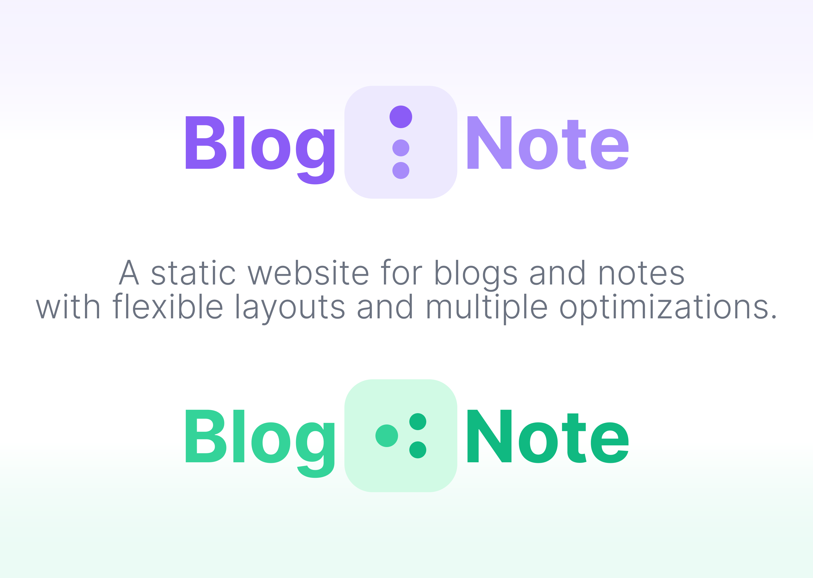
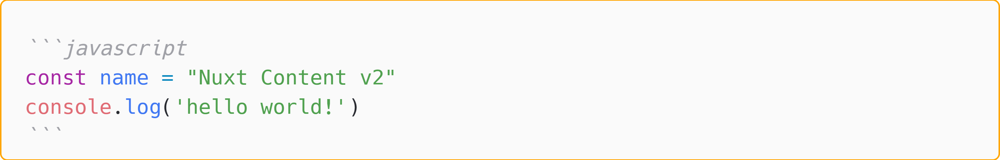

## 项目简介



BlogiNote 是一个基于 [Nuxt Content](https://content.nuxtjs.org/) 的静态网站模板，基于 MIT 协议进行开源。

它可用于展示你的博客文章或学习笔记，它对于不同长短、不同类型的内容提供不同的布局和多种交互上的优化。

:link: 项目仓库 https://github.com/Benbinbin/BlogiNote

:link: 效果演示 https://bloginote.vercel.app/

---

BlogiNote 具有以下特点：

* 由内容驱动：即可以基于多种不同格式的内容生成网页，例如 `markdown`、 `json`、 `csv` 等文件
* 支持 [MDC 语法](https://content.nuxtjs.org/guide/writing/mdc)：可在 Markdown 文件中使用 Vue 组件以拓展其功能，为静态网页提供更丰富的交互体验
* 支持基于多种条件的筛选：可以快速地从大量的数据中找到所需的文章

:muscle: 目前该项目不断更新进化，会添加更多的功能。


## 开发环境设置

* 需要在本地预先配置好 [Node.js](https://nodejs.org/en/download/) 环境（版本是 14.16 或高于 16.11）

* 推荐使用的编辑器是 [Visual Studio Code](https://code.visualstudio.com/)

  :bulb: 该项目使用的是最新版的 Nuxt 3（因此需要熟悉 Vue 3 相关语法），主要基于其模块 [Nuxt Content](https://github.com/nuxt/content) 进行开发

* 还推荐同时安装 Visual Studio Code 的一款插件 [Volar](https://marketplace.visualstudio.com/items?itemName=johnsoncodehk.volar)，可以让编辑器获得更多针对 Vue 3 的开发协助功能

  :warning: 需要同时对编辑器进行一些额外的配置，避免编辑器的一些默认功能与插件提供的类似功能发生冲突，如代码样式的格式化，TypeScript 类型提示等：

  * 开启 [Take Over Mode](https://github.com/johnsoncodehk/volar/discussions/471)（需要将 Volar 版本升级到高于 0.27.17）

    1. 在 VS Code 编辑器中按下快捷键 `Shift+Ctrl+P` 调出命令面包，然后输入并执行命令 `Extensions: Show Built-in Extensions` 以打开内建的插件
    2. 在其中寻找到 `JavaScript 和 TypeScript 的语言功能` 插件，然后右击选择 `禁用（工作区）`
    3. 重启 VS Code

  * 在 Nuxt 项目的配置文件 `nuxt.config.ts`（在后一篇介绍项目创建的文章会创建这个文件，记得往它里面添加上以下的代码）中进行如下配置，以取消为 `*.vue` 类型的文件自动生成 shim （类型声明）文件

    ```ts
    // 📄 nuxt.config.ts
    export default defineNuxtConfig({
      typescript: {
        shim: false
      }
    })
    ```


## 项目初始化

该项目是基于 Nuxt 3 及官方推出的一个模块 Nuxt Content v2 进行开发的，所以本项目基于官方推出的 Nuxt Content v2 模板 [content-wind](https://content-wind.nuxt.dev/) 进行修改作为起手式。

1. 在终端输入以下命令将 [content-wind 仓库](https://github.com/Atinux/content-wind)拷贝到本地

   ```bash
   git clone https://github.com/Atinux/content-wind.git
   ```

   :bulb: 本地开发环境中需要预先安装 [Git](https://git-scm.com/)

   然后本地就会创建一个 :file_folder: `content-wind` 文件夹，其目录结构如下

   ```md
   📁 content-wind
    │  .eslintignore
    │  .eslintrc
    │  .gitignore
    │  app.vue
    │  nuxt.config.ts
    │  package.json
    │  README.md
    │  tailwind.config.ts
    │  theme.config.ts
    │  tokens.config.ts
    │  tsconfig.json
    │  yarn.lock
    │
    ├─📁 .vscode
    │      settings.json
    │
    ├─📁 app
    │      router.options.ts
    │
    ├─📁 components
    │  │  AppNavbar.vue
    │  │  ColorModeSwitch.vue
    │  │  ContentWind.vue
    │  │
    │  └─📁 content
    │          Alert.vue
    │          Icon.vue
    │          List.vue
    │          MarkdownBlock.vue
    │
    ├─📁 content
    │      1.index.md
    │      2.about.md
    │
    ├─📁 layouts
    │      default.vue
    │      full-width.vue
    │
    └─📁 public
           cover.jpg
           favicon.ico
   ```

   其中主要的文件及目录的作用介绍如下，并根据本项目所需作出修改：

   * :page_facing_up: `nuxt.config.ts` 文件：Nuxt 配置文件

   * :page_facing_up: `app.vue` 文件：根组件，但是由于本项目最后是生成一系列的静态页面，而**不是**单页面应用 SPA，所以不需要使用该文件，所以 :no_entry: 将它**删除**，并在根目录下新建 :file_folder: `pages` 目录来存放页面

   * :page_facing_up: `theme.config.ts` 文件和 :page_facing_up: `tokens.config.ts` 文件：它们分别是 [`@nuxt-themes/config/module` 模块](https://github.com/nuxt-themes/config) 和 [`@nuxtjs/design-tokens/module` 模块](https://github.com/nuxt-community/design-tokens-module)的配置文件，本项目目前还不需要使用这两个模块（后期可能考虑引入），所以 :no_entry: 将它们**删除**

     并在 :page_facing_up: `package.json` 文件中移除相应依赖

     ```diff
     {
       // ...
       "dependencies": {
          // ...
     -    "@nuxt-themes/config": "npm:@nuxt-themes/config-edge@latest",
          // ...
     -    "@nuxtjs/design-tokens": "npm:@nuxtjs/design-tokens-edge@latest",
       }
       // ...
     }
     ```

     并在 :page_facing_up: `nuxt.config.ts` 项目配置文件中删除相应的模块导入声明

     ```diff
     export default defineNuxtConfig({
       modules: [
     -    '@nuxt-themes/config/module',
     -    '@nuxtjs/design-tokens/module',
          // ...
       ]
       // ...
     }
     ```

     :warning: 由于该模板还使用 `@nuxtjs/design-tokens/module` 模块为 TailwindCSS 自定义了颜色基础类，所以还需要在 :page_facing_up: `tailwind.config.ts` 配置文件中删除相应的设置

     ```diff
     - import { $dt } from '@nuxtjs/design-tokens'
     export default {
       // ...
     - theme: {
     -   extend: {
     -     colors: {
     -       primary: $dt('colors.primary')
     -     }
     -   }
     - }
     }
     ```

   * :file_folder: `components` 目录：用于存放项目的组件，该目录中的组件都是自动导入的，即在其他目录的 Vue 组件中使用时，并不需要引用它们。

     :bulb: 其子文件夹 `content` 中的组件可以直接用于 markdown 文件中，即 [MDC 语法](https://content.nuxtjs.org/guide/writing/mdc)。

     在该模板的 `components` 目录中，有一些内置的组件，可以参考学习，不过大部分组件都是本项目所不需要的，所以仅保留其中 `Icon.vue` 组件，:no_entry: 其中的组件都**删除**

   * :file_folder: `content` 目录：用于存放文章（如 markdown 文件等）

   * :file_folder: `layouts` 目录：用于存放布局模板文件。

      :bulb: 当一系列页面有共用的布局 UI 时，可以将这个设计抽取到一个 `*.vue` 文件并放置到该目录中，作为一个页面「骨架」，然后在实际的页面中可以通过内置组件 `<NuxtLayout name="layoutComponentName"></NuxtLayout>` 来复用这个布局 UI。

   * :file_folder: `public` 目录：用于存放资源文件。此外还需新建 :file_folder: `assets` 目录来存放另外一些资源文件。

      :bulb: :file_folder: `public` 和 :file_folder: `assets` 这两个目录都是可以用于存储资源文件，但是两者对于资源文件处理方式不同。:file_folder: `public` 目录中的文件在编译时是不经处理就直接「搬运」到部署文件夹的根目录下的；而 :file_folder: `assets` 目录中的文件在编译时被打包工具，如 Vite 或 Webpack，进行压缩等处理。

    :bulb: Nuxt 3 项目的各个文件和目录的更详细的说明，可以参考  [Nuxt 3 官方文档](https://v3.nuxtjs.org/guide/directory-structure/) 和 [Nuxt Content v2 文档](https://content.nuxtjs.org/)

2. 在终端输入以下命令以安装项目的依赖

    ```bash
    yarn install
    ```

3. 然后在终端输入以下命令启动一个本地的开发服务器

    ```bash
    yarn dev
    ```

    这样项目初始化就完成了，接着就可以进行项目开发了，并在 http://localhost:3000 中预览网站效果

## 首页
首页的主要有两部分，首先是展示一个关于该网站简介描述，它允许用户通过创建 `index.md` 文件来进行设置；然后展示一些最近更新的文章。

### 文章列表数据获取
:sweat_smile: 不过文章创建时间要如何获取，在 Nuxt Content v2 中好像还没有相关的 API，后期可能会支持吧，所以首页就先设计为展示特定数量的文章吧 :joy:

:bulb: 如果有对文章[进行排序](https://content.nuxtjs.org/guide/writing/content-directory#ordering)的需求，其实可以在文件或目录名称上使用数字前缀，如 `1.article.md`，然后使用 Nuxt Content v2 所提供的获取文章的相关 API 时，返回的数据就会依序排列。另外如果需要忽略文章，可以在文件或目录名称上使用 `.` 作为前缀，例如 `.thisIsTheIgnoreArticle.md`

Nuxt Content v2 提供了一个[组合式 API `queryContent()`](https://content.nuxtjs.org/api/composables/query-content) 用于查询内容数据：

1. 首先调用 `queryContent()` 以创建一个查询器 queryBuilder，它可以接受一系列的参数，以查询特定**嵌套目录**下的内容数据

    ```js
    // 默认就是查询 content/ 目录下的内容数据
    const queryBuilder = queryContent()
    // 查询 content/articles 目录下的数据
    const queryBuilder = queryContent('articles')
    // 查询深度嵌套的目录 content/articles/nuxt3 文件夹中的数据
    const queryBuilder = queryContent('articles', 'nuxt3')
    ```

    :bulb: 该查询器 queryBuilder 还有一些[方法](https://content.nuxtjs.org/api/composables/query-content/)，如 `queryBuilder.where()`，`queryBuilder.only()` 等，而且这些方法支持**链式调用**，使用类似于 MongoDB 的语法来**构建更复杂的查询条件**。

2. 然后再调用以下查询器的三个方法之一，以发送异步请求（这些方法会自动解析响应，并返回更方便后续使用的数据格式）

  * `queryBuilder.find()` 该方法获取**所有**满足查询条件的文章

  * `queryBuilder.findOne()` 该方法最多只会获取**一篇**满足查询条件的文章

  * `queryBuilder.findSurround(path, options)` 该[方法](https://content.nuxtjs.org/api/composables/query-content/#findsurroundpath-options)会获取指定路径 `path` 所对应文章的**邻近**文章（默认是前后两篇）

    ```js
    // 获取 content/articles 文件夹内的所有文章（包括子文件夹中的文章）
    const articles = await queryContent('articles').find()
    ```

:bulb: 由于发送的是异步请求，所以该方法一般会与 Nuxt 提供的获取数据的[组合式 API `useAsyncData()`](https://v3.nuxtjs.org/api/composables/use-async-data) 配合使用

```js
const { data, pending, refresh, error } = await useAsyncData('articleData', () => queryContent('/').findOne())
```

该组合式 API 用于封装异步获取数据的方法 `useAsyncData(key, fetchFun, options)` 其参数说明如下：

* `key` 是一个字符串，作为该异步请求操作的唯一标识符，这样就可以对该请求做缓存，避免在项目中重复对同一个 url 发送请求。该参数是可选的，如果不提供 Nuxt 会自动为该请求生成一个唯一标识符。

* `fetchFun` 是发送异步请求的函数

* `options` 配置对象

如果组件中调用了该组合式 API，则默认会使用 [`<Suspense>` 组件](https://vuejs.org/guide/built-ins/suspense.html)阻碍路由的加载，直到异步请求获取到数据，可以通过配置对象 `options.lazy` 属性来修改该默认行为。

该组合式 API 返回值可以解构为以下属性（都是 Ref 对象，可以直接用于组件的模板中）：

* `data` 返回的数据（已经将 JSON 格式转换为 Ref 对象）
* `pending` 一个布尔值，表示请求状态，如果已经返回数据则为 `false`
* `refresh` 因为 Nuxt 会对相同的请求做缓存，如果需要再次发送请求以刷新数据，可以直接调用该返回的方法 `refresh()`
* `error` 一个包含错误信息的对象

为了可以基于不同的主题来列出最近的文章，即基于文件夹来获取文章，这就还需要使用 Nuxt Content v2 提供的另一个[组合式 API `fetchContentNavigation()`](https://content.nuxtjs.org/api/composables/fetch-content-navigation) 来获取目录结构。

例如在项目的 :file_folder: `content` 目录里具有以下文件和子文件夹

```md
📁 content
 |  index.md
 │
 ├─📁 sub-folder
 │  |  about.md
```

则可以使用 `fetchContentNavigation()` 获取该目录结构

```js
const { data: navigation } = await useAsyncData('navigation', fetchContentNavigation())
```

返回一个数组，表示 `/content` 目录下含有的文件和目录的**嵌套结构**

```js
[
  {
    "title": "Hello Content V2",
    "_path": "/",
  },
  {
    "title": "Sub Folder",
    "_path": "/sub-folder",
    "children": [
      {
        "title": "About Content V2",
        "_path": "/sub-folder/about"
      }
    ]
  }
]
```

对于以上示例：

* 第一个元素就是 :page_facing_up: `index.md` 文件

  :bulb: 对于文件，默认只包含 `title` 和 `_path` 这两个属性。其中 `title` 属性是标题，对于 markdown 文件，默认以文章的一级标题为 `title` 属性；`_path` 属性是该文件的路径

* 第二个元素就是 :file_folder: `sub-folder` 目录

  :bulb: 对于目录，除了 `title` 和 `_path` 属性，还会包含 `children` 属性。其中 `title` 属性是该目录的名称；`_path` 属性是该目录的路径；`children` 属性是一个数组，各元素是该目录所包含的文件和子目录，形成嵌套结构，如该目录里只有一个 :page_facing_up: `about.md` 文件，则数组就只有一个元素。

  :warning: `fetchContentNavigation()` 方法并不是获取目录的完整树形结构，因为它会**自动忽略空目录**

:bulb: 对于文件和目录除了以上的默认属性外，还可以在文件或目录的相应文件中添加额外的「导航信息」，然后在 `fetchContentNavigation()` 方法返回的目录结构树中，就会附加关于文件和目录的更丰富的信息：

* 如果要为 markdown 文件添加额外的「导航信息」，可以在文件开头的 front-matter 部分，使用 YAML 语法设置 `navigation` 属性（属性值是列表），为文件添加自定义的额外属性

  ```md
  ---
  navigation:
    msg: 'hello'
    msg2: 'world'
  ---

  # Article Example

  article content
  ```

  然后在使用 `fetchContentNavigation()` 方法返回的结果中，该文件所对应的数组元素是

  ```js
  [
    {
      "title": "Article Example",
      "_path": "/the/path/of/this/article",
      "msg": "hello",
      "msg2": "world"
    }
  ]
  ```

* 如果要为目录添加额外的「导航信息」，可以在该目录下创建一个 `_dir.yml` 文件，使用 YAML 语法设置所需的额外属性

  ```yaml
  navigation:
    msg: "this is a directory"
  ```

  然后在使用 `fetchContentNavigation()` 方法返回的结果中，该目录所对应的数组元素是

  ```js
  [
    {
      "children": [...]
      "msg": "this is a directory",
      "title": "folderName",
      "_path": "/the/path/of/this/folder",
    }
  ]
  ```

* 还可以在 `nuxt.config.ts` 项目的配置文件中进行相应的设置，这样以上所述的两种添加扩充额外「导航信息」的方式，都不用特定写在 `navigation` 属性之下了：

```ts
defineNuxtConfig({
  content: {
    navigation: {
      fields: ['msg']
    }
  }
})
```

组合式 API `fetchContentNavigation()` 默认以 `content` 作为根目录，返回其内在的树形结构。其实该方法还可以接受一个 queryBuilder 参数，以设置 `content` 内的哪个子文件夹作为根目录，即以此为起点，返回其内在的树形结构。

:bulb: queryBuilder 即使用方法 `queryContent()` 创建的对象

```js
// 以 /content/article 作为根目录，获取其内部的树形结构
const queryBuilder = queryContent("article")
const { data: navigation } = await useAsyncData('navigation', fetchContentNavigation(queryBuilder))
```

:bulb: 但是[在最近的 Nuxt Content v2 版本中](https://github.com/nuxt/content/issues/1399)，`fetchContentNavigation()` 似乎无法使用直接通过字符串指定根目录的 queryBuilder :sob: 作为替代方案，可以通过 queryBuilder 的 `where()` 方法来指定根目录

```js
const queryBuilder = queryContent().where({ _path: { $contains: '/article' } })
const { data: navigation } = await useAsyncData('navigation', fetchContentNavigation(queryBuilder))
```

:no_entry: 如果希望在 `fetchContentNavigation()` 方法返回值中，禁止列出特定的目录或文件，可以进行相应的设置：

* 可以在 markdown 文件开头的 front-matter 部分设置 `navigation` 属性为 `false`，则该文件就不会出现在目录结构树中

  ```md
  ---
  navigation: false
  ---
  ```

* 可以在目录下创建一个 `_dir.yml` 文件，并设置 `navigation` 属性为 `false`，则整个目录（及其内部的文件和子目录）都不会出现在目录结构树中

  ```yaml
  navigation: false
  ```

* 也可以直接在文件或目录的名称前添加 `_` 下划线作为前缀，这样该文件或目录就会被忽略，也不会出现在目录结构树中

:bulb: 此外 Nuxt Content v2 还提供了一个内置的组件 `<ContentNavigation v-slot="{ navigation }" :query="queryBuilder">`，它会自动获取给定 queryBuilder 查询器所指向的目录的结构树，并通过作用域插槽 `v-slot="{ navigation }"` 暴露出导航数据。可以将该组件看作为 headless 组件，这样就可以在开发中专注于导航栏的 UI 设计，而不是获取树形结构数据的繁琐逻辑。

---

以下这些代码片段摘自 :page_facing_up: `/pages/index.vue` [文件](https://github.com/Benbinbin/BlogiNote/blob/main/pages/index.vue)，是关于如何在首页获取和展示文章列表

```js
// 获取 article 目录树结构
const queryBuilder = queryContent().where({ _path: { $contains: '/article' } })
const { data } = await useAsyncData('articleTree', () => fetchContentNavigation(queryBuilder))

const articleTree = data.value[0] // 这就是 article 目录的树结构

// 构建一个 queryBuilder
// 限制获取文章数量最多是 5 篇
// 并限制获取的字段，主要是舍弃了 body 字段，因为首页列表只需要展示文章的概要信息，如标题、封面、摘要、所述系列、标签等
const queryCategoryArticlesParams: QueryBuilderParams = {
  limit: 5,
  only: ['title', 'description', '_path', 'cover', 'series', 'seriesOrder', 'tags']
}
```


```vue
<!-- 基于每一个 category 创建一个 section -->
<!-- 即对于 /content/article 目录下的每一个子文件夹都创建一个分组，每一个分组列出最多 5 篇文章 -->
<template v-for="category in articleTree.children">
  <section v-if="category.children" :key="category._path" class="...">
    <!-- 这是每个 section 的表头部分 -->
    <div class="...">
      <!-- category 名称，即子文件夹名称 -->
      <h2 class="...">
        {{ category.title }}
      </h2>
      <!-- 添加一个到 list 页面的链接，以方便查看所有属于该 category 的文章 -->
      <NuxtLink
        :to="{ path: '/list', query: { category: category.title.toLowerCase() } }"
        class="..."
      >
        More
      </NuxtLink>
    </div>

    <!-- 这是每个 section 下的具体文章列表-->
    <div>
      <ContentList v-slot="{ list }" :path="category._path" :query="queryCategoryArticlesParams">
        <!-- 省略的内容就是基于作用域插槽所暴露的 list 数据，自定义制成的文章列表，而且对于显示器大屏和移动端触屏小屏做了不同的适配 -->
      </ContentList>
    </div>
  </section>
</template>
```

:loudspeaker: 由于 BlogiNote 使用 [Tailwind CSS](https://tailwindcss.com/) 设置大部分的页面样式，所以模板中各元素的类 class 会十分冗长，为了突出重点，以上代码摘要一般会用 `...` 代替表示。

以上示例中使用了两个内置组件 `<NuxtLink>` 和 `<ContentList>`

* [组件 `<NuxtLink>`](https://v3.nuxtjs.org/api/components/nuxt-link) 是 Nuxt 3 提供的内置组件。

  类似于 Vue Route 的 `<RouterLink>` 组件，最终会生成一个 `<a>` 锚标签。可以为该组件传递一系列 [props 属性](https://v3.nuxtjs.org/api/components/nuxt-link#props)来定制其行为。

  :bulb: 推荐在 Nuxt 项目中使用 `<NuxtLink>` 组件，而非直接使用 `<a>` 标签，因为它会根据链接的属性（外部链接还是内部链接）进行优化（预加载等）

* [组件 `<ContentList>`](https://content.nuxtjs.org/api/components/content-list) 是 Nuxt Content v2 提供的内置组件。

  它会根据 prop `path` 所指定的目录路径获取其中包含的文章，并根据 prop `query` 所指定的 queryBuilder 查询器对文章进行筛选。最后通过作用域插槽 v-slot="{ list }" 暴露出所获取的文章数据。因此也可以将该组件看作是 headless 组件，这样在开发中就可以专注文章列表的 UI 设计，而不必过多地操心如何获取文章数据。

  以上示例中，`:path="category._path"` 就是获取 `/content/article` 目录下的**不同子目录里**的文章，`:query="queryCategoryArticlesParams"` 就是之前所构建的 queryBuilder 查询器，即每一个分组最多获取 5 篇文章。而作用域插槽 `v-slot="{ list }"` 解构出来的 `list` 就是所获取到的文章数据，是一个数组，可以在该组件内部使用这些数据来构建文章列表，每篇文章都会具有如 queryBuilder 查询器所列出的属性信息。

### 文章列表适配移动端
通过设计两种布局来展示文章列表，以便适配大屏鼠标交互和小屏触屏交互。

其中通过 [Tailwind CSS 所提供的响应式断点](https://tailwindcss.com/docs/responsive-design) `sm` 来控制两种布局的切换


```vue
<!-- 区分小屏和大屏设备的断点是 640px -->

<!-- 大屏设备中，文章从上往下排列 -->
<!-- 该部分默认不显示，只有屏幕宽度宽于  时才显示该部分-->
<!-- 这个布局对于由多个 category 的情况下不太好，需要滚动多次才能够查看到不同 section，不过对于大屏幕和通过鼠标滑轮进行滚动操作来说也影响不大 -->

<!-- 小屏中，文章卡片从左往右排列 -->
<!-- 默认时显示该部分，但是当屏幕宽度 640px 时就会隐藏 -->
<!-- 在触屏设备上使用者可以通过左右滑动方便地浏览各个 section 的文章，而上下滑动则是浏览不同的 section，对于多个 category 情况时这个交互更合适，可以在小屏设备尽可能多地展示内容 -->
<div class="... flex flex-row sm:flex-col gap-2 overflow-x-auto ...">
  <ContentList v-slot="{ list }" :path="category._path" :query="queryCategoryArticlesParams">
    <!-- ... -->
  </ContentList>
</div>
```

### 文章列表项添加封面

BlogiNote 大部分页面都是使用 markdown 文件生成的，我们一般在书写 Markdown 文档时，都是关注其基本语法，如通过 `#` 标记将内容设置为一级标题，但是 Markdown 还可以通过内嵌符合 [YAML（或称为 YML） 语法](https://yaml.org/)的内容来为文档添加额外的信息。

:bulb: YAML 实际就是用一系列键值对 `key: value` 写出的内容

一般 YAML 内容是写在 markdown 文档的顶部，并用 `---` 三条横杠将内容包括其中，例如

```md
---
cover: article-cover-image.png
---
```

然后在 Nuxt Content v2 所获取的文章数据对象中，就会增添一个 `cover` 属性。

以下这些[代码片段](https://github.com/Benbinbin/BlogiNote/blob/main/pages/index.vue)摘自 :page_facing_up: `/pages/index.vue` 文件，是关于如何在首页展示文章的封面

:bulb: 这些文章的封面图片属于项目的资产 assets，可以放置在 :file_folder: `/assets` 目录或 :file_folder: `/public` 目录中，BlogiNote 是要求使用者把图片存放在 :file_folder: `/public/covers` 目录中

```html
<!-- 这是每一篇文章的模板 -->
<!-- 由于封面图采用相对定位 absolute 进行布局，所以文章的容器需要采用 relative 布局-->
<div
  v-for="article in list"
  :key="article._path"
  class="... relative ..."
>
  <!-- 避免图片拉伸的问题，这里是将封面图设置为 div 元素的背景图 -->
  <!-- 并采用 bg-contain bg-no-repeat 方式来填充 -->
  <!-- 图片定位在文章列表的右下角-->
  <div
    v-if="article.cover"
    :style="`background-image: url('/covers/${article.cover}'); `"
    class="w-1/5 h-[90%] absolute bottom-0 right-0 -z-10 bg-contain bg-right-top bg-no-repeat"
  >
    <!-- 这里再设置一层白色的「遮罩」，避免封面图的颜色过于鲜艳导致文章简介难以阅读 -->
    <div
      class="absolute inset-0"
      style="background: linear-gradient(135deg, rgba(249,250,251,1) 40%, rgba(249,250,251,0.6) 80%, rgba(249,250,251,0.9) 100%)"
    />
  </div>
  <!--- ... -->
</div>
```

### 文件目录树结构展示

正如 BlogiNote 的名称，它可用于展示博客文章 Blog，也可用于展示笔记文章 Note。

博客文章一般都是完整的，且章节的前后顺序和相关性都较强，比较适合以线性布局展示；而笔记可能就比较零碎，可能会是各个知识点的罗列集合，比较适合通过树图或画布平铺来展示。BlogiNote 提供灵活变化的布局 Flexible layout 来优化两种应用场景。

首先需要有一个全局的状态来记录和控制当前网站处于 `blog` 或是 `note` 两者中的哪一个模式。

Nuxt 3 提供了一个[组合式 API `useState()`](https://v3.nuxtjs.org/guide/features/state-management) 来创建和管理响应性的全局状态，而且支持在 SSR 服务端渲染的项目中使用。

:bulb: 所以在开发状态并不复杂的 Nuxt 应用时，可以直接使用这个方法来创建全局状态，而不需要引入其他第三方状态管理模块（如 [Pinia](https://pinia.vuejs.org/)）。

组合式 API `useState(key, init())` 各参数的含义：

* `key` 是该全局状态的唯一标识符，可以避免 Nuxt 在获取数据时发出重复的请求。该参数是**可选**的，如果省略，Nuxt 会自动基于该全局状态所在的文件和所在的代码行数创建一个唯一标识符。

* `init()` 是一个初始化函数，该函数的返回值会作为该全局状态的初始值

```vue
<script setup>
// 创建一个名为 counter 的全局状态，其（TypeScript）数据类型是 number，初始值是 0
const useCounter = useState<number>('counter', () => 0)
</script>

<template>
 <!-- 对全局状态进行修改 -->
  <div>
    Counter: {{ counter }}
    <button @click="counter++">
      +
    </button>
    <button @click="counter--">
      -
    </button>
  </div>
</template>
```

```vue
<script setup>
// 在其他组件使用该全局状态
// 由于它是响应性的，所以在上述组件中对其进行改变，其值在该组件也会随着改变
const count = useCounter() // Same as useState('count')
</script>

<template>
  <p>Current count: {{ count }}</p>
</template>
```

:warning: 由于全局状态的值需要序列化为 JSON 格式，所以其值要能够被序列化 serialized，即不能是 class，function，symbol 等类型。

:thumbsup: `useState()` 所创建的全局状态在 SSR 模式下也是具有响应性的，因此也可以将它作为 `ref()` 的替代

---

在 BlogiNote 中就创建了一个 :page_facing_up: `/composables/state.ts` [文件](https://github.com/Benbinbin/BlogiNote/blob/main/composables/states.ts)专门用于创建和管理这些全局状态，以供其他组件使用

```ts
// 该全局状态就是用于记录和管理网站处于 'blog' 模式还是处于 'note' 模式，依此变化网页的布局
// 网站默认处于 'blog' 模式
// flexible mode
export const useFlexiMode = () => useState<'blog' | 'note'>('flexiMode', () => 'blog')
```

---

当网站处于在 `blog` 模式时，首页就会获取最近更新的部分文章，并以列表的方式展示（之前相关章节就是介绍如何搭建该布局）；当网站处于 `note` 模式时，首页就会基于 markdown 文件的目录树结构（以文件夹为单位）获取所有文章，并以网格方式展示。

其中目录树结构数据就是通过前面章节所介绍的组合式 API `fetchContentNavigation()` 获取的。

以下这些代码片段摘自 :page_facing_up: `/pages/index.vue` [文件](https://github.com/Benbinbin/BlogiNote/blob/main/pages/index.vue)，是关于如何在首页获取目录树结构数据

```js
// 具体的文章是在 📁 /content/article 目录里
// 所以先构建一个查询器
// 约束 fetchContentNavigation() 以 📁 /content/article 目录为根目录获取其目录树结构
const queryBuilder = queryContent().where({ _path: { $contains: '/article' } })
const { data } = await useAsyncData('articleTree', () => fetchContentNavigation(queryBuilder))
```

获取到的数据 `data` 结构如下

```js
[{
  title: 'Article',
  _path: '/article',
  children: [...]
}]
```

该数据是一个数组，只有一个元素，因为根据查询器的约束，只获取到一个元素，作为根目录。因为该元素是目录，所以除了 `title` 属性和 `_path` 属性以外，还具有 `children` 属性（这里假设 :file_folder: `/content/article` 目录不是空文件夹，不然 `fetchContentNavigation()` 方法就获取不到该数据了），该属性正是 :file_folder: `/content/article` 目录里的文件树结构。

```js
// 所获取到的数据 data 是一个数组，其唯一元素就是 📁 /content/article 目录
const articleFolder = data.value[0]
// 当前的目录树结构，它一个响应式变量
// 可以通过改变该变量的值，模拟我们浏览目录树结构（打开子文件夹或返回祖先文件夹）的操作
const currentTree = ref([])
// 初始的目录树就是 📁 /content/article 目录里的内容
currentTree.value = articleFolder.children
```

在页面上使用 Grid 布局来展示目录树结构（第一层）各个节点

```html
<!-- 将 Grid 网格布局的列数设置为随页面宽度响应性变化，以更高的效率利用大屏幕来展示数据 -->
<div
  class="... grid grid-cols-1 sm:grid-cols-2 md:grid-cols-3 lg:grid-col-4 xl:grid-cols-5 2xl:grid-cols-6 gap-2"
>
  <template v-for="(item, index) in currentTree">
    <!-- 根据树节点的类型（文件还是子文件夹）不同而显示不同的内容 -->
  </template>
</div>
```

在页面中展示树节点时，根据节点类型不同，采用不同的显示方式：

* 如果树节点是文章，则使用 `<NuxtLink>` 来渲染出一个链接，供浏览者点击查看具体的文章

* 如果树节点是子文件夹，则使用一个自定义组件 `<FolderTree>` :sparkles: 并在交互设计上进行特别的优化，在最小化的模式时，它就像我们常用的文件系统一样，仅展示一个文件夹图标及其名称，如果浏览者**点击**它，那么它就会变成一个容器展示其内部所包含的文章，相当于在页面上**内嵌了一个小窗口**

  :bulb: 该组件的交互设计并不像常用的文件系统一样，即浏览者点击（一般是双击）文件夹就会触发数据下钻（即整个页面的文件全都替换展示为该目录内部所包含的内容），取而代之该组件会「扩展」变成一个小窗口展示其内部包含的文件（而不是直接触发整个页面的数据变化），这是考虑到浏览者可能只是好奇想看看目录里有哪些文章。

  :sparkles: 此外这个小窗口还允许浏览者在**不断下钻**，以探寻深度内嵌的子目录，同时依然保持整个页面的数据所在的层级不变，对于初次浏览网页的用户，这样交互更友好，让祂们不会「迷失」在深度嵌套的目录结构树中。

  :v: 而且该组件的顶部还提供了一个**面包屑导航栏 breadcrumb navigation**，可以让用户一目了然直到自己下钻的深度，并通过点击一步回到上几级的目录来。

  以下是关于该组件核心代码的一些解析，摘自 :page_facing_up: `/components/FolderTree.vue` [文件](https://github.com/Benbinbin/BlogiNote/blob/main/components/FolderTree.vue)

  ```js
  // 该组件会接收一系列的 props
  // 其中 rootName 就是该文件夹名称（对于该组件而言就是根目录的名称）
  // 而 rootTree 就是该文件夹所包含的内容（对于该组件而言就是根目录树）
  // 此外 rootIndex 是该文件夹在其父文件夹里的索引值，这是为了实现整个页面下钻时需要使用的
  const props = defineProps<{
    rootName: string;
    rootTree: NavItem[];
    rootIndex: number;
  }>()
  ```

  为了创建面包屑导航栏创建以下变量

  ```js
  // 一开始还没进行下钻，所以导航栏数组只有一个元素，即只包含根目录自身
  // title 属性是文件夹的名称
  // path 属性是该文件夹所对应的下钻（相对于根目录，即其自身）路径
  // 由于没有进行下钻，所以 path 为空数组
  const folderNavArr = ref([
    {
      title: props.rootName,
      path: []
    }
  ])

  // 当前的下钻路径，每下钻一步，该数组就会添加一个元素
  // 它是用于构建导航栏数组的
  let folderNavPath = []

  // 当前的目录树
  const currentTree = ref<NavItem[]>([])

  // 初始值是根文件夹所包含的内容
  currentTree.value = props.rootTree

  const setFolderNavPath = (path) => {
    // 该方法是响应浏览者点击导航栏的操作
    // 返回上几级的目录
  }

  const addFolderNav = (title, index) => {
    // 该方法是响应浏览者点击子文件夹的操作
    // 触发数据下钻
  }

  const setTreeHandler = () => {
    // 该方法是响应浏览者点击当前的文件夹
    // 抛出 'set-tree' 操作，触发整个页面的数据下钻
  }
  ```

  配合组件的 UI（模板结构）介绍以上的各个方法是如何实现各种交互功能的

  ```html
  <template>
    <!-- 未展开文件夹时，渲染为一个按钮 -->
    <!-- 点击按钮后将变量 expand 设置为 true 就可以将文件夹「展开」，且隐藏该按钮-->
    <button
      v-show="!expand"
      class="..."
      @click="expand = true"
    >
      <!-- 未展开文件夹时，只显示文件夹的名称 -->
      {{ props.rootName }}
    </button>

    <!-- 展开文件夹时，渲染为一个包含复杂元素的 div -->
    <!-- 该 div 是 grid 布局的项目（之后可能会对这个布局方案进行优化）-->
    <!-- 它占据 grid 布局中的两列 -->
    <!-- 而根据文件夹中包含的文件数量，动态调整其所占据 grid 布局的行数 -->
    <div
    :class="expand ? (rootTree.length <= 2 ? 'col-span-1 sm:col-span-2 row-span-2' : (rootTree.length <= 4 ? 'col-span-1 sm:col-span-2 row-span-3' : 'col-span-1 sm:col-span-2 row-span-4')) : 'col-span-1 self-start'">
      <!-- 展开文件夹时，显示文件夹中所包含的具体内容 -->
    </div>
  </template>
  ```

  关键是展开文件夹时的 UI 设计和交互实现，而其中较复杂的逻辑是其顶部的面包屑导航栏

  ```html
  <!-- 组件顶部的导航栏 -->
  <div class="folder-nav-container ...">
    <!-- 固定在导航栏左侧的按钮，属于面包屑导航栏的一部分 -->
    <!-- 要将面包屑导航栏分开为两部分，这是因为交互逻辑不同-->
    <!-- 这一部分只显示一个文件夹是 folderNavArr 的第一个元素，即当前下钻的目录 -->
    <!-- 如果再点击该按钮，其交互逻辑是触发整个页面的数据下钻到该目录 -->
    <!-- 可以查看 setTreeHandler 方法是如何实现该交互逻辑的 -->
    <button
      class="..."
      @click="setTreeHandler"
    >
      {{ folderNavArr[0].title }}
    </button>
    <!-- 面包屑导航栏的另一部分 -->
    <!-- 这一部分显示一系列文件夹是 folderNavArr 的第二个元素到最后一个元素，即当前下钻目录的祖先文件夹 -->
    <!-- 所以这里通过 v-show 设置了显示条件，当组件的数据没有下钻时，不需要显示导航栏的该部分 -->
    <!-- 该部分是可以左右滚动的（如果下钻过深时，面包屑包含很多文件夹名称，就有可能过长而无法完全显示，需要左右滚动，设置了相关的样式 overflow-x-auto scroll-smooth -->
    <div
      v-show="folderNavArr.length > 1"
      ref="folderNavContainer"
      class="folder-nav-container overflow-x-auto scroll-smooth ..."
      @scroll.passive="folderNavScrollingHandler"
    >
      <!-- 如果点击该部分的按钮，其交互逻辑时触发该组件的数据返回到该目录（下钻的逆操作） -->
      <!-- 可以查看 setFolderNavPath 方法是如何实现该交互逻辑的 -->
      <button
        v-for="(folder, index) in folderNavArr.slice(1)"
        ...
        @click="setFolderNavPath(folder.path)"
      >
        {{ folder.title }}
      </button>
    </div>
    <!-- 固定在导航栏右侧的一些操作按钮 -->
    <div class="...">
      <!-- 让面包屑导航栏向左滚动的按钮 -->
      <!-- 如果面包屑导航栏滚动到最左侧时，scrollPos 的值就会是 start，则该按钮就会 disabled，且透明度降为 30% -->
      <!-- 可以查看 scrollFolderNavHandler 方法是如何实现该交互逻辑的 -->
      <button
        v-show="showScrollBtn"
        :disabled="scrollPos === 'start'"
        class="..."
        :class="scrollPos === 'start' ? 'opacity-30' : ''"
        @click="scrollFolderNavHandler('left')"
      >
        <!-- ... -->
      </button>
      <!-- 让面包屑导航栏向右滚动的按钮，也有类似的交互逻辑 -->
      <button
        v-show="showScrollBtn"
        :disabled="scrollPos === 'end'"
        class="..."
        :class="scrollPos === 'end' ? 'opacity-30' : ''"
        @click="scrollFolderNavHandler('right')"
      >
        <!-- ... -->
      </button>
      <!-- 「关闭」组件按钮，将状态设置回未展开的状态 expand=false -->
      <button
        class="..."
        @click="expand = false"
      >
        <!-- ... -->
      </button>
    </div>
  </div>
  ```

  * `setTreeHandler()` 方法是用于响应用户点击面包屑的第一个按钮

    点击后会触发整个页面下钻到该目录。由于需要整个页面的数据变动，而不是组件内部的变动，所以需要通过分发事件 `set-tree` 的方式，通知父组件（页面）进行处理

    ```js
    // 分发 set-tree 事件，并携带当前目录的路径信息 path，以及其他相关信息
    const setTreeHandler = () => {
      const path = [props.rootIndex, ...folderNavPath]
      emits('set-tree', path, 'drill-down')
    }
    ```

    :bulb: 然后在页面的组件上监听该事件，并基于参数 `path`（下钻路径）来更改整个页面的数据

    ```html
     <FolderTree ... @set-tree="setTreeHandler"/>
    ```

  * `setFolderNavPath(path)` 方法用于响应用户点击面包屑的第二部分的一系列按钮中的任意一个

    点击按钮后会触发组件「返回」到相应的祖先目录（与下钻操作相反）

    要实现这个交互逻辑的关键是如何从完整目录树数据中找到目标节点，即所点击的目录在完整目录树中的对用节点。

    一般思路是基于目标文件夹的名称进行树搜索，但是对于目标文件夹是深度嵌套的情况时，可能需要不少的性能消耗和交互延迟。

    :v: 这里结合实际的交互操作，可以采用更简单的逻辑来实现。该组件在每次执行数据下钻都只是往子目录深入一级，而不会「跳级」，因此可以记录每次下钻时子目录（相对于父文件夹）的索引值，然后把所有索引值依次拼接起来，就得到了**从根文件夹下钻到当前后代文件夹的完整路径 `path`**。

    每当下钻发生时，就会往面包屑导航栏新增文件夹（按钮），此时只要把上面说到的相应的路径 `path` 数据与这个新增的文件夹（按钮）绑定，那么面包屑导航栏上的这些按钮就都会自带完整的路径 `path` 数据。

    ```js
    // 当浏览者点击展开内容中的文件夹时
    // 会调用以下方法触发组件的数据下钻
    const addFolderNav = (title, index) => {
      // 将下钻目录（相对于父目录）的索引值添加到当前路径数组 folderNavPath 中
      folderNavPath = folderNavPath.concat(index)

      // 为面包屑导航栏新增该下钻的目录
      // 不只是设置文件夹的名称，还可以记录完整的下钻路径
      folderNavArr.value.unshift({
        title,
        path: folderNavPath
      })

      // 然后再更新组件的目录树数据为当前下钻目录中所包含的内容
      currentTree.value = currentTree.value[index].children

      // 因为面包屑导航栏更新了，可能会因为文件夹过长而无法完全显示，需要重新判断是否要显示左右滚动按钮
      nextTick(() => {
        rejudgeShowScrollBtn()
      })
    }
    ```

    当点击面包屑导航栏（第二部分）上的任意按钮以「返回」相应的祖先目录时，只需要借助这些按钮所绑定的 `path` 路径数据，就可以准确快速地从完整的目录树上找到对应的节点。这就是 `setFolderNavPath(path)` 所要实现的交互逻辑

    ```js
    // 当点击面包屑导航栏上的任意一个文件夹（按钮）时执行以下方法
    const setFolderNavPath = (path) => {
      // 将当前下钻路径设置为目标文件夹所绑定的路径
      folderNavPath = path
      // 并设置一系列的临时 xxxtemp 的变量
      // 这些临时目录树数据都是以根目录为起始
      let treeTemp = props.rootTree

      const folderNavArrTemp = [{
        title: props.rootName,
        path: []
      }]

      let folderNavPathTemp = []

      if (path.length > 0) {
        // 然后基于 path 路径模拟一步步下钻到目标文件夹
        // 在这循环期间，同时一步步修改 xxxtemp 变量
        path.forEach((index) => {
          folderNavPathTemp = folderNavPathTemp.concat(index)
          folderNavArrTemp.unshift({
            title: treeTemp[index].title,
            path: folderNavPathTemp
          })
          treeTemp = treeTemp[index].children
        })
      }

      // 最后将模拟下钻计算得出的 xxxtemp 变量值赋予为当前的相应变量
      currentTree.value = treeTemp
      folderNavArr.value = folderNavArrTemp

      // 因为面包屑导航栏更新了，需要重新判断是否要显示左右滚动按钮
      nextTick(() => {
        rejudgeShowScrollBtn()
      })
    }
    ```

  :sparkles: 在设计可左右滚动的面包屑导航栏时，需要考虑一个小细节，就是在大屏幕里鼠标滚轮默认是无法触发左右滚动，只能拉动横向的滚动条实现相关的操作（而触屏设备则不需要考虑这个问题，因为可以通过左右滑动来实现左右滚动）。

  但是为了美观，我通过设置 CSS 将导航栏的左右滚动的滚动条隐藏了

  ```scss
  .folder-nav-container {
    &::-webkit-scrollbar {
      display: none;
    }
  }
  ```

  为了弥补因为隐藏滚动条而无法在大屏幕左右滚动的操作，所以再在导航栏最右侧添加了两个按钮，点击它们可以分别实现向左或向右滚动。通过 `scrollFolderNavHandler()` 方法响应用户点击左右滚动按钮

  ```js
  const scrollFolderNavHandler = (direction) => {
    if (!folderNavContainer.value) { return }
    const containerWidth = folderNavContainer.value.clientWidth // 面包屑导航栏（第二部分）的长度

    // 根据方向 direction 来增加/减小面包屑的滚动距离 scrollLeft
    if (direction === 'left') {
      folderNavContainer.value.scrollLeft -= containerWidth
    } else if (direction === 'right') {
      folderNavContainer.value.scrollLeft += containerWidth
    }
  }
  ```

  此外滚动条还有另一个功能，就是它的位置可以协助使用者判断滚动的状态，如是否滚动到底部，对于这个功能可以通过设置按钮的样式变化来实现，如滚动到最右侧时，设置相应的按钮透明度使其变淡，以表示其已经无法被点击，并将其 `disabled` 属性设置为 `true`。

  为了实现这个功能，就需要监听面包屑导航栏的 `scroll` 事件

  ```html
  <div ref="folderNavContainer" ... @scroll.passive="folderNavScrollingHandler"
  >
    <!-- 面包屑导航栏（第二部分）-->
  </div>
  ```

  具体实现逻辑在 `folderNavScrollingHandler()` 方法里，基于面包屑导航栏的滚动距离为变量 scrollPos 设置不同的值以表示滚动状态

  ```js
  // 该方法会在面包屑导航栏滚动时被调用
  const folderNavScrollingHandler = () => {
    if (folderNavContainer.value) {
      // scrollLeft 是面包屑导航栏已经滚动的距离
      // clientWidth 是面包屑导航栏的宽度
      // scrollWidth 是面包屑导航栏的总宽度（相对于把滚动部分展开的总长度）
      if (folderNavContainer.value.scrollLeft + folderNavContainer.value.clientWidth >= folderNavContainer.value.scrollWidth) {
        // 通过比较 scrollLeft + clientWidth 与 scrollWidth 的大小，可以知道面包屑是否滚动到最右侧
        // 如果面包屑导航栏在最右侧，则将 scrollPos 设置为 end
        scrollPos.value = 'end'
      } else if (folderNavContainer.value.scrollLeft === 0) {
        // 如果没有滚动距离，则面包屑导航栏滚动到最左侧，则将 scrollPos 设置为 start
        scrollPos.value = 'start'
      } else {
        // 如果面包屑导航栏滚动在中间状态，则将 scrollPos 设置为 middle
        scrollPos.value = 'middle'
      }
    }
   }
  ```

:bulb: 页面整体也支持数据下钻，在页面的顶部也有相应的面包屑导航栏，其交互逻辑也是和 `<FolderTree>` 组件的实现原理差不多。

## 导航栏
BlogiNote 导航栏的主要功能是可以快捷访问几个页面。

---

导航栏中各种按钮采用内置组件 `<NuxtLink>` 渲染出链接，点击即可转到相应的页面，例如左侧的用户头像，以下代码摘自 :page_facing_up: `/components/HeaderNav.vue` [文件](https://github.com/Benbinbin/BlogiNote/blob/main/components/HeaderNav.vue)

```html
<NuxtLink to="/" class="hover:">
  
</NuxtLink>
```

---

此外导航栏还进行了屏幕尺寸的适配，在大屏幕中显示在顶部，在小屏幕中显示在底部。

对于顶部导航栏包含以下各部分：

* 左侧的用户头像图标是可点击的，链接到首页

* 右侧的三个按钮 `Category`、`About`、`RSS` 分别链接到「列表」页面、「关于」页面、「订阅」页面

  :bulb: 其中 `Category` 按钮在 hover 或点击时**会触发一个下拉式的子菜单**，用于显示文章主类别，点击任意的类别都可以跳转到「列表」页面并筛选出该类别的文章

* 最右侧的图标是可点击的，用于切换网站的显示模式 `flexiMode`，在 `blog` 和 `note` 之间进行切换，实现不同的布局优化

:bulb: 而对于底部导航栏，进行了一些优化，由于屏幕宽度的限制，所以将 `Home`、`About`、`RSS` 按钮收纳至二级菜单，通过点击左侧用户头像图标展开

:sparkles: 由于小屏幕一般都是手机，通过触摸进行交互，所以将导航栏移置底部，即使大屏手机也可以让手指触及到

由于导航栏是在所有的页面显示的，所以它应该是基础 UI 框架的一部分，复用于所有页面中。

可以在 Nuxt 项目中添加 :file_folder: `/layouts` 目录，然后在该文件夹中下创建 `*.vue` 组件，这些组件就可以作为**布局框架**复用于特定的页面中，一般会在这些 `*.vue` 组件会包含多个页面共有的 UI 设计，例如导航栏、底部版权声明等。

这些布局组件一般都会有插槽 `<slot>`，以便复用时将页面的具体内容插入到指定的位置.

一般会在 `/layouts` 目录中创建一个名为 `default.vue` 的默认布局组件：

```html
<template>
  <div>
    <!-- 该布局框架的作用就是在页面插入以下一段话 -->
    <p>This is a default layout</p>
    <!-- 默认插槽 -->
    <!-- 具体页面的内容会置于该处 -->
    <slot />
  </div>
</template>
```

:warning: 这些布局组件只能有一个根元素（而且根元素不能是 `<slot>` 插槽），以便于在切换布局时可以让 Nuxt 正常地处理过渡动效。

然后在具体的页面中通过内置的组件 `<NuxtLayout>` 来使用这个**默认布局框架**

```html
<template>
  <div>
    <NuxtLayout>
      <!-- different page content -->
    </NuxtLayout>
  </div>
</template>
```

:no_entry: 因为 `<NuxtLayout>` 组件在内部会采用 `<Transition>` 组件去包裹插入的具体内容，所以在页面中使用该组件时，不建议将 `<NuxtLayout>` 作为根元素

如果在 :file_folder: `/layouts` 目录中创建其他布局组件，则在具体页面中有以下两种方式来指定使用哪一种具体的布局框架：

* 在组件 `<NuxtLayout>` 中使用 prop `name` 指定所需使用的布局组件的名称

  ```html
  <template>
    <div>
      <NuxtLayout name="custom">
        <template #header> Some header template content. </template>

        The rest of the page
      </NuxtLayout>
    </div>
  </template>
  ```

  :warning: 由于布局组件的名称会被 Nuxt 转换为 kebab-case 形式，所以在设置组件 `<NuxtLayout>` 的 prop `name` 以指定采用哪一种布局框架时，也应该采用全小写连线的形式。

* 在页面中通过方法 `definePageMeta()` 来设置页面的元信息，其中 `layout` 属性用于指定使用哪一个布局组件

  ```html
  <script>
  // This will also work in `<script setup>`
  definePageMeta({
    layout: "custom",
  });
  </script>
  ```

---

以下是 BlogiNote 项目中的一个[布局组件](https://github.com/Benbinbin/BlogiNote/blob/main/layouts/base.vue) :page_facing_up: `/layouts/base.vue` 的核心代码

```html
<template>
  <div class="bg-gray-50 flex flex-col min-h-screen">
    <!-- 位于顶部的导航栏 -->
    <!-- 只在大屏幕上显示 -->
    <header class="hidden sm:block ...">
      <HeaderNav />
    </header>
    <div class="...">
      <!-- 默认插槽 -->
      <!-- 具体页面的内容会置于该处 -->
      <slot />
    </div>

    <!-- ... -->

    <!-- 位于底部的导航栏 -->
    <!-- 只在小屏幕上显示 -->
    <nav class="sm:hidden ...">
      <FooterNav />
    </nav>
  </div>
</template>
```

然后在具体的页面，例如在[文件](https://github.com/Benbinbin/BlogiNote/blob/main/pages/about.vue) :page_facing_up: `/pages/about.vue` 中，通过 `<NuxtLayout name="base">` 来使用该布局框架

```html
<template>
  <div>
    <!-- ... -->
    <NuxtLayout name="base">
      <!-- ... -->
    </NuxtLayout>
  </div>
</template>
```

---

导航栏的构成并不复杂，其主要特色在于下拉式二级菜单的设计。

为了给二级菜单添加下拉动效，使用 Vue 的内置组件 `<Transition>`，该组件作为一个容器会为其所包裹的元素进入或离开页面时应用动画，该组件主要支持通过 CSS 或 JS 两种方式进行动画设置。

:warning: 组件 `<Transition>` 只能包裹单个元素（如果是组件，则该组件只能有一个根元素）


* **CSS 方式** - 在过渡的不同阶段，该组件会将以下 6 个不同的 CSS class 应用到所包裹的元素上

  :fast_forward: 对于所包裹的元素进入页面时，会在相应的阶段为其依次添加以下的 CSS class

  1. `v-enter-from` 在过渡动效开始时应用到所包裹的元素上，但是过渡动效的下一帧就会移除
  2. `v-enter-active` 在过渡动效的整个过程中，都会应用到所包裹的元素上
  3. `v-enter-to` 在过渡动效结束时应用到所包裹的元素上，但是在下一帧就会移除

    一般在 `v-enter-from` 和 `v-enter-to` 设置静态的状态，而在 `v-enter-active` 设置过渡动效相关的参数，如缓动曲线

  :rewind: 对于所包裹的元素离开页面时，类似地，会在相应的阶段为其依次添加以下的 CSS class

    1. `v-leave-from`
    2. `v-leave-active`
    3. `v-leave-to`

  :warning: 上述这些类名会在相应的过渡动效阶段结束时「拔除」，所以过渡动效结束时，最后所包裹的元素上其实并不会留有以上列出的任何类名

  以上的这些都是 `<Transition>` 组件为其所包裹的元素在过渡时默认插入的 CSS class 类名，如果希望在过渡时插入**自定义的类名**，可以通过组件 `<Transition>` 所提供的一系列 props 进行设置：

  * `enter-from-class`
  * `enter-active-class`
  * `enter-to-class`
  * `leave-from-class`
  * `leave-active-class`
  * `leave-to-class`

  以上的类名这些 props 会在相应的过渡动效阶段为所包裹的元素添加上自定义的 CSS class，并在相应阶段结束时「拔除」

* **JS 方式** - 在过渡动效的不同阶段，组件 `<Transition>` 会抛出不同的事件，且事件携带着所包裹元素作为 payload，所以只需要在组件 `<Transition>` 上监听相应的事件，就可以在过渡动效的不同阶段执行相应的操作，而且事件回调函数的入参就是所包裹的元素

  * `@before-enter="onBeforeEnter"`
  * `@enter="onEnter"`
  * `@after-enter="onAfterEnter"`
  * `@enter-cancelled="onEnterCancelled"`
  * `@before-leave="onBeforeLeave"`
  * `@leave="onLeave"`
  * `@after-leave="onAfterLeave"`
  * `@leave-cancelled="onLeaveCancelled`

---

BlogiNote 采用**基于 CSS 实现的过渡动效**，这得益于 Tailwind CSS 可以方便地进行样式设置，结合组件 `<Transition>` 所提供的一系列 props 可以在动效的不同阶段为下拉式菜单设置不同的 Tailwind CSS 类名

以下代码摘自 :page_facing_up: `/components/HeaderNav.vue` [文件](https://github.com/Benbinbin/BlogiNote/blob/main/components/HeaderNav.vue)

```html
<!-- enter-from-class="translate-y-0" 表示下拉菜单显示时，初始纵向的偏移量为 0 -->
<!-- enter-to-class="translate-y-full" 表示下拉菜单显示时，最后纵向的偏移量为 100% -->
<!-- enter-active-class="transition-all duration-300 ease-in" 设置了缓动函数为 ease-in 动效时间为 300ms -->
<!-- 下拉菜单隐藏时，过程和样式设置则是相反的 -->
<Transition
  enter-from-class="translate-y-0"
  enter-active-class="transition-all duration-300 ease-in"
  enter-to-class="translate-y-full"
  leave-from-class="translate-y-full"
  leave-active-class="transition-all duration-75 ease-out"
  leave-to-class="translate-y-0"
  @after-enter="onAfterEnter"
>
  <!-- 二级菜单 -->
</Transition>
```

:warning: 这里还需要使用一个 JS 的 hook `@after-enter="onAfterEnter"` 这是因为自定义的 Tailwind CSS 类名会在过渡动效结束时被「拔除」，而下拉菜单（采用相对定位）在显示时，需要应用偏移 `translate-y` 以显示出来，所以在进入动效结束时，需要通过 JS 的 hook `@after-enter="onAfterEnter"` 来添加回这个偏移

```js
const onAfterEnter = (el) => {
  el.classList.add('translate-y-full')
}
```

:bulb: 这里补上下拉菜单的结构，以便于理解上面的动效（自定义 CSS class）为何这样设置

```html
<div class="relative">
  <!-- 导航栏 -->
  <!-- ... -->
  <!-- 下拉菜单 -->
  <Transition ...>
    <div
      v-show="showSubNav"
      class="... max-h-[60vh] overflow-y-auto overscroll-y-none absolute -z-10 bottom-0 inset-x-0 ..."
      @mouseover="setSubNav(true)"
      @mouseleave="setSubNav(false)"
    >
      <!-- ... -->
    </div>
  </Transition>
</div>
```

根据以上的下拉菜单的 HTML 结构，可以知道下拉菜单采用相对于导航栏的定位，初始定位 `bottom-0` 是下拉菜单的底部与导航栏的底部相同。而由于设置 `-z-10` 让下拉菜单的层级更低，所以一开始下拉菜单是不可见的，它是被在导航栏遮挡着，位于导航栏的下一层，正是这样的设置在实现上述的动效时，下拉菜单就有种从导航栏底下抽拉出来的效果。

此外还设置 `max-h-[60vh]` 限制下拉菜单最大的高度不超过视窗高度的 60%，如果文章的类别过多，由于设置了 `overflow-y-auto` 所以下拉菜单就可以通过纵向的滚动来显示完全。

:sparkles: 这里考虑到一个交互的小细节，如果下拉菜单滚动到底部但是使用者继续滚动，一般会触发「滚动穿透」（即如果父元素也在该方向上滚动时，就会触发父元素的滚动）。对于这个例子，就是当下拉菜单滚动到底部时，继续滚动就会触发整个页面的滚动，这样的交互就会让使用者感到疑惑，因为滚动不是发生在当前的元素上。所以这里使用 `overscroll-y-none` 阻止下拉菜单在纵向的「滚动穿透」，这时即使滚动到下拉菜单的底部时，继续滚动鼠标的滚轮也不会触发整个页面的滚动。

## 文章页面

### 页面与路由
因为我们需要在特定 URL 页面上渲染对应的文章内容，所以要先了解 Nuxt 3 的[页面和路由的规则](https://v3.nuxtjs.org/guide/directory-structure/pages)。

Nuxt 3 提供了一个十分方便的方式创建页面，即**基于文件 file-based** 来创建页面。

只需要在项目中创建 :file_folder: `/pages` 目录，则在该目录里所创建的 `*.vue`、`*.js`、`*.ts`、`*.tsx` 文件，最终都会分别为项目创建出一个网页页面，这些页面的路由路径是由 [Vue Router](https://router.vuejs.org/) 根据 `*.vue` 文件在 :file_folder: `/public` 目录内的相对路径创建的。

:warning: 为了在页面切换时可以实现动效，需要限制在 :file_folder: `/public` 目录内的 `*.vue` 等这些文件只有一个根元素（而且 HTML 的注释也算是一个元素）。

:bulb: 对于一个 Nuxt 3 项目而言，:file_folder: `/pages` 目录是**可选的**，因为你可能只需要创建一个单页面应用 SPA（而不是多页面应用），你仅需要在项目的根目录中含有一个 :page_facing_up: `app.vue` 基础组件即可。但是如果你同时在项目中包含 :page_facing_up: `app.vue` 和 :file_folder: `/pages` 目录，**你需要在 :page_facing_up: `app.vue` 基础组件中包含一个 Nuxt 所提供的内置组件 `<NuxtPage>`**。这时基础组件 :page_facing_up: `app.vue` 就相当于每个页面的基础 UI 框架（:bulb: 如果需要为页面设置不同的 UI 框架，可以查看 Nuxt 官方文档中关于 :file_folder: `/layouts` 目录[这一章](https://v3.nuxtjs.org/guide/directory-structure/layouts)），而具体每一页的内容来自 `/posts` 目录中的相应文件，并由内置组件 `<NuxtPage>` 渲染出来。

```html
<template>
  <div>
    <NuxtPage/>
  </div>
</template>
```

BlogiNote 需要基于每一个 markdown 文件创建一个页面，按照 Nuxt 3 基于文件创建页面的思路，就需要在 :file_folder: `/public` 目录中创建出与 markdown 文件一样数量的 `*.vue` 文件，然后分别去获取相应的文章数据并渲染在相应的页面上，但是这样是十分繁琐的，而且开发者实际并不知道使用者会书写多少篇文章和文章的具体路径。

因此需要使用**动态路由**，它是可以匹配符合特定条件的一系列 URL，然后就可以只创建一个 `*.vue` 文件来负责渲染出这一类 URL 的页面。

Nuxt 3 支持通过**文件名**来创建动态路由，只需要在文件名上**使用双方括号 `[]`** 即可，例如在 :file_folder: `/pages` 目录创建如下文件

```md
📁 pages
 |
 |-📁 users-[group]
 |  |
 |  |- [id].vue
```

则 `[id].vue` 可以匹配 `/users-admins/123` 这一类型的 URL，并且**动态路由参数**所匹配到的值可以在该组件中通过路由对象来读取

```vue
<template>
  <div>
    <!-- 在模板中使用 $route 来访问路由对象 -->
    <p>{{ $route.params.group }} - {{ $route.params.id }}</p>
    <!-- 最终渲染为 <p>admins - 123</p> -->
  </div>
</template>

<script setup lang="ts">
  // 也可以使用组合式 API useRoute() 来访问路由对象
  const route = useRoute()

  console.log(route.params.group);
  console.log(route.params.id);
</script>
```

:bulb: 如果希望匹配的参数是可选的，可以**使用双方括号 `[[]]`** 来表示，例如 `/pages/[[slug]]/user.vue` 可以匹配 `/user` 或 `/test/user` 这两类 URL

如果希望匹配所有的路由，可以使用形如 `[...slug].vue` 的文件命名方式，这样在路由对象中，相应的参数 `slug` 将是一个数组，各元素就是匹配到的路由的各部分，例如创建了一个 :page_facing_up: `/pages/[...slug].vue` 文件，当访问 `/hello/world`

```html
<template>
  <p>{{ $route.params.slug }}</p>
  <!-- 最终渲染为 <p>["hello", "world"]</p> -->
</template>
```

:bulb: Nuxt 3 还支持通过 `/pages/404.vue` 文件来设置一个 404 页面，即当所有的路由都无法匹配到当前的 URL 时，就会显示该页面

---

在 BlogiNote 中需要在 :file_folder: `/pages` 目录下建立以下文件，以创建相应的页面：

* 创建一个 :page_facing_up: `/pages/article/[...slug].vue` [文件](https://github.com/Benbinbin/BlogiNote/blob/main/pages/article/%5B...slug%5D.vue)，用于展示具体的文章的页面。即匹配 `/article/the_article_title` 这一类的 URL

* 创建一个 :page_facing_up: `/pages/index.vue` [文件](https://github.com/Benbinbin/BlogiNote/blob/main/pages/index.vue)、:page_facing_up: `/pages/about.vue` [文件](https://github.com/Benbinbin/BlogiNote/blob/main/pages/about.vue)、:page_facing_up: `/pages/list.vue` [文件](https://github.com/Benbinbin/BlogiNote/blob/main/pages/list.vue)、:page_facing_up: `/pages/rss.vue` [文件](https://github.com/Benbinbin/BlogiNote/blob/main/pages/rss.vue)，分别用于展示「首页」、「关于」页面、「列表」页面以及 「RSS 订阅」页面

此外还创建了 :page_facing_up: `/layouts/base.vue` [文件](https://github.com/Benbinbin/BlogiNote/blob/main/layouts/base.vue)，用于设置文章页面的基础 UI 框架，例如导航栏和页面的底部版权声明内容等。

### 渲染文章
Nuxt Content v2 模块会解析在 :file_folder: `/content` 目录内的文件，并根据文件的路径创建相应的 API（这样我们就可以使用 `fetch()` 等原生的 JS API 来获取数据，当然更推荐使用 `queryContent()` 获取这些数据，因为可以构建更复杂的查询条件）例如：

| File | Path | API |
| --- | --- | --- |
| `/content/index.md` | `/` | `/api/_content/query?_path=/` |
| `content/about.md` | `/about` | `/api/_content/query?_path=/about` |

为了 Nuxt Content v2 模块可以解析读取你写的文章，所以需要把 markdown 文件放在 :file_folder: `/content` 目录内。

---

由于在 BlogiNote 中支持使用者通过创建 `/content/index.md` 和 `/content/about.md` 文件分别定制「首页」与「关于」页面的内容，为了区分具体的文章和这两个页面的 markdown 文件，所以具体的文章都需要放在 `/content/article` 这个子目录里，这对于管理和迁移也是方便的。

:sob: 所以如果日后你希望使用其他的静态网站生成器（而不是 BlogiNote），只需要复制迁移 :file_folder: `/content/about` 这个文件夹即可，它包含了你书写的所有的具体文章。

---

将 markdown 文件的内容[渲染](https://content.nuxtjs.org/guide/displaying/rendering)到页面上有多种方法，Nuxt Content v2 模块提供了两个内置的组件 `<ContentDoc>` 和 `<ContentRenderer>` 用于将 markdown 数据渲染到页面上。

* `<ContentDoc>` 组件：该组件会根据 prop `path` 所设置的路径获取文章数据并渲染到页面上

  组件的 prop `path` 是可选的，默认值是当前页面的路由路径 `$route.path`，因为 Nuxt Content v2 模块为文章所创建的 API 是基于文章在目录树结构的路径的，所以一般都不需要配置该组件的 prop `path`

  它支持的 props 如下：

    * `tag` 该组件渲染为哪一种 HTML 标签，默认值是 `div`，即渲染为 `<div>` 标签作为包裹文章的容器

    * `path` 获取所需文章的路径，默认值是 `$route.path`，即以当前的路由作为 fetch 的 url

    * `excerpt` 是否渲染摘要，默认值是 `false`

    * `query` 设置传递给 `queryContent()` 查询器的参数，可以用于定制更复杂的查询条件，默认值是 `undefined`

    * `head` 是否启用组合式 API `useContentHead()` 设置页面的头部信息，默认值是 `true`

  除了设置组件的 props，还可以设置该组件的插槽。

  该组件的默认插槽就是用于控制渲染哪些内容到页面上的，一般是结合其作用域插槽 `v-slot="{ doc }"` 来使用（其中解构出来的 `doc` 就是所获取到的文章数据）

  ```html
  <template>
    <main>
      <ContentDoc v-slot="{ doc }">
        <!-- 默认插槽 -->
        <!-- 先设置一个一级标题 -->
        <h1>{{ doc.title }}</h1>
        <!-- 再使用 ContentRenderer 组件渲染出文章数据 -->
        <ContentRenderer :value="doc" />
      </ContentDoc>
    </main>
  </template>
  ```

  此外还提供了两个具名插槽 `not-found` 和 `empty` 以分别设置当无法查询到文章时应该展示的内容，或者异步获取的文章数据未返回时展示的默认内容

  ```html
  <template>
    <main>
      <ContentDoc>
        <!-- 具名插槽 not-found -->
        <!-- 无法查询到文章时，展示的替代内容 -->
        <template #not-found>
          <h1>Document not found</h1>
        </template>
      </ContentDoc>
    </main>
  </template>
  ```

  ```html
  <template>
    <main>
      <ContentDoc>
        <!-- 具名插槽 empty -->
        <!-- 文章数据未渲染到页面时，展示的默认内容 -->
        <template #empty>
          <h1>Document is empty</h1>
        </template>
      </ContentDoc>
    </main>
  </template>
  ```

* `<ContentRenderer>` 组件：该组件将 prop `value` 所设置的文章数据（即 markdown 文件经过 Remark 解析器转换为 AST 格式的数据）渲染到页面上

  它支持的 props 如下：

    * `value` 所需渲染的文章数据，默认值为 `{}`

    * `tag` 该组件渲染为哪一种 HTML 标签，默认值为 `div`，即渲染为 `<div>` 标签作为包裹文章的容器

    * `excerpt` 是否渲染摘要，默认值为 `false`

  该组件提供具名插槽 `empty`，用于设置当异步获取的文章数据未返回时，展示的默认内容

  ```vue
  <script setup lang="ts">
  // 异步获取文章数据
  const { data } = await useAsyncData('page-data', () => queryContent('/hello').findOne())
  </script>

  <template>
    <main>
      <ContentRenderer :value="data">
        <!-- 具名插槽 empty -->
        <!-- 文章数据未渲染到页面时，展示的默认内容 -->
        <template #empty>
          <p>No content found.</p>
        </template>
      </ContentRenderer>
    </main>
  </template>
  ```

  :bulb: 对于非 markdown 转换生成的 AST 数据（如通过 fetch JSON、CSV 等格式的文件所得到的数据）会通过 `<pre>` 标签直接将数据打印到页面上

---

与前一个章节（页面与路由）所述的内容串联起来，在 BlogiNote 中通过 `/pages/article/[...slug].vue` 文件，它是用来设置展示文章数据的页面，Nuxt 3 会创建一个动态路由匹配 `/article/article_name` 这一类的 URL。

而我们要求具体的文章也正好放在 :file_folder: `/content/article` 目录内，所以 Nuxt Content v2 会解析每个 markdown 文件，并且它们生成相应的 API，其路径 `_path` 格式是 `/article/article_name` 正好也符合以上动态路由的捕获规则。

因此当我们访问相应的 URL 时，以该页面路由对象的 `path` 属性值作为 `queryContent()` 的参数值，正好就可以获取到相应文章数据，然后再通过组件 `<ContentRenderer>` 将文章数据渲染到页面上

:bulb: 这里采用分步方式，先通过 `queryContent()` 获取数据再通过组件 `<ContentRenderer>` 来渲染文章，因为我们还需要基于文章的数据 `data.body.toc` 来构建文章的目录列表，所以先通过 `queryContent()` 获取文章数据，将数据暴露出来便于其他组件二次调用（而不是使用组件 `<ContentDoc>` 一步到位的方式，因为这种方式的文章数据的获取是在该组件内部自动完成的）。

以下这些代码片段摘自 :page_facing_up: `/pages/article/[...slug].vue` [文件](https://github.com/Benbinbin/BlogiNote/blob/main/pages/article/%5B...slug%5D.vue)，是关于如何获取和渲染文章数据

```js
// 基于当前页面的路由获取文章数据
const { data, pending } = await useAsyncData(`${route.path}`, () => queryContent<ParsedContent>(route.path).findOne())
```

```html
<!-- 使用组件 <ContentRenderer> 渲染文章数据 -->
<ContentRenderer v-if="!pending && data" :value="data">
  <!-- 具名插槽 empty -->
  <!-- 文章数据未渲染到页面时，展示的默认内容 -->
  <template #empty>
    <div>
      <h1>Article is empty</h1>
    </div>
  </template>
</ContentRenderer>
```

### Prose 组件
Nuxt Content v2 使用内置的一系列[前缀为 `Prose` 的组件](https://github.com/nuxt/content/tree/main/src/runtime/components/Prose)将 markdown 转换为 HTML。

这些组件对应于 markdown 的基础语法，例如 markdown 基础语法规定文本形式为 `[link](www.google.com)` 表示链接，Nuxt Content v2 通过 `ProseA` [组件](https://github.com/nuxt/content/tree/main/src/runtime/components/Prose/ProseA.vue) 将该部分文本渲染为 `<a>` 元素。

Nuxt Content v2 支持使用自定义组件以覆盖原生的 Prose 组件，可以将符合 markdown 基础语法的文本转换为特定的 HTML 元素：

1. 在 Nuxt Content v2 的[代码库](https://github.com/nuxt/content/tree/main/src/runtime/components/Prose)中找到需要定制的 Prose 组件的名称（也可在[官方文档](https://content.nuxtjs.org/api/components/prose/)中查看，:warning: 但是文档更新有一定的滞后）

2. 在 :file_folder: `/components/content` 目录中创建**同名的组件**（则 Nuxt 将 markdown 渲染为 HTML 时就会采用该文件夹中的组件）

  :bulb: 不同的 Prose 组件会接收不同的 props，具体可以参考 Nuxt Content v2 的[代码库](https://github.com/nuxt/content/tree/main/src/runtime/components/Prose)

#### 标题
例如以下是用于渲染 H4 标题的官方 [Prose 组件](https://github.com/nuxt/content/blob/main/src/runtime/components/Prose/ProseH4.vue) :page_facing_up: `ProseH4.vue`

```vue
<template>
  <h4 :id="id">
    <a :href="`#${id}`">
      <slot />
    </a>
  </h4>
</template>

<script setup lang="ts">
defineProps<{ id: string }>()
</script>
```

因此 markdown 基础语法规定文本形式为 `#### Heading 4` 会渲染为如下 HTML 元素

```html
<h4 id="heading-4">
  <a href="#heading-4">
    Heading 4
  </a>
</h4>
```

但是对于用于渲染 H4 标题的官方 [Prose 组件](https://github.com/nuxt/content/blob/main/src/runtime/components/Prose/ProseH5.vue) :page_facing_up: `ProseH5.vue` 就很简单

```vue
<template>
  <h5><slot /></h5>
</template>
```

因此 markdown 基础语法规定文本形式为 `###### Heading 5` 只会会渲染出一个简单的 `<h5>Heading 5</h5>` 元素，并不会渲染出锚链接

可以在 :file_folder: `/components/content` 目录中创建一个同名的组件 :page_facing_up: `ProseH5.vue` 仿照官方的组件 :page_facing_up: `ProseH4.vue` 对其进行「重写覆盖」

---

以下代码摘自 :page_facing_up: `/components/content/ProseH5.vue` [文件](https://github.com/Benbinbin/BlogiNote/blob/main/components/content/ProseH5.vue)

```vue
<template>
  <h5 :id="id">
    <NuxtLink :href="`#${id}`">
      <slot />
    </NuxtLink>
  </h5>
</template>

<script setup lang="ts">
defineProps<{ id: string }>()
</script>
```

BlogiNote 对于 `ProseH6.vue` [组件](https://github.com/Benbinbin/BlogiNote/blob/main/components/content/ProseH6.vue)也进行了相应的「重写覆盖」

```vue
<template>
  <h6 :id="id">
    <NuxtLink :href="`#${id}`">
      <slot />
    </NuxtLink>
  </h6>
</template>

<script setup lang="ts">
defineProps<{ id: string }>()
</script>
```

#### 表格
而用于渲染 markdown 表格的 `ProseTable.vue` [组件](https://github.com/Benbinbin/BlogiNote/blob/main/components/content/ProseTable.vue)，则添加了 Tailwind CSS class `overflow-x-auto` 允许过长的表格可以横向滚动，以优化长表格的显示与交互

```html
<template>
  <div class="max-w-full overflow-x-auto">
    <table>
      <slot />
    </table>
  </div>
</template>
```

#### 代码块
参考：

* [How to Create a Custom Code Block With Nuxt Content v2](https://mokkapps.de/blog/how-to-create-a-custom-code-block-with-nuxt-content-v2/#nuxt-content-v2)
* [剪贴板操作 Clipboard API 教程](https://www.ruanyifeng.com/blog/2021/01/clipboard-api.html)

官方用于渲染 markdown 代码块的[组件](https://github.com/nuxt/content/blob/main/src/runtime/components/Prose/ProseCode.vue)是 `ProseCode.vue`

```html
<script lang="ts">
import { defineComponent } from '#imports'

export default defineComponent({
  props: {
    code: {
      type: String,
      default: ''
    },
    language: {
      type: String,
      default: null
    },
    filename: {
      type: String,
      default: null
    },
    highlights: {
      type: Array as () => number[],
      default: () => []
    }
  }
})
</script>

<template>
  <slot />
</template>

<style>
pre code .line {
  display: block;
  min-height: 1rem;
}
</style>
```

其中组件可接收的 props 如下：

* `code` 代码文本（数据类型是字符串）
* `language` 代码所属的语言
* `filename` 代码所在的文件名称
* `highlights` 代码中需要高亮哪些行

:bulb: 此外还需要在 Nuxt 项目的配置文件 :page_facing_up: `/nuxt.config.ts` 进行相关的设置，以实现代码高亮。Nuxt Content v2 使用 [Shiki](https://shiki.matsu.io/) 实现代码高亮。

它有[一系列的主题色](https://github.com/shikijs/shiki/blob/main/docs/themes.md#all-themes)可供选择（每个主题的具体视觉效果可以在该[网站](https://vscodethemes.com/)查看）。

此外 Nuxt 会[预载](https://content.nuxtjs.org/api/configuration/#highlightpreload)一系列常见的（编程）语言 `diff`、`json`、`js`、`ts`、`css`、`shell`、`html`、`md`、`yaml` 在编译时会对相应这些语言的代码块进行识别并实现高亮，如果在文章中有写到其他编程语言的代码块，则需要在配置文件中列出（可以在 Shiki 官方文档中查看目前支持高亮[哪些编程语言](https://github.com/shikijs/shiki/blob/main/docs/languages.md#all-languages)，并且找到所对应的具体名称是如何拼写的）。

```ts
// ...
export default defineNuxtConfig({
  // ...
  content: {
    highlight: {
      theme: 'one-dark-pro', // 选择 one-dark-pro 高亮主题
      preload: ['vue', 'python'] // 列出需要额外预载的编程语言，以对这些代码也实现高亮
    },
    // ...
  }
})

```

:memo: 例如书写以下的 markdown 代码块文本 :point_down:



:gear: 最后编译生成的 HTML 如下 :point_down:

```html
<pre>
  <code>
    <span class="line">
      <span class="ct-f1aa4d">const</span>
      <span class="ct-e1b0cb"> </span>
      <span class="ct-792e78">name</span>
      <span class="ct-e1b0cb"> </span>
      <span class="ct-bc88f2">=</span>
      <span class="ct-e1b0cb"> </span>
      <span class="ct-b23614">"Nuxt Content v2"</span>
    </span>
    <span class="line">
      <span class="ct-792e78">console</span>
      <span class="ct-e1b0cb">.</span>
      <span class="ct-c08727">log</span>
      <span class="ct-e1b0cb">(</span>
      <span class="ct-b23614">'hello world!'</span>
      <span class="ct-e1b0cb">)</span>
    </span>
  </code>
</pre>
```

官方的 Prose 组件和渲染得到的 HTML 结果，可以知道虽然该组件可以接收丰富的 props 信息，但是默认情况下只会渲染出一个 `<pre>` 标签，包裹着 prop `code` 所指定的内容，除此之外就没有更多的功能了。

而通过 Shiki 高亮处理后，代码变得有一定的规律，其中每一行的代码都使用 `<span class="line">` 标签进行包裹，即每一行都会有一个 `line` 的 CSS class。

可以结合官方的 Prose 组件和通过 Shiki 高亮处理后渲染生成 HTML 元素的特点，自定义一个 Prose 组件，以渲染出功能和样式更丰富的代码块。

---

以下代码摘自 :file_folder: `/components/content/ProseCode.vue` [文件](https://github.com/Benbinbin/BlogiNote/blob/main/components/content/ProseCode.vue)，与官方的 Prose 组件相比，增加了一些额外的功能

* 收缩/展开
* 一键复制
* 显示行数
* 代码高亮
* 显示代码来源和所属的编程语言

自定制的代码块会添加一个顶栏，用以放置相关的功能按钮和显式额外的信息。

```html
<template>
  <div class="...">
    <div class="...">
      <!-- 顶部工具栏 -->
    </div>
    <div ref="codeContainer" class="..." ...>
      <!-- 代码块 -->
    </div>
  </div>
</template>
```

##### 折叠展开
如果在文章中展示大段的代码块就会占据很大的篇幅，常见的一个优化方案是约束代码块的最大高度，如果代码块超过这个高度就触发纵向滚动，另一个优化方案是为代码块添加一键收缩/展开的功能，如果浏览者不需要阅读代码块时，可以点击按钮将其收起，而不需要频繁多次滚动来跳过。

为代码块添加一键收缩/展开的功能的核心代码如下：

```html
<script lang="ts" setup>
// ...

const expand = ref(true) // 控制代码块收缩/展开状态
const codeContainer = ref(null) // 获取代码块 DOM 元素
const codeLines = ref(3) // 先默认假设代码块具有 3 行代码

onMounted(() => {
  if (codeContainer.value) {
    // 在代码块渲染到页面上以后，再获取到该代码块的准确的代码行数
    codeLines.value = codeContainer.value.getElementsByClassName('line').length
  }
})

// ...
</script>

<template>
  <div class="...">
    <!-- 顶部工具栏 -->
    <div class="...">
      <!-- 提供一个按钮，让浏览者通过点击来切换该代码块的收缩/展开状态 -->
      <!-- 这里还对按钮的显示设置了条件 -->
      <!-- v-show="codeLines > 3" 表示只有在代码块的行数大于 3 时才展示该按钮 -->
      <!-- 因为过长的代码块在收缩后依然会有 72px 的高度（约为 3 行代码块的高度），所以在代码块行数比较少时就不会显示该按钮，以免点击后没有预期的效果，让浏览者感到疑惑 -->
      <!-- 按钮的图标是一个原本向右指示的箭头，这里还做了一个小的 UI 优化 -->
      <!-- :class="expand ? 'rotate-90' : ''" 表示在代码块展开时，箭头指示向下；而在代码块收缩时，箭头指示向右 -->
      <button v-show="codeLines > 3" @click="expand = !expand">
        <IconCustom
          name="..."
          class="..."
          :class="expand ? 'rotate-90' : ''"
        />
      </button>
      <!-- ... -->
    </div>
  </div>
  <!-- 代码块容器通过调整其最大高度实现代码块的收缩/展开效果 -->
  <!-- 即使是在收缩状态，代码块容器依然会有 72px 的高度（约为 3 行代码块的高度）-->
  <!-- 在收缩状态时，依然保留一定的高度，展示少量的代码内容，因为这样感觉在视觉上会更佳，让浏览者一样看到就知道是代码块 -->
  <div ref="codeContainer" class="relative px-2" :class="expand ? '' : 'max-h-[72px]'">
    <!-- 为了进一步优化视觉效果，在收缩状态时所展示少量的代码内容上添加一层「蒙版」，制造模糊的效果，如果要看具体的代码，就可以引导浏览者点击按钮展开完整的代码 -->
    <div
      v-show="!expand"
      class="absolute inset-0 z-10 bg-gradient-to-b from-transparent to-white/30 backdrop-blur-[2px]"
    />
    <!-- 代码块 -->
    <slot />
  </div>
</template>
```

以上代码实现了一个功能：当代码块的行数大于 3 行时，就会在顶栏的左侧提供一个箭头按钮，点击即可将代码块收缩到 72px（约为 3 行代码的高度），再点击即可展开回原来的高度。

##### 一键复制

为了实现「一键复制」的功能，需要使用 [Clipboard API](https://developer.mozilla.org/zh-CN/docs/Web/API/Clipboard_API) 来访问剪贴板内容。

这个 API 是为了取代旧的 `document.execCommand()` [方法](https://developer.mozilla.org/zh-CN/docs/Web/API/Document/execCommand)，它更注重用户的隐私安全，由于该 API 相对较新，所以在使用前应该考虑与浏览器的兼容性问题。在 BlogiNote 主要使用的是该 API 的 `writeText` 方法，查看其[兼容性](https://caniuse.com/mdn-api_clipboard_writetext)还是不错的

:warning: 出于安全性的考虑，Clipboard API 并不支持采用 `http` 协议的网站，但是对于 `


为代码块添加一键复制的功能的核心代码如下：

```html
<script lang="ts" setup>
  const props = defineProps({
  // 该 prop 就是代码内容，也是需要被复制的字符串
  code: {
    type: String,
    default: ''
  },
  // ...
})

// ...

// copyState 用于记录当前的复制状态
// 有 4 种复制状态，复制按钮会显示相应的图标：
// * wait 等待复制
// * process 复制进行中（因为 Clipboard API 大部分方法都是异步的，所以要完成复制操作可能需要等待一小段时间）
// * success 复制成功
// * fail 复制失败
type CopyState = 'wait' | 'process' | 'success' | 'fail'
const copyState = ref<CopyState>('wait') // 一般的默认复制状态是 wait
const clipboard = ref(null) // 剪切板对象，默认为 null，因为不知道当前浏览器是否支持 Clipboard API

// 由于剪切板对象是在浏览器对象模型 BOM 的 navigator 对象中的
// 因此需要在页面渲染完成后（具体而言是指该 code block 渲染完成），再尝试去获取 navigator.clipboard 剪切板对象
onMounted(() => {
  clipboard.value = navigator.clipboard
})

// 点击复制按钮时，会执行以下函数
const copyHandler = () => {
  copyState.value = 'process' // 将复制状态切换为 process，则显示的图标就是一个 loading 的圈圈，以表示正在将代码内容写入剪切板
  if (clipboard.value) {
    // 使用剪切板对象上的 writeText 方法将代码内容 props.code 写入剪切板
    // 这是一个异步操作
    // 所以通过链式调用的方式，（根据返回的结果）在 then 或 catch 方法里执行下一步操作
    clipboard.value.writeText(props.code).then(() => {
      // 如果复制成功就将复制状态切换为 success，则显示图标就是一个对勾，以表示复制成功
      copyState.value = 'success'

      // 这里用了 setTimeout 等待 800ms 后再将复制状态切换回原来的默认状态 wait 以等待浏览者再次点击复制按钮
      const timer = setTimeout(() => {
        copyState.value = 'wait'
        clearTimeout(timer)
      }, 800)
    })
      .catch(() => {
        // 如果复制失败则将复制状态切换为 fail，则显示图标是一个叉叉，以表示复制失败
        copyState.value = 'fail'

        // 这里也是使用 setTimeout 先等待 800 ms 再将复制状态切换回 wait
        const timer = setTimeout(() => {
          copyState.value = 'wait'
          clearTimeout(timer)
        }, 800)
      })
  }
}
</script>

<template>
  <div class="...">
    <div class="...">
      <!-- 顶部工具栏 -->
      <div class="...">
        <!-- 左侧按钮 -->
      </div>
      <div class="...">
        <!-- 右侧按钮 -->
        <!-- 复制按钮 -->
        <!-- 基于浏览器是否支持 Clipboard API 做了一些显示和交互上的优化 -->
        <!-- :class="!clipboard ? 'opacity-10' : ''" 该代码的作用是在浏览器无法支持 Clipboard API 时，降低按钮图标的透明度为 30%，从视觉上来表示该功能无效 -->
        <!-- :disabled="copyState !== 'wait' || !clipboard" 该代码的作用则是在按钮刚刚被点击后（仍在执行着异步处理流程）或浏览器无法支持 Clipboard API 时让按钮失效，这就是从交互上实际禁用按钮的点击功能，因此也不能触发 copyHandler 函数 -->
        <!-- :title="copyState === 'wait' ? 'copy code' : ''" 该代码是一个小的优化设计，即基于复制状态来绝对鼠标悬浮在按钮上时显示的提示语，如果不是在 wait 等待点击的状态下，就不会显示任何提示文本，这样也算是暗示浏览者不应该连续频繁地点击按钮 -->
        <button
          :title="copyState === 'wait' ? 'copy code' : ''"
          class="..."
          :class="!clipboard ? 'opacity-10' : ''"
          :disabled="copyState !== 'wait' || !clipboard"
          @click="copyHandler"
        >
          <IconCustom v-show="copyState === 'wait'" name="uil:copy" class="..." />
          <IconCustom v-show="copyState === 'process'" name="eos-icons:loading" class="..." />
          <IconCustom v-show="copyState === 'success'" name="uil:check" class="..." />
          <IconCustom v-show="copyState === 'fail'" name="icon-park-outline:file-failed-one" class="..." />
        </button>
        <!-- ... -->
      </div>
    </div>
    <!-- ... -->
  </div>
</template>
```

以上就是实现「一键复制」功能的核心代码，其中有一个针对复制状态切换的特别优化设计，使用 `setTimeout` 方法为复制状态的切换设置了延迟，这是因为即使复制操作是异步操作，但是一般执行速度是相当快的，所以手动做了延迟，以保证有一定的时间时间显示复制状态的相应的图标，让浏览者知道复制的结果是成功还是失败。

##### 显示行数

利用 Shiki 高亮处理后渲染生成 HTML 元素的特点，即每一行都会有一个 `line` 的 CSS class，可以为 code block 每一行前面添加一个**表示当前行数**的数值。

主要利用 CSS 的[计数器](https://developer.mozilla.org/zh-CN/docs/Web/CSS/counter)实现行数的统计，主要包含以下各部分：

* CSS 属性 `counter-reset` 用于设置计算器的重置/重新计算（也可以理解为设置一个新的计算器）

  例如以下代码的作用就是每当页面上出现 `<ul>` 标签就重置计算器 `my-count`

  ```css
  ul {
    counter-reset: my-count
  }
  ```

* CSS 属性 `counter-increment` 用于设置计数器的递增方式

  例如以下代码分别表示计算器 `my-count` 每当页面每次出现 `<li>` 标签时的不同递增方式

  ```css
  /* 计算器默认每次递增 1 */
  li {
    counter-increment: my-count
  }
  ```

  ```css
  /* 每次递减 1 */
  li {
    counter-increment: my-count - 1
  }
  ```

  ```css
  /* 不递增也不递减 */
  li {
    counter-increment: none;
  }
  ```

* CSS 函数 `counter(counter-name)` 用于获取名为 `counter-name` 的计数器的当前值，起始值是 `1`

  :bulb: 计算器默认使用阿拉伯数字进行计数，如 `1`、`2`、`3` 等，也可以向函数传递第二个参数，如 `upper-roman`，将统计方式设置为采用大写的罗马数字，如 `I`、`II`、`III` 等

为代码块添加显示行数功能的核心代码如下：

```html
<template>
  <div class="...">
    <div class="...">
      <!-- 顶部工具栏 -->
    </div>

    <div ref="codeContainer" class="..." ...>
      <!-- ... -->
      <!-- 官方的 Prose 组件的模板就是只有一个插槽，它是代码内容插入替换的位置，最终渲染出一个 <pre> 标签 -->
      <slot />
    </div>
  </div>
</template>

<style lang="scss">
// 由于代码内容是插入到 <slot> 插槽中，并且最终渲染出一个 <pre> 标签
// 所以可以使用 vue 所提供的 slot 选择器为将要插入到插槽中的元素设置样式
// 参考官方文档 https://vuejs.org/api/sfc-css-features.html#scoped-css
:slotted(pre) {
  // ...
  counter-reset: lines; // 设置名为 lines 的计算器在遇到 <pre> 元素时进行重置

  code {

    //...

    // 使用 .line 选择器为每一行代码设置样式
    .line {
      // ...

      // 使用伪元素 ::before 在每一行的前面显示其所对应的行数
      &::before {
        counter-increment: lines; // 每一行递增 1
        content: counter(lines); // 将计数器当前的指作为伪元素的内容
        // ...
      }
    }
  }
}
</style>
```

##### 行高亮
虽然内置的 `ProseCode` [组件](https://github.com/nuxt/content/blob/main/src/runtime/components/Prose/ProseCode.vue)并没有针对高亮代码块中某些行的设计，但是如果要实现这个功能也是很方便的，因为 Nuxt Content v2 本来就支持在 markdown 代码块指定需要高亮哪些行，经过编译器解析后会作为组件的 prop `highlights`

在编写 markdown 代码块时，只需要在开头的三个反引号之后（使用空格分隔），使用花括号将所需高亮的行数的数值包裹即可，如果要连续高亮多行可以用 `-` 连字符表示，需要高亮分隔的多行这些数值之间用逗号 `,` 分隔，例如 `{2-4, 6}` 表示高亮代码块的第 2 行到第 4 行，以及第 6 行

另外代码经过 Shiki 高亮处理后，在渲染生成 HTML 元素中会为指定要高亮的那些行添加 CSS class `highlight`，利用这个特点仅仅需要添加一些 CSS 样式即可实现行高亮的效果。

为代码块添加显示行高亮功能的核心代码如下：

```scss
:slotted(pre) {
  // ...

  .line {
    // 这里为每一行的左侧都设置了 2px 的边框，并设置边框颜色与代码块的背景色一致的颜色，所以是看不出来的
    @apply ... border-l-2 border-gray-900;

    //...
  }

  // 这里将需要高亮的行的背景色，设置为具有一定透明度的灰色，而边框颜色改为紫色，这样的外观设计可以凸显该行
  .highlight {
    @apply bg-gray-700/80 border-purple-500
  }
}
```

##### 编程语言
内置的 `ProseCode` [组件](https://github.com/nuxt/content/blob/main/src/runtime/components/Prose/ProseCode.vue)并没有显示代码块属于哪一种编程语言的设计，但是 Nuxt Content v2 是支持在 markdown 代码块中指定所属的编程语言的，以便 Shiki 可以正确地高亮代码

在编写 markdown 代码块时，只需要在开头的三个反引号之后（不需要空格分隔）写上代码所属的编程语言即可，经过编译器解析后会作为组件的 prop `language`

在自定义的 Prose 组件中，将这个信息显示在顶栏的右侧

为代码块添加显示所属编程语言的核心代码如下：

```html
<template>
  <div class="...">
    <div class="...">
      <!-- 顶部工具栏 -->
      <!-- ... -->
      <div class="...">
        <div class="...">
          <!-- 为不同的编程语言配上不同颜色的小圆点，显示在编程语言名称前 -->
          <div
            class="..."
            :style="languageColorMap[props.language.toLowerCase()] ? `background-color: ${languageColorMap[props.language.toLowerCase()]}` : `background-color: ${languageColorMap.theme}`"
          />
          <!-- 显示编程语言名称 -->
          <span class="text-xs text-gray-500">{{
            $props.language || 'code'
          }}</span>
        </div>
      </div>
    </div>

    <div ref="codeContainer" class="..." ...>
      <!-- 代码块 -->
    </div>
  </div>
</template>
```

除了显示编程语言的名称以外，还在编程语言名称的前面添加一个指示不同编程语言主题色的小圆点，是在视觉上的一个小优化，这里参考了 Github 的[配色方案](https://github.com/ozh/github-colors/blob/master/colors.json)。

```js
// 常见的编程语言的颜色映射关系
const languageColorMap = {
  theme: '#a855f7', // 默认颜色
  bash: '#89e051',
  shell: '#89e051',
  html: '#e34c26',
  javascript: '#f1e05a',
  js: '#f1e05a',
  css: '#563d7c',
  scss: '#c6538c',
  vue: '#41b883'
}
```


##### 文件来源
Nuxt Content v2 内置的 `ProseCode` [组件](https://github.com/nuxt/content/blob/main/src/runtime/components/Prose/ProseCode.vue)很简单，并没有显示代码块是来源于哪个文件的，但是支持显示代码的来源文件也很简单，因为 Nuxt Content v2 也是支持在 markdown 代码块中指定代码的来源文件的。

在编写 markdown 代码块时，只需要在开头的三个反引号之后（使用空格分隔），使用中括号将来源文件的路径包裹即可，像这样 `[fileName]`，然后经过编译器解析后会作为组件的 prop `file`。

在自定义的 Prose 组件中，将这个信息显示在顶栏的中间。

此外代码块的来源可能不是本地的/本项目的文件，还可以是参考自网络，因此使用者可能将网址作为来源，即 prop `file` 的值不仅仅是文件（路径）名，也可以是 URL（虽然都是字符串）。为了优化体验，可以对 prop `file` 的值进行判断（网址虽然各有不同，但是都遵循一定的规则，可以使用正则表达式进行匹配判断），如果该值是网址，就将其渲染为一个链接，可供浏览者点击。

为代码块添加显示来源文件的核心代码如下：

```html
<script>
//...
// 用于匹配网址的正则表达式
// 参考 https://stackoverflow.com/a/17773849/10699431
// 该正则表达式可匹配的网址形式是以 http 或 https 或 www 开头的，最后至少有两个（非空格）字符，并且与之前的内容以 . 分隔
// 虽然这个正则表达式的规则并不能准确匹配所有的网址（例如 IP 地址就不能匹配），也不能检验网址的有效性，但是目前而言，用于识别字符串是否为网址是足够的
const urlRegex = /(https?:\/\/(?:www\.|(?!www))[a-zA-Z0-9][a-zA-Z0-9-]+[a-zA-Z0-9]\.[^\s]{2,}|www\.[a-zA-Z0-9][a-zA-Z0-9-]+[a-zA-Z0-9]\.[^\s]{2,}|https?:\/\/(?:www\.|(?!www))[a-zA-Z0-9]+\.[^\s]{2,}|www\.[a-zA-Z0-9]+\.[^\s]{2,})/
</script>

<template>
  <div class="...">
    <div class="...">
      <!-- 顶部工具栏 -->
      <!-- ... -->
      <!-- 代码的来源文件显示在顶栏的中间 -->
      <!-- 由于文件（路径）名可能很长，所以添加了 overflow-x-auto 类名，允许左右滑动来显示完整的文件（路径）名 -->
      <div v-if="props.filename" class="... overflow-x-auto">
        <!-- 如果 props.filename 通过正则表达式 urlRegex 匹配到的是网址 -->
        <!-- 则显示为一个链接，仅以一个图标表示 -->
        <!-- 因为网址一般是要浏览的，所以只渲染为一个可点击的链接图标即可，不需要显示冗长的网址字符串 -->
        <NuxtLink
          v-if="urlRegex.test(props.filename)"
          :to="props.filename"
          target="_blank"
          class="..."
          style="text-decoration-line: none; color: #94a3b8;"
        >
          <IconCustom name="bi:link-45deg" class="shrink-0 w-4 h-4" />
          <!-- <span class="shrink-0 text-xs">{{ props.filename }}</span> -->
        </NuxtLink>
        <!-- 如果 props.filename 是文件（路径）名，而不是网址 -->
        <!-- 则显示一个图标和完整的文件（路径）名 -->
        <div v-else class=" flex items-center gap-2 text-gray-400 ">
          <IconCustom name="bi:file-earmark-code" class="shrink-0 w-4 h-4 " />
          <span class="shrink-0 text-xs">{{ props.filename }}</span>
        </div>
      </div>
      <!-- ... -->
    </div>

    <div ref="codeContainer" class="..." ...>
      <!-- 代码块 -->
    </div>
  </div>
</template>
```

#### 图片
官方用于渲染 markdown 图片的[组件](https://github.com/nuxt/content/blob/main/src/runtime/components/Prose/ProseImg.vue)是 `ProseImg.vue`

```html
<script setup lang="ts">
defineProps({
  src: {
    type: String,
    default: ''
  },
  alt: {
    type: String,
    default: ''
  },
  width: {
    type: [String, Number],
    default: undefined
  },
  height: {
    type: [String, Number],
    default: undefined
  }
})
</script>

<template>
  
</template>
```

其中组件可接受的 props 如下：

* `src` 图片的来源

* `alt` 图片的替代文本

* `width` 图片的宽度

* `height` 图片的高度

然后模板就只是一个 `` 元素，即该 Prose 组件只是将图片渲染到页面上，除了可以通过 `width` 和 `height` 属性来设置图片的宽高就没有其他功能了。

为了实现双击图片弹出一个 LightBox 以进行缩放图片的功能，需要自定义一个 Prose 组件，此外还需要创建一个 LightBox `ImageLightbox` [组件](https://github.com/Benbinbin/BlogiNote/blob/main/components/ImageLightbox.vue)与该 Prose 组件联动。

---

以下代码摘自 :file_folder: `/components/content/ProseCode.vue` [文件](https://github.com/Benbinbin/BlogiNote/blob/main/components/content/ProseImg.vue)，与官方的 Prose 组件相比，主要是为图片元素添加了双击事件的监听器。

```html
<script setup lang="ts">
// ...
const image = ref(null) // 用于获取图片 DOM 元素

// 用了一系列的全局的状态变量
// 因为该图片 Prose 组件需要与 ImageLightbox 组件联动，所以需要共享状态数据
const showZoomImage = useShowZoomImage() // 该状态表示是否展示 Lightbox，该值是一个布尔值
const zoomImage = useZoomImage() // 该状态表示需要缩放的图片，该值是一个对象，包含了需要缩放的图片的相关信息
const currentZoomImage = useCurrentZoomImage() // 该状态表示当前缩放的图片（这是用于和图片组相兼容的），一般情况该值是和 zoomImage 相同

// 双击后执行以下函数
const doubleClickHandler = () => {
  if (image.value) {
     // 通过 getBoundingClientRect() 方法获取该图片的尺寸和定位坐标
     // 这些数据是用于实现 Lightbox 从图片的原始大小和位置弹出的动效
    const imageRect = image.value.getBoundingClientRect()
    // 设置需要缩放的图片
    zoomImage.value = {
      src: props.src,
      width: imageRect.width,
      height: imageRect.height,
      x: imageRect.x,
      y: imageRect.y
    }

    currentZoomImage.value = zoomImage.value
    // 触发 lightbox 弹出
    showZoomImage.value = 'show'
  }
}

</script>

<template>
  <!-- 主要是添加了双击事件监听器 -->
  
</template>
```

---

然后就是对 LightBox 组件 `ImageLightbox` 的开发，该组件的核心代码都是对图片缩放和拖拽功能的实现，而且还考虑了基于鼠标和触屏的两种不同的交互方式。

以下代码摘自 📁 `/components/ImageLightbox.vue` [文件](https://github.com/Benbinbin/BlogiNote/blob/main/components/ImageLightbox.vue)

##### 显示与隐藏动效
要实现 LightBox 更形象的显示与隐藏动效，即 LightBox 从双击图片的位置弹出，并从图片的原始大小放大到屏幕可容纳最大的大小，这就需要使用到图片的尺寸和坐标信息，即上面所提到的 `currentZoomImage` 状态变量。

以下是 LightBox 的模板结构

```html
<template>
  <!-- LightBox 的背景设置为白色的模糊样式，而且是可以被点击的，点击后就触发 clickHandler 将 LightBox 隐藏-->
  <!-- cursor-zoom-out 将鼠标指针样式设置为缩小形式的放大镜，以表示点击 LightBox 的背景区域会触发 LightBox 的缩小隐藏 -->
  <div
    v-show="showZoomImage !== 'hidden'"
    class="... cursor-zoom-out"
    :class="(showZoomImage !== 'hidden' && showBlurBg) ? 'touch-none bg-white/30 backdrop-blur-sm' : ''"
    @click="clickHandler(false)"
  >
    <!-- 使用 Vue 的内置组件 <Transition> 实现 LightBox 的显示与隐藏动效 -->
    <!-- 这里利用不同动效阶段该组件所分发的事件，通过 JS 的方式来设置动效 -->
    <Transition
      @before-enter="onBeforeEnter"
      @after-enter="onAfterEnter"
      @before-leave="onBeforeLeave"
      @leave="onLeave"
      @after-leave="onAfterLeave"
    >
      <!-- 通过 showZoomImage 状态变量控制 LightBox 显示与隐藏 -->
      
    </Transition>
  </div>
  <!-- ... -->
</template>
```

以下是实现 LightBox 显示与隐藏动效的核心逻辑代码

```js
/**
 *
 * 显示与隐藏 LightBox
 * 这里的动效实现参考了一个开源项目 https://github.dev/mvoloskov/fast-image-zoom
 *
 */
// 在显示和隐藏 LightBox 前后，需要添加/删除有关动效的 Tailwind CSS 类名
// 这是因为在显示和隐藏过程中，需要这些类名才可以实现过渡动效
// 而在浏览者与 LightBox 交互（缩放、拖拽图片）时是不能有过渡动效的，否则就会有「不跟手」的效果
// 所以需要在特定的时期添加和删除这些与动效相关的 Tailwind CSS 类名
const toggleImageClassName = (action = 'add') => {
  if (!image.value) { return }
  if (action === 'add') {
    image.value.classList.add('transition-all')
    image.value.classList.add('duration-100')
    image.value.classList.add('ease-in-out')
  } else {
    image.value.classList.remove('transition-all')
    image.value.classList.remove('duration-100')
    image.value.classList.remove('ease-in-out')
  }
}

// 使用 Vue 的内置组件 <Transition> 来实现动效
// 通过监听该组件在不同过渡阶段所分发的事件，在相应的回调函数中设置 Tailwind CSS 类名来实现
const onBeforeEnter = () => {
  // 在显示 LightBox 前为元素添加上与动效相关的 Tailwind CSS 类名
  toggleImageClassName('add')
  // 设置好 LightBox 的初始大小和位置坐标
  transitionInitial()
}

// ...

const transitionEndHandler = () => {
  if (showZoomImage.value === 'show') {
    showBlurBg.value = true
    // 在显示 LightBox 后将元素上与动效相关的 Tailwind CSS 类名移除
    toggleImageClassName('remove')
  }
}

const onBeforeLeave = () => {
  // 在隐藏 LightBox 时分为两种情况
  // 即 LightBox 当前所显示的图片源是否为浏览者双击的图片一致
  // 这是用于和图片组相兼容的判断
  if (currentZoomImg.value.src === zoomImage.value.src) {
    // 如果 LightBox 当前所显示的图片源与浏览者双击的图片一致
    // 则为 LightBox 添加上与动效相关的 Tailwind CSS 类名
    // 在隐藏过程中触发过渡动效
    toggleImageClassName('add')
    currentZoomImg.value = zoomImage.value
  } else {
    // 如果 LightBox 当前所显示的图片源与浏览者双击的图片不一致
    // 则直接隐藏 LightBox
    showZoomImage.value = 'hidden'
    // ...
  }
  showBlurBg.value = false
}

const onLeave = () => {
  transitionInitial()
}

const onAfterLeave = () => {
  // 在隐藏 LightBox 后将元素上与动效相关的 Tailwind CSS 类名移除
  toggleImageClassName('remove')

  showZoomImage.value = 'hidden'
  // ...
}

// 计算 LightBox 在显示过渡动效前的的尺寸与定位
const transitionInitial = () => {
  if (!currentZoomImg.value || !document?.documentElement) { return }

  // 通过 currentZoomImage 状态变量获取需要放大的图片（即浏览者双击的图片）的尺寸
  width.value = currentZoomImg.value.width
  height.value = currentZoomImg.value.height

  // LightBox 在显示过渡动效中，初始状态是源图的大小和位置；最终状态是屏幕的正中央，而图片的大小是取决于源图片的宽高和屏幕的宽高，在保证完整显示图片的情况下，采用尽可能大的缩放比例来放大图片
  // 这里将 LightBox 过渡动效的最终状态看作是基准，所以一般需要在过渡前通过 transform 的 translateY 来将 LightBox 的图片中点移到源图的中点（不需要更改 translateX 因为源图在文章布局上就已经是位于屏幕的水平居中了，而文章是可以上下滚动的，所以在垂直状态下，源图并不一定位于屏幕的垂直居中）
  translateX = 0
  const windowHeight = document.documentElement.clientHeight // 屏幕的高度
  // 通过屏幕的中点 windowHeight / 2 和源图片的中点 currentZoomImg.value.y + currentZoomImg.value.height / 2 的距离，计算出 LightBox 的图片在垂直方向上需要移动的距离
  translateY = -(windowHeight / 2 - (currentZoomImg.value.y + currentZoomImg.value.height / 2))
  scale.value = 1 // 在显示过渡动效前，LightBox 的图片大小与源图一样，所以缩放值为 1（即不需要缩放）

  // 通过修改 LightBox 的 transform 值来实现移动
  transformValue.value = `translate(${translateX}px, ${translateY}px) scale(${scale.value})`
}

// 计算 LightBox 在显示过渡动效结束后的的尺寸与定位
const transformInitial = () => {
  if (currentZoomImg.value && document.documentElement) {
    const windowWidth = document.documentElement.clientWidth // 屏幕的宽度
    const windowHeight = document.documentElement.clientHeight // 屏幕的高度

    // 计算将源图宽度放大到与屏幕一样宽时的放大比例 widthScale
    const widthScale = windowWidth / currentZoomImg.value.width
    // 这里判断如果将原图按照放大比例 widthScale 对源图的宽度进行放大时，是否会超出屏幕的高度（即这个基于宽度计算出来的放大比例是否「安全」）
    const widthScaleSafe = widthScale * currentZoomImg.value.height <= windowHeight

    // 源图的宽高比
    const currentZoomImgWidthHeightRatio = currentZoomImg.value.width / currentZoomImg.value.height

    if (widthScaleSafe) {
      // 如果基于宽度计算出来的放大比例是「安全」的，则按照 widthScale 来设置 LightBox 的图片的宽高
      width.value = windowWidth
      height.value = width.value / currentZoomImgWidthHeightRatio
    } else {
      // 否则就按照高度来设置 LightBox 的图片的宽高
      height.value = windowHeight
      width.value = height.value * currentZoomImgWidthHeightRatio
    }
  }

  // 显示过渡动效结束时的最终状态看作是基准，所以 transform 过渡的各个参数值都是初始值
  // 即不需要在水平、垂直方向上平移 translateX 和 translateY 都是 0，也不需要缩放 scale 为 1（因为在过渡动效结束后，已经直接将 Lightbox 的图片大小 width 和 height 进行修改）
  translateX = 0
  translateY = 0
  scale.value = 1
  transformValue.value = `translate(${translateX}px, ${translateY}px) scale(${scale.value})`
}
```

##### 缩放与平移交互
LightoBox 图片支持使用对于大屏和小屏的交互进行适配。在大屏设备中一般使用鼠标交互，通过按住鼠标的左键将图片进行拖拽移动，通过滚动鼠标的滑轮进行缩放。在小屏设备中一般支持触屏交互，通过单指按压移动将图片进行拖拽移动，通过双指捏放进行缩放。

一般要适配两种不同输入方式的交互逻辑，需要分别监听 click 相关事件和 touch 相关事件；另一种方案是只需要监听 pointer 相关事件，将不同的输入方式抽象为统一的一系列指针对象，BlogiNote 就是采用这种方式，可以让代码更简洁且方法更通用，例如可以适配以手写笔作为输入方式的场景。

pointer 事件和 touch 事件类似，但是它更通用，其中比较关键的一点是**在每一个 pointer 中，事件对象都有 `pointerId` 属性**，通过该属性值可以区分触发当前的 pointer 事件的指针，例如对于 multi-touch screen 多点触控的屏幕，只要触屏的手指未松开，手指在屏幕上移动，不断触发 pointer 事件，该事件对象的 `pointerId` 值就不会变，利用这一点，可以实现复杂的交互逻辑。

:bulb: 更多与 `pointer` 事件相关的介绍可以参考 MDN [相关文档](https://developer.mozilla.org/zh-CN/docs/Web/API/Pointer_events)。

```js
/**
 *
 * 双指 pinch 来缩放图片或是单指拖拽来移动图片
 * 这些交互都是通过监听 pointer 事件实现的
 *
 */
// 由于以上操作最多需要记录两个 pointer 对象，这里设置了一系列的变量（其中 A 和 B 分别表示两个不同 pointer 对象的相关信息）
let startPointerA = null // 原始的 pointer 事件对象 A
let startPointerB = null // 原始的 pointer 事件对象 B
let pointerA = null // 当 pointer 事件对象 A 所对应的指针/手指发生移动后，会抛出相应的 pointer 事件，在这些事件中的 pointer 事件对象关于位置的参数会更新，但是 pointerId 依然不变（与原始的 pointer 事件对象 A 相关联），该变量记录更新后的 pointer 事件对象 A
let pointerB = null // 该变量记录更新后的 pointer 事件对象 A
let originRelativeX = 0 // 记录原始两个 pointer 之间的横坐标中点
let originRelativeY = 0 // 记录原始两个 pointer 之间的纵坐标中点
let prevDistance = 0 // 双指 pinch 移动前的距离

// 用于计算两个指针间的直线距离
const getDistance = (a, b) => {
  return Math.sqrt((b.clientX - a.clientX) ** 2 + (b.clientY - a.clientY) ** 2)
}

// 当有指针（鼠标/手指）按下时执行以下函数
const pointerDownHandler = (event) => {
  if (!showZoomImage.value) { return }

  // 这里的意思是如果变量 pointerA 或 pointerB 为空时（未有用于记录指针事件对象时）
  // 将这个新触发的指针事件对象记录在「空」变量中
  // 否则就忽略这个新触发的指针事件，因为最多只需要记录两个指针事件对象即可完成上述的交互逻辑，再多的指针记录下来也没用（在多点触控设备中，浏览者可以同时按下多个手指，触发多个 pointer 事件生成多个不同的指针事件对象）
  if (!pointerA) {
    startPointerA = event
    pointerA = startPointerA
  } else if (!pointerB) {
    startPointerB = event
    pointerB = startPointerB
  }

  if (pointerA && pointerB) {
    // 如果把新增的指针事件对象算上，刚好记录满两个指针，就计算以下的一些「衍生值」，为下一步双指 pinch 进行缩放的交互做准备

    // 计算这两个指针的直线距离，可以作为之后图片缩放的基准值，用于计算缩放倍数
    prevDistance = getDistance(pointerA, pointerB)

    // 计算两个指针连线的中点，可以在之后作为图片缩放的中点
    originRelativeX = (startPointerA.offsetX + startPointerB.offsetX) / 2
    originRelativeY = (startPointerA.offsetY + startPointerB.offsetY) / 2
  }

  // 记录图片的初始变换值
  translateStartPointX = translateX // 图片横向的移动
  translateStartPointY = translateY // 图片纵向的移动
}

// 当指针（鼠标/手指）移动时执行以下函数
const pointerMoveHandler = (event) => {
  if (!showZoomImage.value) { return }

  if (pointerA && pointerB) {
    // 如果此时刚好记录满两个指针，则浏览者是在执行 pinch 缩放交互操作
    event.preventDefault()

    // 通过当前指针事件对象的 pointerId 判断是之前记录的哪一个指针（A 还是 B）需要更新
    if (event.pointerId === pointerA.pointerId) {
      pointerA = event
    } else if (event.pointerId === pointerB.pointerId) {
      pointerB = event
    }

    // 使用更新后的位置参数，计算当前两个指针间的直线距离
    const currentDistance = getDistance(pointerA, pointerB)

    // 按照一定的换算比例将移动的距离转换为缩放倍数
    const divisor = 100

    const distanceDiff = (currentDistance - prevDistance) / divisor

    const currentScale = scale.value + distanceDiff // 缩放倍数
    // 这里的检查是为了对缩放倍数进行约束，避免让图片缩放得太小或放得太大
    // miniScale 是 0.2
    // maxScale 是 10
    // 如果超过这个范围就直接返回，停止对图片的缩放操作
    if (currentScale < miniScale || currentScale > maxScale) { return }

    scale.value = currentScale // 将计算得到的缩放倍数作为图片的变换参数中的缩放值

    // 由于允许浏览者拖拽移动图片，而缩放时希望以指针所在的位置作为缩放的中点（如果是双指 pinch 缩放，则是以两个指针的原始连线的中点）
    // 而图片缩放变换的基准点 transform-origin 默认为图片元素的中点，这里并不是改变缩放中心，而是在缩放后通过横轴和纵轴上的移动进行「校正补偿」，以模拟（给人一种感觉）以指针所在的位置作为缩放的中点
    // 这个「校正补偿」值和指针的位置相关，也和图片的宽度、高度相关
    translateX += (-originRelativeX * distanceDiff) + (image.value.clientWidth * distanceDiff / 2)
    translateY += (-originRelativeY * distanceDiff) + (image.value.clientHeight * distanceDiff / 2)

    // 最后将两个指针的距离基准值进行更新，以作为下一次 pinch 的参考
    prevDistance = currentDistance

    // 最后将这些变换参数应用到图片上，触发图片缩放和移动
    transformValue.value = `translate(${translateX}px, ${translateY}px) scale(${scale.value})`
  } else if (pointerA || pointerB) {
    // 如果记录只有一个指针，则浏览者是在执行拖拽移动交互操作
    let prevPointer

    // 根据当前指针事件的 pointerId 更新相应的指针（A 还是 B）
    if (pointerA && event.pointerId === pointerA.pointerId) {
      prevPointer = startPointerA
      pointerA = event
    } else if (pointerB && event.pointerId === pointerB.pointerId) {
      prevPointer = startPointerB
      pointerB = event
    }

    // 通过当前指针和相应的原始指针的距离计算出图片移动距离
    translateX = translateStartPointX + (event.clientX - prevPointer.clientX)
    translateY = translateStartPointY + (event.clientY - prevPointer.clientY)

    // 最后将这些变换参数应用到图片上，触发图片移动
    transformValue.value = `translate(${translateX}px, ${translateY}px) scale(${scale.value})`

    // ...
  }
}

// 当指针（鼠标/手指）松开/离开交互界面时执行以下函数
const pointerCancelHandler = (event) => {
  // ...

  // 根据当前指针事件对象的 pointerId 来判断应该清除哪个变量所存储的失效指针，及其对应的存储着原始指针的变量
  if (pointerA && event.pointerId === pointerA.pointerId) {
    pointerA = null
    startPointerA = null
  } else if (pointerB && event.pointerId === pointerB.pointerId) {
    pointerB = null
    startPointerB = null
  }

  // 由于指针松开/离开表示这一次的交互结束，所以将结束时图片的变换（横轴和纵轴的平移）记录为初始状态，作为下一次交互的基准
  translateStartPointX = translateX
  translateStartPointY = translateY

  // 并清除/重新初始化与双指针相关的其他参数，以便为下一次交互作准备
  if (!pointerA || !pointerB) {
    prevDistance = 0
    originRelativeX = 0
    originRelativeY = 0
  }
}
```

而通过滚动鼠标的滑轮进行缩放的交互逻辑则是需要另外处理的，需要在图片元素上监听 `wheel` 滚轮事件

:bulb: 在笔记本的触控板 trackpad 上通过双指捏合来缩放图片时，实际上分发的也是 `wheel` 滚轮事件，不过参数变化上有所不同，所以在以下代码中有对该场景下的交互进行优化

```js
const miniScale = 0.2
const maxScale = 10

// 滚动鼠标的滑轮进行缩放
// 缩放的基准点 transform-origin 默认是图片元素的中点，为了实现以指针的位置作为缩放的中点，所以也需要在缩放后，在横轴和纵轴上对图片进行移动，通过这种「校正补偿」以模拟出以指针所在的位置作为缩放的中点的感觉
// 该交互逻辑的实现参考自 https://stackoverflow.com/a/70251437/10699431
const scrollToZoomHandler = (event) => {
  if (showZoomImage.value === 'show' && zoomImage.value) {
    // 这里阻止了滚轮事件的默认行为（页面滚动）
    event.stopPropagation()
    event.preventDefault()
    // 获取当前滚动的幅度，之后将其转换为缩放幅度
    const delta = (event.wheelDelta ? event.wheelDelta : -event.deltaY)

    // 在笔记本的触控板 trackpad 上通过双指捏合来缩放图片时
    // 所分发是 wheel 事件会有一个特点，即该事件是伴随着按下了 Ctrl 键
    // 而在笔记本的触控板 trackpad 进行缩放时，其模拟的滚轮幅度 delta 并不大
    // 所以这里通过 Ctrl 键是否按下来判断这个 wheel 事件是否真的有滚动鼠标滑轮产生
    // 并依此采用不同的缩放转换比例
    const dScale = event.ctrlKey ? 0.05 : 0.2

    // 根据滚动的方向，采取增大或减小缩放比例
    const currentScale = delta > 0 ? (scale.value + dScale) : (scale.value - dScale)

    // 这里也是对缩放倍数进行约束，避免让图片缩放得太小或放得太大
    if (currentScale < miniScale || currentScale > maxScale) { return }

    scale.value = currentScale

    // 然后基于鼠标所在的点和图片的宽、高进行「校正补偿」
    const mouseRelativeX = event.offsetX
    const mouseRelativeY = event.offsetY

    // 根据缩小还是放大，将图片的横轴和纵轴在相应的方向上进行移动
    const coefficient = delta > 0 ? dScale : -dScale

    translateX += (-mouseRelativeX * coefficient) + (image.value.clientWidth * coefficient / 2)
    translateY += (-mouseRelativeY * coefficient) + (image.value.clientHeight * coefficient / 2)

    // 最后将这些变换参数应用到图片上，触发图片缩放和移动
    transformValue.value = `translate(${translateX}px, ${translateY}px) scale(${scale.value})`
  }
}
```

##### 隐藏 LightBox
为了方便设置了多种触发 LightBox 隐藏的方式：

:bulb: 其中核心是将 `showZoomImage` 全局（响应式）状态变量设置为 `false`

* 点击视窗右上角的红色按钮即可触发 LightBox 隐藏

  ```html
  <!-- 这是按钮模板结构 -->
  <!-- 点击后会调用 clickHandler 方法，并传入参数 false-->
  <button
    v-show="showBtns"
    class="..."
    @click.stop.prevent="clickHandler(false)"
  >
    <span>Esc</span>
    <IconCustom name="ic:round-close" class="w-4 h-4" />
  </button>
  ```

  ```js
  // 该方法会在多种情况触发
  // 点击红色的用于隐藏 LightBox 的按钮时
  // 或是点击图片，以隐藏其他浮在图片上的可交互元件，以完整地查看图片
  // 所以该方法是可以接受参数的，以根据不同的情况执行相应的操作
  const clickHandler = (state) => {
    if (state && zoomImage.value) {
      // 如果传入的参数 state 是 true 则表示隐藏浮在图片上的其他元素
      showBtns.value = !showBtns.value
    } else {
      // 如果传入的参数是 false 则表示隐藏 LightBox
      showZoomImage.value = 'hiding'
    }
  }
  ```

* 点击 LightBox 背景（模糊区域）即可触发 LightBox 隐藏

  和上一种方式类似，在 LightBox 背景（一个 `<div>` 元素）上监听 `click` 事件，并在点击后调用 `clickHandler(false)` 方法

* 按下 `Esc` 键即可触发 LightBox 隐藏

  ```js
  // 因为需要在整个页面（document 对象）上监听按键
  // 所以需要在 onMounted 生命周期中添加按键监听器
  onMounted(() => {
    watch(showZoomImage, () => {
      // 这里通过侦听 showZoomImage 变量的变化，以添加或移除关于 LightBox 的按键监听器
      // 并不能像常见的情况下在 onUnmounted 生命周期中将事件监听器移除，该组件为了实现的一些功能，在隐藏时只能通过 v-show（即 display=hidden）的方式，而不是移除 DOM 元素
      // 按需引入按键监听器，可以避免与其他场景下的按键监听器相冲突
      if (document) {
        if (showZoomImage.value !== 'hidden') {
          document.addEventListener('keyup', lightboxKeyListener)
        } else {
          document.removeEventListener('keyup', lightboxKeyListener)
        }
      }
    })
  })

  // 当浏览者按下按键时会执行以下函数
  const lightboxKeyListener = function (event) {
    if (event.key === 'Escape') {
      // 判断是否按下是否为 Escape 键
      // 如果是，就将 zoomImageState.value 设置为 hiding 触发 LightBox 隐藏的一系列流程
      zoomImageState.value = 'hiding'
    }
    // ...
  }
  ```

* 在无缩放、平移图片的状态下，上滑或下滑图片达到阈值即可触发 LightBox 隐藏

  要实现这种交互逻辑主要是要结合 pointer 相关事件

  :bulb: 关于 pointer 相关事件的回调函数中的一些变量的具体含义，可以参考之前关于*缩放与平移交互*的相关文章

  ```js
  // 当指针（鼠标/手指）移动时执行以下函数
  const pointerMoveHandler = (event) => {
    // ...

    if (pointerA && pointerB) {
      // ...
    } else if (pointerA || pointerB) {
      // 如果记录只有一个指针，则浏览者是在执行拖拽移动交互操作
      // ...

      // 当图片没有经过缩放和平移变换时，即变换参数仍等于初始化值时（`scale` 等于 `1`，而 `translateX` 和 `translateY` 都等于 `0`），如果此时浏览者上下移动图片，除了真的只想移动照片，还可能表示想 swipe 「扫除」图片，即将 LightBox 隐藏
      // 这两个操作可以通过设定移动的距离的大小来区别，并添加一些视觉上的提示
      if (scale.value === 1 && translateStartPointX === 0 && translateStartPointY === 0) {
        const imageRect = image.value.getBoundingClientRect()
        if (Math.abs(translateY) > Math.abs(translateX)) {
          // 这里通过计算在移动操作中，垂直方向上的移动范围是否大于水平方向上的移动范围，来判断浏览者操作的方向是否为上下 swipe
          // 这是为了与图片组相兼容的，因为图片组的 LightBox 中允许浏览者（在图片未经变换的状态下）左右滑动 swipe 来切换图片
          // 即使浏览者明确地进行水平方向上的左右滑动 swipe 交互时，由于微小的抖动就可能同时产生垂直方向上的移动（对于上下滑动交互的情况也是类似的），因此一般情况只要是进行 swipe 交互，图片都会在水平和垂直上有移动，所以要区分浏览者具体往哪个方向上 swipe 就不能单纯地只通过水平或垂直方向上的移动距离是否大于 `0` 来判断浏览者的滑动意图，而是要比较浏览者在哪个方向上滑动距离较大来判断
          // 在 swipe 过程中根据移动距离的大小降低图片的透明度，在视觉上提示浏览者图片即将被「扫除」隐藏
          opacity.value = 1 - Math.abs(translateY) / imageRect.height < 0.2 ? 0.2 : 1 - Math.abs(translateY) / imageRect.height
        } else {
          // 如果是左右滑动 swipe 则执行另外的操作
          // ...
        }
      }
    }
  }
  ```

  ```js
  // 当指针（鼠标/手指）松开时执行以下函数
  const pointerCancelHandler = (event) => {
    // 如果在该该指针移动到释放前，图片处于未经变换的状态时，则浏览者可能是在执行 swipe 「扫除」隐藏 LightBox 的操作（而不是单纯的移动图片的操作）
    if (scale.value === 1 && translateStartPointX === 0 && translateStartPointY === 0) {
      const imageRect = image.value.getBoundingClientRect()

      // 这里根据在垂直方向上图片移动的距离大小，来区分浏览者是在执行 swipe 上下「扫除」隐藏 LightBox 的操作，还是单纯地上下移动图片
      // 区分的阈值是图片元素高度的 1/4，
      const escapeThreshold = Math.abs(translateY) - imageRect.height / 4
      if (escapeThreshold > 0) {
        // 如果移动距离超过该阈值再释放指针，就会触发 LightBox 隐藏
        clickHandler(false)
      } else {
        // 否则就只会单纯地执行移动变换（并将之前为图片调低的透明度恢复为 100%
        opacity.value = 1
      }

      // ...
    }
  }
  ```

### Remark 插件

## Sitemap 与 RSS Feed
Nuxt Content 模块的[文档](https://content.nuxtjs.org/guide/recipes/sitemap)有给出如何设置 Sitemap 的方法，可以让 Google 等搜索引擎更好地解析网页。

利用类似的方法，可以为网址创建 RSS Feed，可以让访问者使用 RSS 阅读器订阅。当我们发布或更新文章时，RSS 阅读器就会主动获取到，十分方便。

### Sitemap

首先需要安装相关的依赖包（用于生产 `*.xml` 文件）

```bash
yarn add sitemap
```

然后在项目的 :file_folder: `/server/routes` 文件夹中添加 `sitemap.xml.ts` 文件

::TipBox{type="announce"}
Nuxt 会自动扫描 :file_folder: [`server` 目录](https://v3.nuxtjs.org/guide/directory-structure/server)中的文件并注册相应的 API。

在文章的前面内容提到 Nuxt 会根据 :file_folder: `Pages` 中文件创建相应的路由和页面。这里的方式也是类似的，会根据 :file_folder: `server` 目录中的目录结构创建相应的 API。
::

```ts [/server/routes/sitemap.xml.ts] {2, 4}
import { serverQueryContent } from '#content/server' // 该方法是 Nuxt Content 模块提供的，可以在 server 端运行，获取文档数据
import { defineEventHandler } from 'h3'
import { SitemapStream, streamToPromise } from 'sitemap'
import { useRuntimeConfig } from '#imports'

// 每一个在 📁 server 目录里的文件都需要默认导出一个 defineEventHandler 方法，用于创建相应的 API
export default defineEventHandler(async (event) => {
  const config = useRuntimeConfig()

  // 获取所有文章
  // 文档数据是 mdast 格式
  const docs = await serverQueryContent(event).find()

  // 对文章进行筛选，只选出类型为 markdown 的文件添加到 sitemap 中
  const articles = docs.filter(doc => doc?._type === 'markdown')

  // 创建 Sitemap
  const sitemap = new SitemapStream({
    hostname: config.public.hostname
  })

  for (const article of articles) {
    // 迭代文章以创建相应的 sitemap 条目
    sitemap.write({
      url: article._path,
      changefreq: 'monthly'
    })
  }

  sitemap.end()

  // 最后需要返回 JSON 数据，或是一个 Promise，或者是 `event.res.end()` 返回一个响应
  return streamToPromise(sitemap)
})
```

::TipBox{type="warning"}
特别需要注意的是目前在 :file_folder: `server` 目录中，并**不**支持[自动导入 auto-import](https://v3.nuxtjs.org/guide/concepts/auto-imports)，因此在 `sitemap.xml.ts` 文件的开头需要显式地导入 Nuxt 或 Vue 所提供的内置函数，如 `useRuntimeConfig`、`defineEventHandler` 等（Nuxt 使用的后端服务器是 `h3`，其中 `defineEventHandler` 方法就是由 `h3` 提供的）
::

:hammer: 最终的效果可以查看这个[网页](https://bloginote.benbinbin.com/sitemap.xml)。

最后为了在 server side rendering 时可以生成相应的 `sitemap.xml` 文件，需要在 :page_facing_up: `nuxt.config.ts` 文件中进行配置，让 crawler 爬虫访问特定的 API，生成 `sitemap.xml` 文件

```ts [nuxt.config.ts]
export default defineNuxtConfig({
  // ...
  nitro: {
    prerender: {
      routes: ['/sitemap.xml']
    }
  },
  // ...
})
```

### RSS

::TipBox{type="tip"}
参考：

* [Create an RSS Feed With Nuxt 3 and Nuxt Content v2](https://mokkapps.de/blog/create-an-rss-feed-with-nuxt-3-and-nuxt-content-v2/)
* [How to generate an RSS feed for a Nuxt Content site](https://journal.maciejpedzi.ch/generating-rss-feeds-for-a-nuxt-content-site)
::

要为网址生成 RSS Feed 也是通过类似的步骤，只是使用的依赖包不同。

首先需要安装相关的依赖包（用于生产 `*.xml` 文件）

```bash
yarn add feed
```

然后在项目的 :file_folder: `/server/routes` 文件夹中添加 `rss.xml.ts` 文件

```ts [/server/routes/rss.xml/ts]
import { Feed } from 'feed'
import { defineEventHandler, appendHeader } from 'h3'
import { serverQueryContent } from '#content/server'
import { useRuntimeConfig } from '#imports'

export default defineEventHandler(async (event) => {
  const config = useRuntimeConfig()

  // 设置 feed 的相关信息
  // 因为主题的使用者会为项目指定一个域名
  // 所以这里的相关信息并不「写死」，而是读取配置文件相关参数
  const feed = new Feed({
    id: config.public.hostname, // 标识符
    title: config.rss.title, // feed 标题
    description: config.rss.description, // feed 描述
    link: config.public.hostname, // feed 所指向的网站链接
    image: config.rss.image, // feed 图标
    copyright: config.rss.copyright // 版权声明
  })

  // 获取所有文档
  const docs = await serverQueryContent(event).find()

  // 从中筛选出 markdown 文档
  // 数据结构是 mdast
  const articles = docs.filter(doc => doc?._type === 'markdown')

  if (articles.length > 0) {
    // 设置 feed 条目
    articles.forEach((article) => {
      // 由于 RSS 阅读器会根据条目的时间来提供阅读者是否有文章更新
      // 所以推荐为 feed 条目设置日期 date
      let articleDate

      // 这里根据文章所提供的不同信息，选择合适的 updated 或 created 属性值构建 Date 对象
      if (article.updated) {
        articleDate = new Date(article.updated)
      } else if (article.created) {
        articleDate = new Date(article.created)
      }

      feed.addItem({
        id: article._path, // 条目的标识符
        title: article.title, // 条目的标题
        link: `${config.public.hostname}${article._path}`, // 条目所指向的网页链接
        description: article.description, // 条目的简介
        // 该属性应该是文章的全文（支持 HTML 内容）
        // 但目前 Nuxt Content 并没有提供显式的方法将 mdast 转换为 html
        // 虽然已经有人尝试获取全文放到 feed 里面 https://journal.maciejpedzi.ch/generating-rss-feeds-for-a-nuxt-content-site
        // 但是考虑到 Nuxt Content 支持 MDC，所以文章并不是完全的静态网页，可能会有一些可交互的动态组件
        // 所以是否需要在 feed 里添加文章全文还有商榷的余地（可能导致 RSS 阅读器无法正确解析全文内容）
        content: 'this should be the full content', // 这里先预设一段话作为该属性的占位值
        date: articleDate // 条目更新时间
      })
    })
  }

  // 设置响应的头部信息
  appendHeader(event, 'Content-Type', 'application/xml')

  return feed.rss2()
})
```

:hammer: 最终的效果可以查看这个[网页](https://bloginote.benbinbin.com/rss.xml)。

最后为别忘了在 :page_facing_up: `nuxt.config.ts` 文件中进行配置，让 crawler 爬虫访问特定的 API，生成 `rss.xml` 文件

```ts [nuxt.config.ts]
export default defineNuxtConfig({
  // ...
  nitro: {
    prerender: {
      routes: ['/sitemap.xml', '/rss.xml']
    }
  },
  // ...
})
```