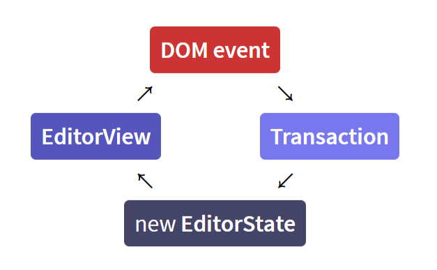
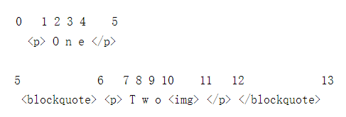

# ProseMirror 概述
ProseMirror is a toolkit for building rich-text editors on the web. It contains many low-level modules to make a highly customized web editor.

::TipBox{type="tip"}
参考：

* [《「译」ProseMirror 的由来》](https://www.xheldon.com/tech/ProseMirror.html)
* [《「译」ProseMirror 1.0 发布》](https://www.xheldon.com/tech/ProseMirror-1.0-release.html)
::

以前的 Web 编辑器其文档直接采用 HTML 结构，主要交互依靠含有 `contentEditable` 属性的元素，但是它处理用户交互的方式在一些边缘情况下行为不可控，很容易让开发者产生混乱。

::TipBox{type="tip"}
关于 ContentEditable 可以参考这篇文章 [*Why ContentEditable is Terrible*](https://medium.engineering/why-contenteditable-is-terrible-122d8a40e480) （[中译版](https://www.oschina.net/translate/why-contenteditable-is-terrible)）
::

在数据结构方面，ProseMirror 不是直接使用 DOM 的数据结构（虽然文档内容在网页中以 DOM 表示），而是用自己的数据结构来描述文档。ProseMirror 所使用的文档的数据结构虽然和 HTML 不同，但是也同样是采用**树形结构**表示文档结构，也同样具有标题、段落等**节点**，和链接、粗体等**标记**等语义化描述。

结构化与语义化的结合，便于我们制定规则，将文档数据解析渲染为 DOM 树显示在网页中，或解析转换为 Markdown 文本，或是任何格式。

ProseMirror 的数据结构中，既有树形的嵌套结构，也有扁平化的线性结构。它有一个根节点，包括了文档的其他子节点；然后对于块级节点，如段落节点，其内容是一些内联元素，它们是线性排列的，这样我们可以通过字符的「偏移量」在段落中对文本进行准确的定位（这比使用树形结构表示位置更简单）。由于数据结构是两种形式的结构，所以在文档中，一个位置是采用一个序列（整数）表示的，相当于一个路径，依次表示树形结构中各级的索引（最后一个表示在最深嵌套的节点中偏移了多少个字符），这样就可以描述清楚在文档中的具体的位置。

而且文档使用的是一个持久化的数据结构，在修改文档时会创建一个新的文档对象，而不是改变旧的对象，并创建一个位置映射，这样可以通过文档差异算法，按需更新 DOM 来显式新的内容，且可以实现文档历史记录。而且对于协同编辑很有利。

在更新文档时，符合**单向数据流**的架构，通过分发事务的方式来触发文档的状态更新，而不是直接响应用户的交互对文档进行修改。

而在交互方面，对文档所做的任何实际修改都是通过**捕获合适的浏览器事件，并转换为我们自己对这些修改的表述（描述和操作对文档的编辑）**，这样我们就可以通过将文档的编辑抽象为标准的行为，可以对文档有完全的控制。而且通过抽象标准化的方式来表示文档的修改，在**协同编辑**时可以准确、统一地处理多个用户的修改。例如：

* 通过监听按键事件，来捕获输入的文本以及退格、回车之类的操作 :bulb: 可以配置快捷键，它们被称为「命令」，除了可以通过用户按下键盘上相应的按键触发，还可以通过调用 `execCommand` 方法（传递相应的「命令」参数）以编程的方式来触发
* 通过监听剪贴板事件，来控制复制、剪切和粘贴行为
* 通过监听拖放事件，来控制文本编辑器的元素的拖拽行为
* 通过监听 [`CompositionEvent` 事件](https://developer.mozilla.org/zh-CN/docs/Web/API/CompositionEvent)，甚至可以控制使用输入法输入时的行为

::TipBox{type="tip"}
而且通过 `inputrules` 模块，可以通过匹配正在输入的内容，触发特定的行为，例如监测到输入 `##` 再按下空格键后，创建一个二级标题
::

## 四个核心模块
ProseMirror 由各种模块 modules 组成，它们就像乐高积木一样，用于完成特定的功能，只有将它们拼接起来才可以得到一个可用的编辑器。ProseMirror 并没有开箱即用的模块，这是它的「设计哲学」，将模块化和可定制化置于第一级，而不是易用性和简约性。

ProseMirror 有 4 个必要的模块：
* [`prosemirror-model` 模块](https://github.com/ProseMirror/prosemirror-model) 设置 Schema 以约束编辑器的可容纳的内容
* [`prosemirror-state` 模块](https://github.com/ProseMirror/prosemirror-state) 编辑器的（内容）状态
* [`prosemirror-view` 模块](https://github.com/ProseMirror/prosemirror-view) 用以搭建用户与编辑器状态（「后台」数据）的桥梁，一方面视图可以显示编辑器的数据，另一方面视图可以接受用户的交互指令
* [`prosemirror-transform` 模块](https://github.com/ProseMirror/prosemirror-transform) 用以实现文档的恢复、重做等功能，其 transaction 系统用于处理状态 state 的变更，使得历史记录功能和协同编辑成为可能

::TipBox{type="tip"}
创建一个功能完整的基础编辑器，即编辑器有视图呈现文本内容，并可以正常处理用户的交互指令，都需要使用这 4 个模块（虽然不是每次都要完整导入这 4 个模块，但是或多或少会以各种方式触及到这 4 个模块所提供的功::
能），例如`prosemirror-model` 模块用于定义文档的数据类型的约束 schema，可能我们是通过导入官方所提供的已定义好的 schema 来使用这个模块的一些 API。

::TipBox{type="tip"}
还有其他的一些由核心团队或社区成员开发维护的拓展模块，实现一些额外的功能，但是它们是可以被忽略或替代的
::

::TipBox{type="question"}
ProseMirror 的 [API 文档](https://prosemirror.net/docs/ref/)中问号 `?` 标记，如果用于参数，则表示该参数是可选参数；如果用于返回值上，则表示该函数的返回值并不一定是所指类型（例如可能在不符合条件时，返回 `null`）
::

:electric_plug: 在 ProseMirror 中会涉及多种 **interface 接口**，其概念和 TypeScript 里的接口类似（虽然 ProseMirror 的核心代码使用 JavaScript 编写）可以理解为一种对数据结构的约束，一般约束一个对象需要具有哪些属性和哪些方法（以及返回值），以便让 ProseMirror 的一些方法可以正确解析接收到的参数，特别对于一些自定义功能的实现（如插件）。

## 单向数据流
这 4 个模块通过一个单向数据流构建起编辑器，EditorView 视图展示编辑器的一个状态，并接受用户的交互指令。当用户修改操作页面触发 DOM 事件分发时 :arrow_right: 通过 Transaction 来生成新的 EditorState :arrow_right: 然后基于这个新的编辑器状态，通过 `updateState()` 方法来更新页面的视图



此外 ProseMirror 支持插件系统，用于扩展编辑器的功能，通过 plugin 的一些 hook （在编辑器的特定状态时间点执行的函数）可以控制 state 的行为。

## 位置系统
ProseMirror 除了将文档看作为树形嵌套结构，通过父子节点的关系来定位文档的位置；此外还自定义了一组规则，通过数值/索引来定位文档的位置（相当于通过扁平化的数据结构来描述文档）：

* 文档的开始是位置 `0`

* 进入和离开一个**非**叶子节点，索引值都会加 `1`

* 在「文本节点」每增加一个字符索引值都会加 `1`

* 叶子节点（不包含内容/子节点的，例如「图像节点」）索引值仅增加 `1`

例如编辑器的文档内容在页面相应的 DOM 结构如下

```html
<p>One</p>
<blockquote><p>Two</p></blockquote>
```

则每一个元素/节点及内容的定位如下



::TipBox{type="warning"}
要留意区别子节点的索引值，例如 `childCount`；整个文档范围下的索引值；以及相对节点内部/本地的索引值。
::