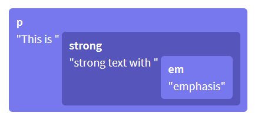
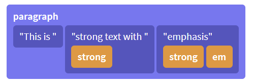
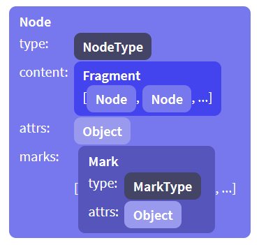

# ProseMirror Model 模块
ProseMirror is a toolkit for building rich-text editors on the web. It contains many low-level modules to make a highly customized web editor.

该模块主要用于定义文档内容的数据结构，即编辑器可以容纳哪些类型的内容。

## 文档结构
ProseMirror 文档的数据结构和 DOM 的**树形数据结构**类似，也是由一系列不同层级的节点构成。但也有所不同，例如在页面的 editable DOM 节点是 `<p>This is <strong>strong text with <em>emphasis</em></strong></p>`

DOM 树型数据结构如下：



对于一些「装饰性」的 inline HTML 行内标签，如 `<strong>` 等，ProseMirror 会将它们解析为样式标记 `mark` 作为节点的属性，简化了树形结构。

ProseMirror 树型数据结构如下：



每一个节点 `node` 都有指定类型，其包含的文本内容或子节点构成段落 `fragment`，以下是一个 `node` 实例对象的属性示意图：



### Node 类
该类的实例化对象在 ProseMirror 不同模块中都需要使用，由于它是编辑器的文档内容的基础。

有多种实例化 Node 类的方法：

* 可以调用 Node 类的静态方法 `Node.fromJSON(schema, json)` 来解析 JSON 对象获取一个 `node` 对象。该方法的各参数的说明如下：

  * 第一个参数 `schema` 是编辑器的数据约束规则
  * 第二个参数 `json` 是 JSON 对象，它包含了节点的内容

  根据给定的 schema 规则对 JSON 对象进行反序列化，返回一个相应的 `node` 实例对象

* 可以调用 `schema.node(type | NodeType, attrs, content | Node | [Node], marks)` 方法来创建一个 `node` 实例对象。

* 可以调用 `schema.nodeFromJSON(json)` 方法来解析 JSON 对象获取一个 `node` 对象。

  :package: 以上两个方法中 `schema` 是数据约束 `Schema` 类的实例对象，该方法的各参数的具体说明可参考文章的关于 `schema` 对象的部分。

* 可以调用 `nodeType.create(attrs, content | Node | [Node], marks)` 或 `nodeType.createChecked(attrs, content | Node | [Node], marks)` 或 `nodeType.createAndFill(attrs, content | Node | [Node], marks)` 方法来创建一个 `node` 实例对象。:package: 以上三个方法中 `nodeType` 是 `NodeType` 类的实例对象，该方法的各参数的具体说明可参考文章的关于 `nodeType` 对象的部分。

* 可以调用 `domParser.parse(dom, options)` 方法来解析 DOM 节点获取一个 `node` 对象。:package: 方法中 `domParser` 是 `DomParser` 类的实例对象，该方法的各参数的具体说明可参考文章的关于 `domParser` 对象的部分。

::TipBox{type="tip"}
在 ProseMirror 的[官方文档](https://prosemirror.net/docs/ref/)中，数据类型 `node` 是指 ProseMirror 节点，而 `dom.Node` 是指 DOM 节点
::

::TipBox{type="warning"}
`node` 实例对象属于持久化的数据，不应该直接修改它。所以在（应用事务 apply transaction）更新文档时，更改的部分是基于给定的内容来创建新的 `node` 实例对象，而旧的 `node` 实例依然保留指向旧文档的相应部分。
::

#### 节点对象
节点对象 `node` 包含多个字段/属性：

* `type` 属性：表示该节点的类型。该属性值是一个 `nodeType` 对象

  :package: 编辑器在实例化数据约束对象 `new Schema()` 时，根据[配置参数的 `nodes` 属性](https://prosemirror.net/docs/guide/#schema.node_types)（该属性值是一个对象，每一个属性的属性名称是节点名称，相应的属性值是该节点的配置对象），创建相应的 `nodeType` 实例对象 :question:，然后这些 `nodeType` 对象就可以用于标记/表示相应的节点 `node` 的类型。

  `nodeType` 对象包含多个字段/属性，以描述节点类型：

  * `name` 属性：节点类型的名称。该属性值是一个字符串。

  * `schema` 属性：该节点类型所属的数据约束对象（相应的节点是在哪个 `schema` 对象中进行定义的）。该属性值是一个 `schema` 对象

  * `spec` 属性：该节点类型所对应的节点配置参数。该属性值是一个对象，它需要符合一种数据约束/接口 `NodeSpec`

    :electric_plug: `NodeSpec` 接口需要满足以下数据结构的约束：

    * `content`（可选）属性：该节点允许包含哪些内容（即子节点）。

      该属性值是 [content expression 内容表达式](https://prosemirror.net/docs/guide/#schema.content_expressions)，是一个包含一些特殊符号的字符串，类似于正则表达式，以描述该节点可以容纳哪些内容或子节点。

      例如以下是一个 `schema` 实例对象（其中 `nodes` 属性就是用于为该编辑器的不同节点进行配置的）

      ```js
      const groupSchema = new Schema({
        nodes: {
          doc: {
            content: "paragraph+" // 允许 doc 节点的内容中包含 paragraph 节点（作为子节点）
          },
          paragraph: {
            content: "text*" // 允许 paragraph 节点的内容中仅包含文本节点
          },
          text: {} // 不允许其他子节点作为该节点的内容
        }
      })
      ```

      以上示例中，各节点的配置参数中 `content` 属性就是用于设置该节点可以容纳的内容和子节点。其中 `paragraph+` 的 `paragraph` 表示内容中包含「段落节点」作为子节点， `+` 符号是正则表达式中用于表示数量的特殊符号，表示节点的数量是一个或多个；其中 `text*` 的 `text` 表示内容中包含「文本节点」作为子节点，`*` 符号是正则表达式另一个表示数量的特殊符号，表示节点的数量是零个或多个。

      除了前面说到的 `+` 和 `*`，表示数量的特殊符号还有 `?` 表示零个或一个；还可以指定具体的数量，例如 `paragraph{2}` 表示内容正好包含两个「段落节点」；也可以指定一个范围，例如 `paragraph{1, 5}` 表示内容可以包含一到五个「段落节点」，或者 `paragraph{2,}` 表示内容可以包含两个或更多的「段落节点」。

      除了可以使用特殊符号来指定节点的数量，还可以使用特殊符号来指定节点类型的组合。content expression 内容表达式是一个字符串，其中可以包含一系列的不同类型节点，例如 `heading paragraph+` 表示该节点的内容是**先有**一个标题节点作为子节点，**然后有**一个或多个段落节点作为子节点，这两种类型的子节点有明显的先后要求。还可以使用 `|` 符号，例如 `(paragraph | blockquote)+` 表示子节点的类型在「段落节点」和「引文节点」之间二选一，而数量是一个或多个。

      ::TipBox{type="warning"}
      如果 ProseMirror 节点所对应的 DOM 节点是**块级节点**，则在实例化数据约束对象 `schema` 配置该节点的 `content` 属性时，应该允许**至少有一个子节点**，这样在页面渲染出来的 DOM 节点才不会因为内容为空而「坍缩」导致不易于编辑输入。
      ::

    * `marks`（可选）属性：该节点内允许使用哪些样式标记。

      该属性值是一个字符串，由在 `schema` 中注册的样式标记（在实例化 `schema` 对象时配置对象的 `marks` 属性）的名称构成，各样式标记之间**以空格间隔**，用以描述哪些样式标记可以应用于节点内。其中 `"_"` 符号表示允许使用**所有**的样式标记，而 `""` 空字符串表示**不允许**使用任何样式标记。

      ```js
      const markSchema = new Schema({
        nodes: {
          doc: {
            content: "block+"
          },
          paragraph: {
            group: "block",
            content: "text*",
            marks: "_" // 该节点内允许使用所有样式标记，即可以对「文本节点」使用 strong 和 em 标记
          },
          heading: {
            group: "block",
            content: "text*",
            marks: "" // 该节点内不允许使用任何样式标记
          },
          text: {
            inline: true
          }
        },
        // 在 schema 中注册两种样式标记
        marks: {
          strong: {},
          em: {}
        }
      })
      ```

      ::TipBox{type="tip"}
      如果节点可以包含行内类型的子节点，则默认允许使用所有样式标记，以为子节点添加样式；而其他类型的节点，则默认不允许任何样式标记。
      ::

    * `group`（可选）属性：该节点所属的组别。

      该属性值是一个字符串，用于指定该节点属于哪些组别，可以指定多个组别，组别名称之间用空格分隔。

      由于编辑器的文档是树形结构，节点之间存在**嵌套**关系，ProseMirror 需要精准控制各个节点内允许包含哪些内容，即哪些类型的节点作为当前节点的子节点，在 `schema` 对象中各节点的 `content` 属性进行设置，该属性值是一个字符串，如果该节点内允许多种类型的节点，则需要将这些节点的名称用空格间隔拼接为一个冗长的字符串。

      为了方便，可以先给「基础」节点（一般这些节点内只包含「文本节点」）指定组别，然后在更上一级节点的 `content` 属性中，**使用组别名称来表示这一类的节点**。

      ```js
      const markSchema = new Schema({
        nodes: {
          doc: {
            content: "block+" // 相当于 (paragraph | blockquote)+
          },
          paragraph: {
            group: "block", // 将「段落节点」指定到 block 组
            content: "text*"
          },
          heading: {
            group: "block", // 将「标题节点」指定到 block 组
            content: "text*"
          },
          blockquote: {
            group: "block", // 将「引文节点」指定到 block 组
            content: "block+" // 这里类似「循环引用」，虽然自身指定为 block 组，其内容也可以有 block 组的节点，即编辑器内引文中可以嵌套引文
          },
          text: {
            inline: true
          }
        }
      })
      ```

    * `inline`（可选）属性：表示该节点是否为行内类型。

      该属性值是一个布尔值。对于 `text` 「文本节点」该属性会默认设置为 `true`

    * `atom`（可选）属性：表示该节点是否需要以一个整体/原子对待

      该属性值是一个布尔值。

      ::TipBox{type="tip"}
      节点作为一个整体对待，就是不能编辑该节点里面的内容，在编辑器的视图中只能整体加入或整体移除。这样的节点在 ProseMirror 的位置计数系统中只算 `1` 个单位。
      ::

    * `attrs`（可选）属性：该节点所拥有的 attributes

      可以为节点或样式标记设置 attributes 以添加额外的信息，在 `schema` 实例对象各节点的 `attrs` 属性中进行设置，其属性值需要是一个「纯对象」 plain object（可以进行 JSON 反序列化的对象）

      ```js
      const markSchema = new Schema({
        nodes: {
          doc: {
            content: "block+"
          },
          paragraph: {
            group: "block",
            content: "text*",
            marks: "_"
          },
          heading: {
            content: "text*",
            attrs: { // 为「标题节点」设置 attribute 以添加额外的信息
              level: { // 为「标题节点」添加 level 属性，默认值是 1，也可以在创建「标题节点」时指定其他值
                default: 1
              }
            }
          }
          text: {inline: true}
        }
      })
      ```

    * `selectable`（可选）属性：该节点是否允许选中，以创建一个 `nodeSelection` 节点选区。

      该属性值是一个布尔值。对于非「文本节点」默认值是 `true`，即可以选中

    * `draggable`（可选）属性：该节点是否允许拖拽移动（在非选中的情况下）。

      该属性值是一个布尔值，默认为 `false`

    * `code`（可选）属性：该节点内是否包含代码文字。

      该属性值是一个布尔值，由于代码文字的处理方式不同（格式化的方式不同，例如需要保留空格和缩进），所以对于包含代码的节点需要设置该属性。

    * `whitespace`（可选）属性：表示如何解析空格符号。

      该属性值可以是 `"pre"` 或 `"normal"` 之一。如果属性值是 `"normal"`（默认值）则 `domParser` 对象在解析节点内的空格，会用空格替代换行符等类似的符号，而多个连续的空格会「压缩」为一个空格。如果属性值是 `"pre"` 则保留空格等格式符号（对于设置了 `code` 属性为 `true` 的节点，`whitespace` 属性默认会设置为 `"pre"` 值）

    * `defining`（可选）属性：该节点的**父节点**是否为一个重要的节点（有特殊的定义/含义，需要在复制粘贴时保留下拉）。

      该属性值是一个布尔值，默认为 `false` 即该节点的父节点并不具有特殊的含义，因此当该节点内容被删除后，该节点也会被移除；而如果该属性值为 `true` 则表示该节点的父节点有特殊的含义，则该节点的内容被移除，或在复制粘贴时整体被替换，会保留该节点，用以包裹插入的新的内容。

      例如对于只包含文本的「段落节点」，将其中的文本内容删除后，该段落节点也会被移除；但是对于 list item 「列表项节点」，它的父节点是列表节点具有特殊意义，所以当列表项的内容被删除后，「列表项节点」依然保留，用以包裹再输入的内容。而如果复制该「列表项节点」的内容时，则在粘贴时应该要保留该节点，而不是将其转换为普通的「段落节点」

    * `isolating`（可选）属性：该节点是否为独立隔离的节点。

      该属性值是一个布尔值，如果为 `true`（默认值为 `false`）表示节点是独立隔离的，即在节点内部的边缘使用删除键或「提升」组合键（按 `Shift + Tab` 将缩进的文本进行提升）无法实现预期的效果，因为该节点是这些编辑操作的边界，**操作无法「穿透」该节点**。常见的一个独立隔离节点是 table cell 「单元格节点」，当单元格的内容清空后，再使用删除键也无法跳转到上一个单元格。

    * `toDom`（可选）属性：将该节点转换为 DOM 元素。

      该属性值是一个函数 `fn(node)` 入参是该节点对象 `node`，（ProseMirror 通过 `DOMSerializer.fromSchema(schema)` 方法所创建的）DOM 生成器/序列化器会调用该函数，以将文档中的相应节点转换为页面的一个 DOM 元素。

      返回值可以是一个 DOM 元素，或一个用于描述 DOM 元素的数组，该数组需要符合一种数据约束/接口 `DOMOutputSpec`

      :electric_plug: `DOMOutputSpec` 接口需要满足以下数据结构的约束以描述一个 DOM 元素，可以有多种形式：

      * 可以是一个字符串，以表示页面的内容是由「文本节点」生成的

      * 可以是一个 DOM 元素，就是表示其自身

      * 可以是一个对象，具有属性 `dom`，该属性值是一个 DOM 元素，和（可选）属性 `contentDOM`，该属性值也是一个 DOM 元素，以指定文档节点的内容渲染的位置

      * 可以是一个数组：
        * 第一个元素是 DOM 元素的名称（可以带有命名空间 URL 的前缀或者空格）
        * 第二个元素可以是一个「纯对象」 plain object 以表示添加到 DOM 元素上的 attribute；也可以不是一个「纯对象」，则它表示该 DOM 元素的子元素，那么它需要满足 `DOMOutputSpec` 接口（相当于一个嵌套关系，用于描述子元素）的约束；也可以是数字 `0` 称为 hole 一个占位符，以表示子节点插入到 DOM 元素内
        * 第三个元素，只有在第二个元素不为 `0` 时才有效，表示子元素，它需要满足 `DOMOutputSpec` 接口的约束

        :no_entry_sign: 对于叶子节点，不需要第二个元素，因为它们不能包含内容

        ```js
        const schema = new Schema({
          nodes: {
            doc: {
              content: "paragraph+"
            },
            paragraph: {
              content: "text*",
              toDOM(node) {
                return ["p", 0] // 表示「段落节点」转换为 <p> 元素，而节点的内容直接插入到 <p> 元素内
              }
            },
            article: {
              content: "paragraph+",
              toDom(node) {
                return ["article", {class: "target"}, 0] // 表示「文章节点」转换为 <article> 元素，并添加 target 类名，而节点的内容直接插入到 <article> 元素内
              }
            },
            div: {
              content: "paragraph+",
              toDOm(node) {
                return ['div', {style:'color:red'}, ['p', 0]] // 表示「div 节点」转换为 <div> 元素，并添加样式，其中还有一个子元素 <p>，而节点的内容是在这个 <p> 元素内
                // 🚫 如果返回的数组是 ['div', {style:'color:red'}, ['p'], 0] 则这是错误的写法
                // 因为 0 是表示放置节点内容（子元素）的位置，这和 <p> 作为子元素的设定冲突了
              }
            }
            text: {}
          }
        })
        ```

      ::TipBox{type="tip"}
      对于 `text` 「文本节点」**不**应该配置该属性，因为 ProseMirror 会将「文本节点」自动生成为页面的文本内容。
      ::

    * `parseDOM`（可选）属性：将 DOM 元素解析为文档节点的一些规则。

      该属性值是一个数组，其中每个元素都是一个对象表示一个解析规则（这些对象需要符合一种数据约束/接口 `ParseRule`）。ProseMirror 会利用这个对象所设定的规则，并通过 `DOMParser.fromSchema(schema)` 方法创建一个 DOM 解析器，以将符合特定规则的 DOM 元素解析为文档的节点。

      :electric_plug: `ParseRule` 接口需要满足以下数据结构的约束，以描述如何将 DOM 元素解析为 ProseMirror 的节点或样式标记：

      * `tag`（可选）属性：一个 CSS 选择器，以描述需要匹配哪个 DOM 元素。

        该属性值是一个字符串

        ```js
        const schema = new Schema({
          nodes: {
            paragraph: {
              content: "inline*",
              parseDOM: [{tag: "p"}], // 为「段落节点」设置一个 DOM 解析规则，将 <p> 元素解析为该类型的文档节点
            },
          },
          marks: {
              em: { // 为「强调样式」设置 3 个 DOM 解析规则
                parseDOM: [
                  {tag: "i"}, // 将 <i> 元素转换为该类型的样式标记
                  {tag: "em"}, // 将 <em> 元素转换为该类型的样式标记
                  {style: "font-style=italic"} // 将含有 style="font-style=italic" 内联样式的 DOM 元素转换为该类型的样式标记
                ],
              },
          }
        })
        ```


      * `namespace`（可选）属性：表示 DOM 元素需要符合的命名空间。

        该属性值是一个字符串或 `null`（表示没有命名空间）

        在解析 DOM 时，会先进行命名空间的匹配，如果符合再进行 `tag` 属性所设置的 CSS 选择器匹配。

        ::TipBox{type="tip"}
        需要设置了上一个属性 `tag` 时，该属性才起作用。
        ::

      * `style`（可选）属性：通过特定的 CSS 内联样式属性来匹配 DOM 元素。

        该属性值是一个字符串，表示希望匹配的 DOM 元素含有的特定样式属性，如果同时希望该内联样式属性具有特定的值，字符串可以采用 `"property=value"` 的形式。

        ::TipBox{type="tip"}
        通过 CSS 内联样式匹配的 DOM 元素一般只会解析为样式标记，而不会解析为文档节点。
        ::

        ```js
        const schema = new Schema({
          marks: {
              em: { // 为「强调样式」设置 3 个 DOM 解析规则
                parseDOM: [
                  {tag: "i"}, // 将 <i> 元素转换为该类型的样式标记
                  {tag: "em"}, // 将 <em> 元素转换为该类型的样式标记
                  {style: "font-style=italic"} // 将含有 style="font-style=italic" 内联样式的 DOM 元素转换为该类型的样式标记
                ],
              },
          }
        })
        ```

        ::TipBox{type="tip"}
        对于复杂的 DOM 元素匹配，可以通过配置 `getAttrs` 属性。
        ::

      * `priority`（可选）属性：设置解析规则的优先级顺序。

        该属性值是一个数值，数值的大小表示解析器匹配该规则的优先级先后顺序，默认值为 `50`。

        ::TipBox{type="tip"}
        这个解析规则的优先级是应用于 `schema` 内部所创建的解析器，如果自己手动创建的 DOM 解析器，则节点的解析规则的优先级顺序按照它们在属性 `parseDOM` 数组的顺序。
        ::

      * `consuming`（可选）属性：设置当该规则被匹配到以后，是否消耗「机会」。

        该属性值是一个布尔值，默认为 `true` 表示匹配到该规则后，停止尝试去匹配余下的规则；如果为 `false` 则依然尝试去匹配并执行匹配到的余下的规则。

      * `context`（可选）属性：用以设置该规则要满足的上下文。

        ::TipBox{type="tip"}
        因为规则中的属性 `tag`、`namespace`、`style` 等都只是针对要匹配的 DOM 元素的，而 `context` 属性则可以用于限制父节点类型（相当于限制所匹配 DOM 元素需要在哪些父元素内）。
        ::

        该属性值是字符串，可以由一个或多个节点或 `group` 名称构成，结尾有一个 `/` 斜线或两个 `//` 斜线。例如：

        * `paragraph/` 表示该规则匹配的 DOM 元素所对应的文档节点的父节点需要是 `paragraph` 「段落节点」类型

        * `blockquote/paragraph/` 表示该规则匹配的 DOM 元素所对应的文档节点的父节点需要是 `paragraph` 「段落节点」类型，而且该「段落节点」需要在 `blockquote` 「引文节点」中

        * `section//` 表示该匹配的 DOM 元素所对应的文档节点的祖先节点需要是 `section` 「章节节点」类型。其中双斜线表示可以嵌套多级，因此该规则表示只要满足祖先节点为 `section` 即可

        * `blockquote/|list_item/` 表示该规则匹配的 DOM 元素所对应的文档节点的父节点可以是 `blockquote` 「引文节点」或 `list_item` 「列表项」节点之一

      * `node`（可选）属性：当该规则匹配时，将 DOM 元素解析为哪一种类型的文档节点。

        该属性值是一个字符串，表示文档节点的类型。

        ::TipBox{type="tip"}
        需要设置了属性 `tag` 时，该属性才起作用。
        ::

        ::TipBox{type="warning"}
        对于一个解析规则 `node`、`mark`、`ignore` 这三个属性只能设置其中一个（当然也可以一个都**不**设置，因为它们是可选属性）
        ::

      * `mark`（可选）属性：当该规则匹配时，将 DOM 元素解析为哪一种类型的样式标记以包裹住内容。

        该属性值是一个字符串，表示文档样式标记的类型。

      * `ignore`（可选）属性：是否忽略与当前规则匹配的 DOM 元素

      * `closeParent`（可选）属性：是否将与当前规则匹配的 DOM 元素的父元素「关闭」，相当于将匹配的 DOM 元素「抽离出来」，即让其「提升」到与父元素同级别。

        该属性值是一个布尔值。

        ::TipBox{type="tip"}
        相当于将父元素所对应的节点分割成两个节点，具体的例子可以查看[这里](https://discuss.prosemirror.net/t/paste-paragraph-containing-br/2760/3)。
        ::

      * `skip`（可选）属性：是否忽略与当前规则匹配的 DOM 元素。

        该属性值是一个布尔值，即使为 `true` 忽略 DOM 元素，但也会解析其内容（作为文档的内容）

      * `attrs`（可选）属性：与当前规则匹配的 DOM 元素解析后生成的节点或样式标记所拥有的 attribute。

        该属性值是一个对象，是为该类型的节点或样式标记添加的额外信息

        ::TipBox{type="tip"}
        如果该解析规则中提供了 `getAttrs` 属性，优先通过该属性所设置的方法来获取节点或样式标记所拥有的 attribute。
        ::

      * `getAttrs`（可选）属性：用于获取与当前规则匹配的 DOM 元素解析后生成的节点或样式标所拥有的 attribute。

        该属性值是一个函数 `fn(dom.Node | string)` 入参值可以是两种类型，因为该函数除了可以获取 attribute，还可以作为进行更细致、更复杂的 DOM 元素匹配，如果希望基于 DOM 元素本身进行匹配，例如 DOM 元素的标签类型，则入参是 `dom.Node` DOM 元素；如果希望基于 DOM 元素的内联样式属性进行匹配，则入参是字符串，它是 DOM 元素所拥有的内联样式值。

        该函数的返回值可以有多用类型：

        * 可以返回一个对象，表示节点或样式标所拥有的 attribute

        * 可以返回 `null` 或 `undefined` 表示节点或样式标**没有** attribute

        * 可以返回 `false` 表示该 DOM 元素无法满足规则，无法匹配

      * `contentElement`（可选）属性：用于指定与当前规则匹配的 DOM 元素的内容放置在编辑器页面的哪个位置。

        如果解析 DOM 元素获得的文档节点**不是**叶子节点，那么默认情况下节点的内容就是 DOM 元素的内容。但是如果希望将 DOM 元素的内容放置在节点内的特定地方，可以配置该属性。

        该属性值可以是一个字符串，表示 CSS 选择器，这样通过 ProseMirror 解析的 DOM 元素（转换为文档节点）再展现回编辑器页面上时，DOM 元素的内容就会放置在编辑器页面上这个 CSS 选择器指定的元素（子孙元素）内；该属性值也可以是一个函数 `fn(dom.Node)` 入参是当前需要匹配解析的 DOM 元素，返回值也是一个 DOM 元素，不过这个 DOM 元素是指在编辑器页面的，作为内容的容器。

      * `getContent`（可选）属性：用于设置与当前规则匹配的 DOM 元素解析后生成的节点的内容。

        该属性值是一个函数 `fn(dom.Node, schema)` 第一个参数是当前需要匹配解析的 DOM 元素，第二个参数 `schema` 是编辑器的数据约束对象。默认情况下会将 DOM 元素的内容作为节点的内容，但是如果设置了该属性，就会调用该属性所配置的函数，并以该函数的返回值作为节点的内容。

        该函数的返回值是一个 `fragment` 对象。

      * `preserveWhitespace` 属性：用于决定如何解析 DOM 元素的内容中的空格键。

        该属性值可以是以下三个值之一：

        * `true` 表示完全保留空格键，但是换行符等会替换为空格键

        * `false` 表示可以对空格键进行简化，即多个相连的空格键会「坍缩」为一个

        * `"full"` 表示完全保留空格键和换行符


    * `toDebugString`（可选）属性：用于定义该类型的节点在调试时输出哪些信息。

      该属性值时一个函数 `fn(node)` 入参是该类型的节点对象，返回值是一个字符串。

  * `contentMatch` 属性：该节点类型的内容表达式 content expression 的匹配情况。

    该属性值是一个 `contentMatch` 对象。

    :package: `ContentMatch` 类的实例用于表示节点的内容表达式 content expression 的匹配情况，也可以用于寻找是否有其他的匹配情况，或者用于判断一个给定的位置是否可以作为该类型的节点的有效结尾。

    该类的实例对象具有以下属性/方法：

    * `validEnd` 属性：表示当前的匹配状态（内容表达式）是否可以确保节点是完整的（即有一个有效的结尾）

      该属性值为一个布尔值

    * `matchType(type)` 属性：当前的匹配状态（内容表达式）是否适合给定的节点类型 `type`，如果适合就返回一个 `contentMatch` 对象

    * `matchFragment(frag, start, end)` 属性：当前的匹配状态（内容表达式）是否适合给定的段落 `fragment` 的指定范围，如果适合就返回一个 `contentMatch` 对象

    * `defaultType` 属性：获取匹配位置中第一个满足条件的节点类型 `nodeType` 对象 :question:

    * `fillBefore(after, toEnd, startIndex)` 方法：通过在段落前面填充特定的节点，以让该段落所在的节点可以与内容表达式相匹配。

      各参数的具体说明如下：

      * 第一个参数 `after`：一个段落 `fragment` 对象，需要查看它是否与内容表达式相匹配

      * 第二个（可选）参数 `toEnd`：一个布尔值（默认为 `false`），如果为 `true` 则表示新创建的 `fragment` 需要匹配完全内容表达式（匹配到结尾）

      * 第三个（可选）参数 `startIndex`：一个数值，表示从哪里开始匹配 :question:

      如果传入的 `after` 段落对象无法与内容表达式匹配，则尝试在它前面添加一些节点，让这个 `fragment` 可以满足内容表达式，并返回**由插入节点构成的段落对象**；如果原来传入的段落对象已经满足内容表达式，即无需在前面添加节点，则返回一个空段落对象

    * `findWrapping(target)` 方法：寻找包裹给定节点类型 `target` 的节点类型，让构成的文档结构满足当前匹配状态（内容表达式），相当于构建一个嵌套结构，其中给定的 `target` 节点类型是作为子节点。该方法返回值视情况而定，如果传入的节点已经满足了内容表达式，则返回 `null` 因为不需要包裹的节点；如果寻找到适合的包裹的节点类型，则返回一个由这些满足条件的节点类型对象构成的数组 :question:

    * `edgeCount` 属性：The number of outgoing edges this node has in the finite automaton that describes the content expression. :question:

      该属性值是数值

    * `edge(n)` 方法：Get the _n_​th outgoing edge from this node in the finite automaton that describes the content expression. :question:

      返回一个对象，含有 `type` 属性，表示匹配的节点类型，`next` 属性是一个 `contentMatch` 对象

  * `inlineContent` 属性：该节点类型中是否包含行内节点

  * `isBlock` 属性：该节点类型是否为块级类型

  * `isText` 属性：该节点类型是否为「文本节点」

  * `isInline` 属性：该节点类型是否为行内类型

  * `isTextblock` 属性：该节点类型是否为仅包含「文本节点」的块级类型

  * `isLeaf` 属性：该节点类型是否为叶子节点，即它不包含内容/子节点。

  * `isAtom` 属性：该节点类型是否为需要独立对待的节点（不能直接修改其内容）

  ::TipBox{type="tip"}
  以上这几个以 `is` 为前缀的属性其值都是布尔值
  ::

  * `whitespace` 属性：该节点类型的内容中空格键的处理方式。

    该属性值可以是 `"pre"` 或 `"normal"`

  * `hasRequiredAttrs()` 方法：该节点类型是否有必须指派的 attribute 属性的值（对于那些没有设置默认值的 attribute 在创建节点时，需要指定 attribute 的值，否则会报错）

  * `create(attrs, content, marks)` 方法：创建一个该类型的节点。

    各参数的具体说明如下：

    * 第一个（可选）参数 `attrs`：这是一个对象，用于设置节点的 attributes。如果该类型的节点没有必须要指派的 attribute 属性，则可以传递 `null` 表示使用默认值来作为该节点的各种 attribute 的值。

    * 第二个（可选）参数 `content`：可以是一个 `fragment` 对象，或是一个 `node` 节点对象，或是一个由一系列的节点对象构成的数组，也可以是 `null`。

      ::TipBox{type="tip"}
      这些节点是作为内容（即子节点）。
      ::

    * 第三个（可选）参数 `marks`：可以是一个由一系列的样式标记对象构成的数组，为节点添加样式标记；也可以是 `null`，表示不使用样式标记。

  * `createChecked(attrs, content, marks)` 方法：类似于 `create(attrs, content, marks)` 方法，也是用于创建一个该类型的节点。

    不过该方法会先对入参 `content` 进行检查，看这些节点是否满足内容表达式的约束，如果满足则创建并返回一个节点；如果不满足就抛出一个错误。

  * `createAndFill(attrs, content, marks)` 方法：类似于 `create(attrs, content, marks)` 方法，也是用于创建一个该类型的节点。

    不过该方法会对入参 `content` 进行检查，看看是否需要在前面或后面增添一些节点，以满足内容表达式。如果可以创建一个满足条件的节点，则返回该节点（一般都可以通过该方法成功创建节点，即使我们为参数 `content` 传入的是 `null` 或 `Fragment.empty` 空的内容，因为补充填充的节点都一般是可以创建的，所以最后都可以拼凑出子节点让它们满足内容表达式）；如果无法创建节点，则返回 `null`

  * `validContent(content)` 方法：查看给定的段落是否满足该节点类型的内容表达式的约束

    该方法返回一个布尔值

  * `allowMarkType(markType)` 方法：查看给定的样式标记类型是否为该节点类型中允许使用的，入参 `markType` 是一个样式标记类型对象

    该方法返回一个布尔值

  * `allowsMarks(marks)` 方法：查看给定的一系列样式标记是否可以用于节点中，入参 `marks` 是一个由一系列样式标记对象构成的数组

    该方法返回一个布尔值

  * `allowedMarks(marks)` 方法：从给定的一系列样式标记中清除掉不允许用于该节点类型中的样式标记，入参 `marks` 是一个由一系列样式标记对象构成的数组，并返回剩下的样式标记构成的一个数组。


* `attrs` 属性：该节点拥有的 attributes。该属性值是一个对象。

* `content` 属性：该节点所包含的内容/子节点。该属性值是一个 `fragment` 对象。

* `marks` 属性：应用到该节点的一系列样式标记。该属性值是一个由一系列样式标记对象构成的数组。

* `text`（可选）属性：这是「文本节点」所具有的属性，该属性值是一个字符串，是该节点的内容。

* `nodeSize` 属性：该节点的大小（这是 ProseMirror 自定义的规则，通过数值来定位文档节点位置，这里的大小就是采用这套系统表示段落的大小）。该属性值是一个数值，对于「文本节点」该数值为内容的字符数量；对于叶子节点该数值是 `1`；对于非叶子节点，该数值是 `结束位置 - 开始位置 + 2`

* `childCount` 属性：该节点拥有的子节点数量。

* `child(index)` 方法：获取该节点特定位置的子节点。如果入参 `index` 的位置超过节点的位置范围，则抛出一个错误。

* `maybeChild(index)` 方法：获取该节点特定位置的子节点，如果存在则返回该子节点。

* `forEach(fn)` 方法：该节点的每个子节点分别执行给定的回调函数 `fn`，该函数 `fn(node, offset, index)` 依次传递子节点对象、该子节点偏离父节点的大小、该子节点在文档的定位。

* `nodesBetween(from, to, fn, startPos)` 方法：在该节点的给定范围内的子节点分别执行给定的回调函数 `fn`，其中第一、二个参数是位置数值，用于指定范围；第三个参数是回调函数 `fn(node, pos, parent, index)` 如果该函数返回 `false` 则该子节点的所有后代节点都不执行该回调函数，否则内嵌的后代节点递归继续执行该函数；第四个参数是手动设定开始计数的位置。

* `descendants(fn)` 方法：为该节点的后代节点设置回调函数 `fn(node, pos, parent, index)` 该函数返回 `false` 则该子节点的所有后代节点都不执行该回调函数。

* `textContent` 属性：将该节点内的所有文本内容合并为一个字符串。

* `textBetween(from, to, blockSeparator, leafText)` 方法：获取特定范围内的文本。

  各参数说明如下：

  * 第一个参数 `from`：开始位置

  * 第二个参数 `to`：结束的位置

  * 第三个（可选）参数 `blockSeparator`：一个字符串，作为块级节点的分隔符，如果抽取的文本来自两个块级节点，则文本之间会插入一个分隔符

  * 第四个（可选）参数 `leafText`：一个字符串或一个返回字符串的函数 `fn(node)` 入参时叶子节点，如果叶子节点不是「文本节点」，则在抽取文本时，使用该参数设定的内容替代。

* `firstChild` 属性：获取第一个子节点。如果没有则返回 `null`

* `lastChild` 属性：获取最后一个子节点。如果没有则返回 `null`

* `eq(otherNode)` 方法：比较给定的节点 `otherNode` 和当前节点是否相同，表示文档中的同一个内容。

* `sameMarkup(otherNode)` 方法：比较两个节点是否具有相同的样式标记（包括样式标记的类型和所需要含有的 attribute），返回一个布尔值。

* `hasMarkup(type, attrs, marks)` 方法：判断该节点是否含有指定「外观」。

  ::TipBox{type="tip"}
  这里的 markup 「外观」是指节点具有指定的节点类型、特定的 attributes，以及一系列样式标记
  ::

  各参数的具体说明如下：

  * 第一个参数 `type`：指定节点类型，它是一个 `nodeType` 对象

  * 第二个（可选）参数 `attrs`：是一个对象，描述节点应该具有的 attributes

  * 第三个（可选）参数 `marks`：一个由一系列 `mark` 对象构成的数值

* `copy(content)` 方法：使用给定的内容 `content` 创建一个节点，且与当前的节点具有相同的「外观」（即具有相同的节点类型、相同的 attributes，以及一系列相同的样式标记）。（可选）参数 `content` 是一个 `fragment` 对象，也可以是 `null`（默认值）则创建一个内容为空的节点。

* `cut(from, to)` 方法：按照给定的范围来拷贝内容，并用这些内容来创建一个新的节点，如果不指定第二个（可选）参数 `to`，则默认一直拷贝到节点末尾的内容。

* `slice(from, to)` 方法：根据给定的范围来创建一个 `slice` 对象。

  :package: `Slice` 类表示文档的一个片段。

    > :bulb: `slice` 片段和 `fragment` 段落类似，都是表示文档的一部分，但是两者又有所不同。`fragment` 段落是由完整的一系列节点构成；而 `slice` 可以包含**不完整**的节点，因为它描述的内容是基于数值的（这是 ProseMirror 自定义的规则，通过数值来定位文档的位置）。`slice` 片段会更常见，因为用户在交互时，如通过复制粘贴，更常产生的是 `slice` 片段，而不一定是包含完整节点的段落。

    该类有一些静态方法：

    * `Slice.fromJSON(schema, json)` 方法：根据编辑器的数据结构约束，将给定的 JSON 对象转换为一个 `slice` 片段对象

    * `Slice.maxOpen(fragment, openIsolating)` 方法：基于给定的 `fragment` 段落对象创建一个 `slice` 片段对象，而且让两侧的节点尽可能地「开放」。其中第二个（可选）参数 `openIsolating` 是一个布尔值（默认为 `true`），表示是否让两侧「开放」。

    * `Slice.empty` 属性：获取一个空的 `slice` 片段对象

    通过以下方法实例化一个片段对象 `slice`

    ```js
    new Slice(content, openStart, openEnd)
    ```

    各参数的具体说明如下：

    * 第一个参数 `content`：一个 `fragment` 对象

    * 第二个参数 `openStart`：段落左侧节点内的位置

    * 第三个参数 `openEnd`：段落右侧节点内的位置

    可以将 `slice` 片段理解为 `fragment` 片段的「进阶」详细版本，它记录了段落两端的节点的具体（相对于段落）位置/深度，所以可以用来描述一个「开放」的段落（两端可以不包含完整的节点）。

    `slice` 片段对象具有以下属性/方法：

    * `content` 属性：该片段的内容，是一个 `fragment` 对象

    * `openStart` 属性：该片段的开始位置/深度

    * `openEnd` 属性：该片段的结束位置/深度

    * `size` 属性：片段的长度（按照如果将该片段插入文档后，文档增加多少个索引值来计算）

    * `eq(otherSlice)` 方法：比较给定的片段与当前片段是否相同

    * `toJSON()` 方法：将该片段转换为 JSON 对象

* `replace(from, to, slice)` 方法：用给定的片段 `slice` 替换文档指定的范围。

  ::TipBox{type="warning"}
  由于 `slice` 片段两端可能是「开发」的，所以在替换插入到文档中时，需要保证这个片段与插入位置的前后节点是「相容」的，且需要满足父节点的约束，否则会抛出 `replaceError` 错误。
  ::

* `nodeAt(pos)` 方法：寻找在给定位置后的节点

* `childAfter(pos)` 方法：寻找在给定的偏移量（相对于父节点）之后的子节点。

  如果寻找到子节点，则返回一个对象，具有属性 `node` 表示子节点，属性 `index` （文档的）索引值，属性 `offset` （先对于父节点）偏移量

* `childBefore(pos)` 方法：寻找在给定的偏移量（相对于父节点）之后的子节点。

* `resolve(pos)` 方法：解析给定位置的上下文情况，返回一个 `resolvePos` 对象

  :package: `ResolvePos` 类是对文档特定索引值进行解析后，获得的相关信息。通过节点的方法 `node.resolve(pos)` 获得该类的实例。

  `resolvePos` 对象具有以下的属性/方法：

  * `pos` 属性：被解析的位置，是一个数值

  * `depth` 属性：该位置相对于根节点的深度（相当于把位置信息转换为树形结构的深度），即该位置所在的节点的**父节点**的深度。

  * `parentOffset` 属性：该位置偏移父节点多远距离。

  * `parent` 属性：该位置所属节点的父节点

  * `doc` 属性：该位置所在的文档的根节点

  * `node(depth)` 方法

### Fragment 类
该类的实例化对象 `fragment` 是一个包含着一系列节点对象的数组，一般用作于节点的 `content` 属性的值，表示该节点包含哪些内容，这些子节点就构成了文档的段落。

该类提供了四种静态方法来进行实例化，获取一个 `fragment` 对象：

* `Fragment.fromJSON(schema, value)` 方法：基于传入的 JSON 对象进行反序列化，获取一个 `fragment` 对象。第一个参数 `schema` 是编辑器的数据约束，第二个（可选）参数 `value` 是 JSON 对象（一般是通过 `fragment.toJSON()` 获取的）。

* `Fragment.fromArray(array)` 方法：基于传入的一组节点，获取一个 `fragment` 对象。入参 `array` 是一个由一系列节点对象 `node` 构成的数组。

  ::TipBox{type="tip"}
  如果入参数组中，相邻的「文本节点」具有相同的样式标记，它们会被连接为一个节点
  ::

* `Fragment.from(nodes)` 方法：这是一个更通用的方法，入参 `nodes` 可以是一个 `fragment` 对象，也可以是一个 `node` 节点，也可以是一个由一系列 `node` 节点构成的数组，然后创建一个相应的 `fragment` 对象。

  ::TipBox{type="tip"}
  如果入参是 `null` 则返回一个空的 `fragment` 对象
  ::

* `Fragment.empty` 属性：获取一个空的 `fragment` 对象，表示没有包含任何节点。

  ::TipBox{type="tip"}
  一般该对象是共用的，指向同一个内存地址，而不是创建一大堆空 `fragment`
  ::

::TipBox{type="warning"}
它和 `node` 节点对象一样，属于持久化的数据，不应该直接修改它，只能通过该类所提供的静态方法来创建新的 `fragment` 对象。
::

#### 段落对象
段落对象 `fragment` 包含多个字段/属性：

* `size` 属性：该段落的大小（这是 ProseMirror 自定义的规则，通过数值来定位文档节点位置，这里的大小就是采用这套系统表示段落的大小，是段落的 `结束位置 - 开始位置 + 2` :question:）

  该属性值是数值

* `nodesBetween(from, to, f, nodeStart)` 方法：对给定范围内的段落的节点执行回调函数

  各参数说明如下：

  * 第一个参数 `from`：开始位置（相对于该段落而言）

  * 第二个参数 `to`：结束的位置（相对于该段落而言）

  * 第三个参数 `f`：回调函数 `fn(node, start, parent, index)` 每个节点会分别调用该函数，并依次传入节点本身、开始的位置、其父节点、索引值（这里的[索引值](https://prosemirror.net/docs/guide/#doc.indexing)是 ProseMirror 自定义的规则通过数值来定位文档节点位置）。:bulb: 如果该函数返回 `false` 时，就会停止对该节点的子孙节点调用该函数。

  * 第四个（可选）参数 `nodeStart`：设置段落的开始位置 :question:，默认值是 `0`

* `descendants(f)` 方法：对段落中的节点及其后代节点依次递归给定的回调函数，入参 `f` 是回调函数 `fn(node, pos, parent)` 依次传入节点本身、节点的位置、父节点，直到回调函数返回 `false` 才停止对其中的后代节点进行调用。

* `textBetween(from, to, blockSeparator, leafText)` 方法：抽取出指定范围的文本。

  各参数说明如下：

  * 第一个参数 `from`：开始位置

  * 第二个参数 `to`：结束的位置

  * 第三个（可选）参数 `blockSeparator`：一个字符串，作为块级节点的分隔符，如果抽取的文本来自两个块级节点，则文本之间会插入一个分隔符

  * 第四个（可选）参数 `leafText`：一个字符串或一个返回字符串的函数 `fn(node)` 入参时叶子节点，如果叶子节点不是「文本节点」，则在抽取文本时，使用该参数设定的内容替代。

* `append(otherFragment)` 方法：将其他的段落合并到尾部，返回一个新的段落。

* `cut(from, to)` 方法：按照给定的范围来获取当前段落的部分，返回一个相应的新段落。

* `replaceChild(index, node)` 方法：用给定的节点替换指定位置的节点，并返回一个新的段落。

* `eq(otherFragment)` 方法：判断给定的段落与当前的段落是否相等，返回一个布尔值。

* `firstChild` 属性：获取段落中第一个节点，如果为空则返回 `null`

* `lastChild` 属性：获取段落中的最后一个节点，如果为空则返回 `null`

::TipBox{type="tip"}
以上两个属性都用了 `Child` 作为后缀，因为 `fragment` 对象一般用于**节点**的 `content` 属性，所以段落中包含的这些节点（一个数组）相对这个**节点**而言，相当于是子节点。
::

* `childCount` 属性：获取段落中节点的数量（包含嵌套的子节点 :question:）

* `child(index)` 方法：获取给定位置的节点。:warning: 如果给定的范围超出了段落的大小就会抛出错误。

* `maybeChild(index)` 方法：如果在给定的位置存在节点，就返回该节点。

* `forEach(f)` 方法：遍历每一个节点，并分别调用给定的回调函数。入参就是需要调用的函数 `fn(node, offset, index)` 函数的参数依次是节点本身、节点先对于父节点的偏移量，在段落中的索引值。

* `findDiffStart(otherFragment)` 方法：从开头比较两个 `fragment` 对象，并返回数值，表示第一个开始不相同的位置，如果完全相同则返回 `null`。

* `findDiffEnd(otherFragment)` 方法：从结尾比较两个 `fragment` 对象，并返回一个对象，包含两个属性 `a` 和 `b` 它们都是数值，分别表示两个段落第一个开始不相同的位置，如果完全相同则返回 `null`。

* `toString()` 方法：返回一个描述段落的字符串，一般用于调试

* `toJSON()` 方法：返回一个 JSON 对象，它包含段落的详细信息。

### Mark 类
该类的实例化对象是用于为节点对象添加样式或额外信息的。

#### 标记对象

## 数据约束

### Schema 类

#### schema 对象