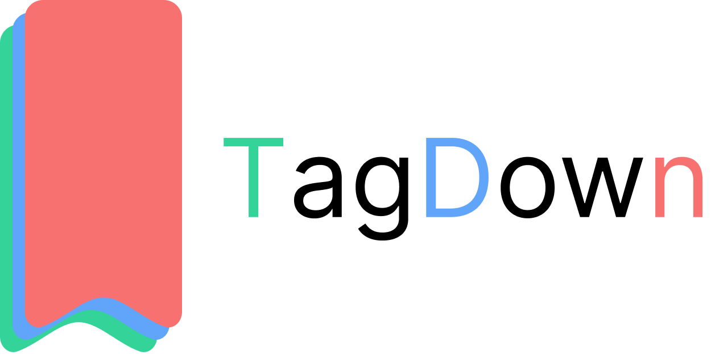
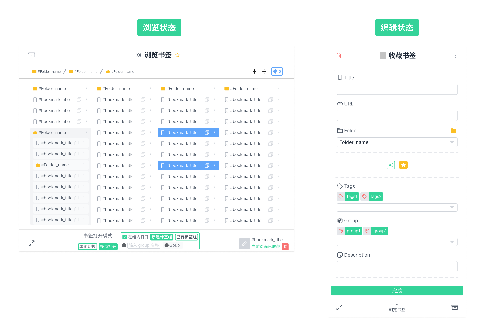
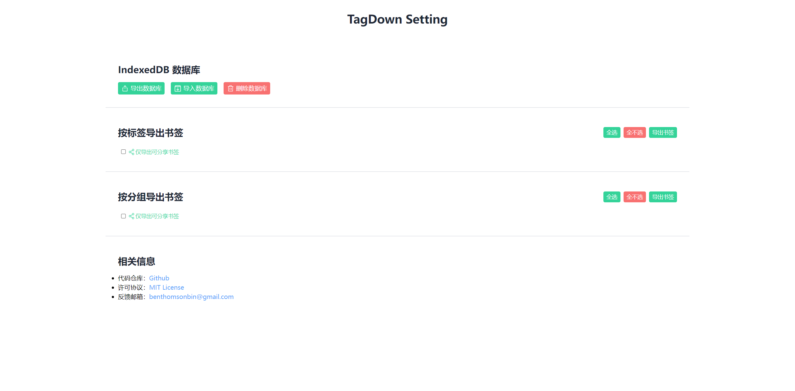
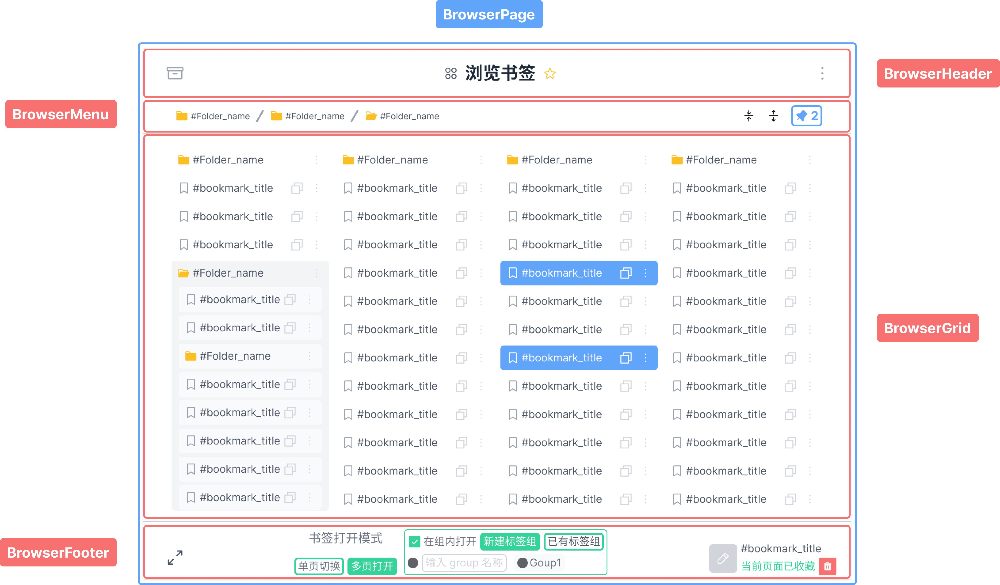
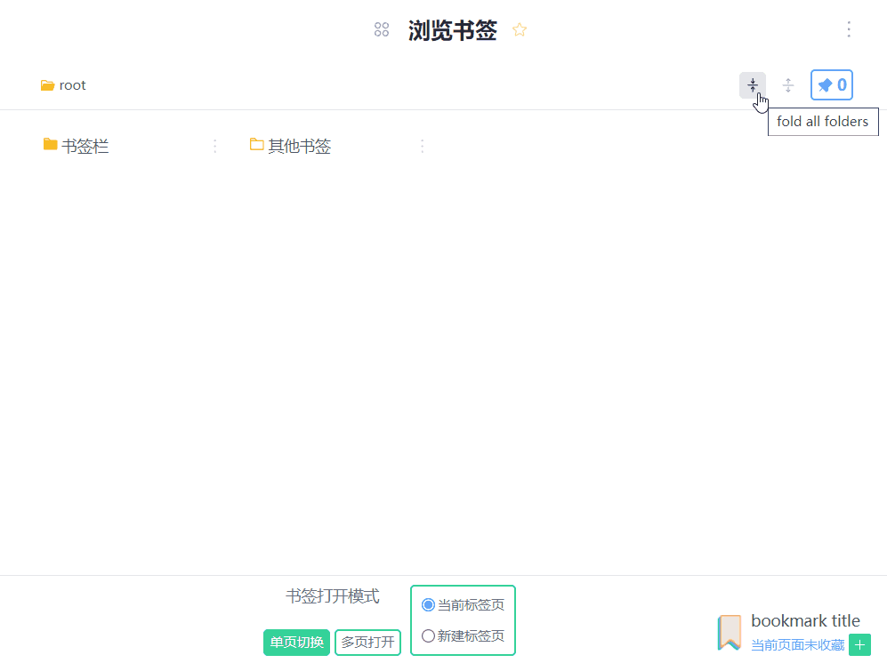
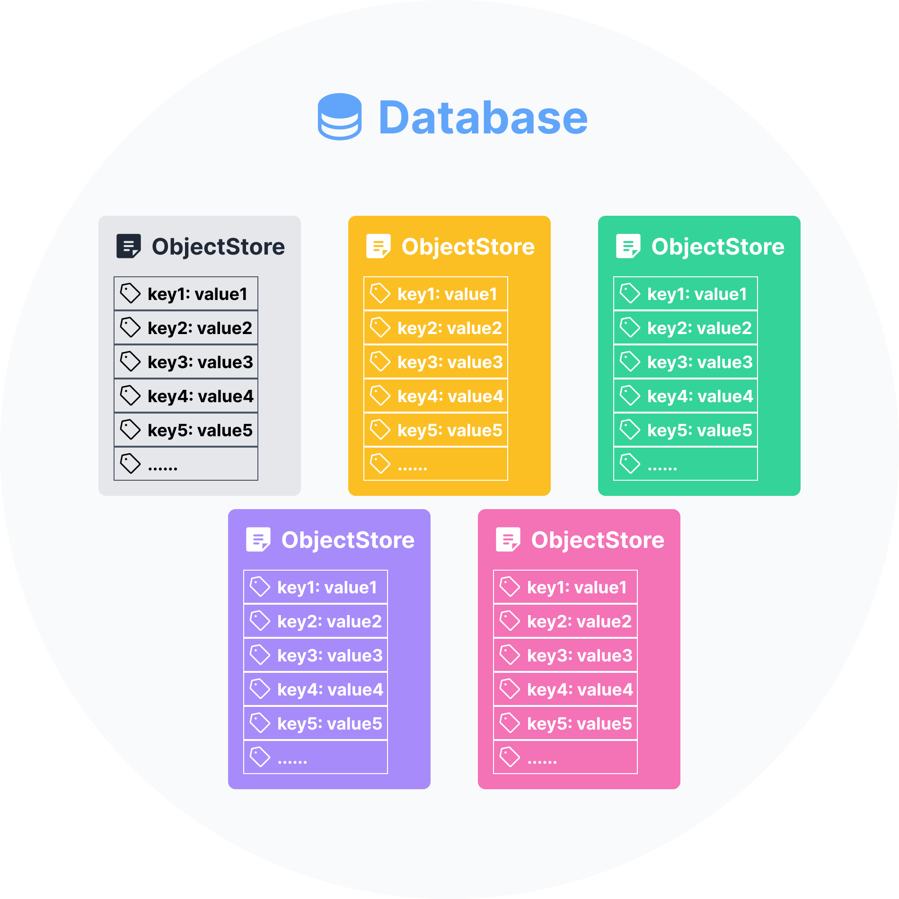
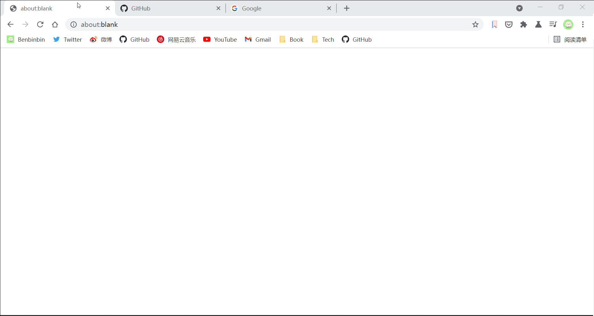

# TagDown
TagDown is an open source browser extension to manage bookmarks, you can browse, add, edit the bookmarks, it also supports for exporting bookmarks in different ways.



TagDown 是一款开源的书签管理插件， 您可以使用扩展程序*浏览*、*新增*、*修改*书签，它也支持以不同方式*导出*书签。

除了常见的书签管理功能，还具有以下特点：

* 支持 :clapper: [新增](https://www.bilibili.com/video/BV1up4y1s7VP?p=4)书签，并附加额外的信息，例如 `tags`、`groups` 等

* 支持 :clapper: [导出](https://www.bilibili.com/video/BV1up4y1s7VP?p=7)任意书签为 `json` 文档

* 以 :clapper: [树图](https://www.bilibili.com/video/BV1up4y1s7VP?p=3)的形式浏览层级结构的书签数据

* 一键打开多个书签，支持在 :clapper: [标签组](https://www.bilibili.com/video/BV1up4y1s7VP)内打开书签

本文主要记录了我在开发 TagDown 扩展程序过程中的一些小收获。

## 设计

该扩展程序与用户的交互界面主要是通过一个**弹出窗 popup**，当用户点击工具栏上扩展程序的图标时，会弹出一个 HTML 页面，该页面实现了大部分扩展程序的功能。

该页面有两种状态：

* 浏览状态 browser：用户可以浏览 Chrome 中已存的所有书签
* 编辑状态 edit：用户在编辑页面可以新增、修改、删除书签



扩展程序在后台会监控标签切换激活状态，以分析当前访问的 URL 是否已收藏为书签，动态切换工具栏上扩展程序的图标状态。

扩展程序还提供一个配置页面 option page，可以对 IndexedDB 数据库执行导出、导入、删除操作，还可以按需导出书签。



更详细的设计稿可以查看[这里](https://www.figma.com/community/file/1014891055524312843)，还有一个[原型](https://www.figma.com/proto/2Rtmm9uWs4LOAqLviyvveX/TagDown?node-id=1447%3A7484&scaling=scale-down&page-id=1403%3A1050&starting-point-node-id=1447%3A7484&show-proto-sidebar=1)可以体验扩展程序的基本交互。

## 预备技能

本项目使用 Vue（Vue 3.0 版本）和 Chrome 所提供的 API 进行开发（当然还使用了必不可少的前端三大基本技能 HTML、CSS、JavaScript），此外 CSS 主要使用 Tailwindcss 框架。

* HTML
* CSS、[Tailwind CSS](https://tailwindcss.com/)
* [Vue](https://v3.cn.vuejs.org/)、JavaScript
* [Chrome APIs](https://developer.chrome.com/docs/extensions/reference/)

## 搭建开发环境

搭建一个使用 Vue+Vite+Tailwindcss 的开发环境，其中开发的扩展程序属于 Manifest V3 版本。

:bulb: 系统已经安装 node 环境

:bulb: 如果在开发中使用 VS Code 文本编辑器，推荐安装 Vue3 开发的配套 [Volar](https://marketplace.visualstudio.com/items?itemName=johnsoncodehk.volar) 插件。

在终端输入以下命令[创建一个 Vue3+Vite 的项目模板](https://cn.vitejs.dev/guide/#scaffolding-your-first-vite-project)

```shell
npm init vite@latest
```

然后根据提示安装依赖包

```shell
# 将终端的路径切换到项目文件夹中
cd project-folder
# 安装依赖包
npm install
```

为了在项目中使用 ESLint 进行代码规范管理，需要安装 [eslint-plugin-vue](https://eslint.vuejs.org/) 模块

```shell
npm install --save-dev eslint eslint-plugin-vue
```

然后在终端输入 `eslint --init` 命令进行初始化配置，根据自己的编程习惯和团队要求，按照提示设置代码样式规范：

* `To check syntax, find problems, and enforece code style`

* `JavaScript modules (import/export)`
* `Vue.js`
* `Browser` & `Node`
* `Use a popular style guide` -> `Airbnb`
* `JavaScript`

然后系统会安装所依赖的包和生成 ESLint 配置文件 `.eslintrc.js`

由于在项目中使用的是 Vue3 版本，所以需要打开配置文件 `.eslintrc.js` 进行相应的修改

```js {4}
module.exports = {
    // ...
    extends: [
      'plugin:vue/vue3-recommended',
      'airbnb-base',
    ],
    // ...
}
```

如果使用 VS Code 进行代码编写，需要在 :file_folder: 文件夹 `.vscode` 中创建一个文件 `settings.json` 进行编辑器的 eslint 配置

```json
{
    "editor.codeActionsOnSave": {
        "source.fixAll.eslint": true
    },
    "eslint.validate": [
        "javascript",
        "vue"
    ],
}
```

:bulb: 更多关于使用 ESLint 进行代码规范管理的细节可以参考该 :clapper: [影片](https://www.bilibili.com/video/BV1pq4y1T75p)

由于开发 Chrome 插件需要特殊的项目结构，例如根目录需要有一个 `manifest.json` 文档以描述扩展程序相关信息和权限，还需要在终端输入以下命令安装一个特殊的插件 [vite-plugin-vue-crx3](https://github.com/yeqisong/vite-plugin-vue-crx3)

```shell
npm i -D vite-plugin-vue-crx3
```

根据该插件的[说明文档](https://github.com/yeqisong/vite-plugin-vue-crx3#2%E4%B8%80%E8%88%AC%E5%BC%80%E5%8F%91%E9%A1%B9%E7%9B%AE%E7%BB%93%E6%9E%84)，修改项目的目录结构，以符合扩展程序开发要求。

> 本插件的核心就是：就以 manifest.json 作为入口文件，自动分析 manifest 中的开发配置，获取 vue 应用的各个入口文件，打包时自动将 manifest.json 中开发路径更新为生产路径。

项目原来的目录结构

```md
│  .eslintrc.js
│  .gitignore
│  index.html
│  package-lock.json
│  package.json
│  README.md
│  vite.config.js
│
├─.vscode
│      extensions.json
│      settings.json
│
├─public
│      favicon.ico
│
└─src
    │  App.vue
    │  main.js
    │
    ├─assets
    │      logo.png
    │
    └─components
            HelloWorld.vue
```

由于项目打包的入口文件是 `manifest.json`，所以删除原来的入口文件 `src/main.js` 以及相应相应的文件 `index.html`。然后新增 `src/manifest.json` 文档和其他文件。修改后的目录结构

:bulb: 参考 [crx3-dev-template](https://github.com/yeqisong/crx3-dev-template) 模板

```md
│  .eslintrc.js
│  .gitignore
│  package-lock.json
│  package.json
│  postcss.config.js
│  README.md
│  tailwind.config.js
│  vite.config.js
│
├─.vscode
│      extensions.json
│      settings.json
│
├─public
│  │  favicon.ico
│  │
│  └─_locales
│      └─en
└─src
    │  manifest.json
    │  options.html
    │  popup.html
    │
    ├─assets
    │  │  logo.png
    │  │
    │  └─images
    │          icon128.png
    │          icon16.png
    │          icon24.png
    │          icon32.png
    │          icon48.png
    │          icon64.png
    │          icon72.png
    │          logo.png
    │
    ├─background
    │      main.js
    │
    ├─options
    │      App.vue
    │      main.js
    │
    └─popup
            App.vue
            main.js
```

主要的文件和文件夹作用：

* `src/manifest.json` 扩展程序的配置清单
* `background` 与扩展程序的后台 service worker 相关的代码，在 manifest V3 版本的扩展程序中，后台没有可视的前端页面，所以该不会不需要使用 Vue
* `src/popup.html` 弹出窗的入口文件，:file_folder: 文件夹 `popup` 放置弹窗页面的相关代码文档，这是一个独立的 Vue 单页面应用
* `src/options.html` 设置页面的入口文件，:file_folder: 文件夹 `options` 放置设置页面的相关代码文档，这是一个独立的 Vue 单页面应用
* :file_folder: 文件夹 `public/_locales` 放置与国际化（翻译）相关的文档

其中在 :file_folder: 文件夹 `src` 中的 `manifest.json` 文档是扩展程序的配置清单

```json
{
    "name": "TagDown",
    "manifest_version": 3,
    "version": "1.0.0",
    "description": "TagDown is a bookmark manager.",
    "background": {
        "service_worker": "./background/main.js",
        "type": "module"
    },
    "action": {
        "default_title": "TagDown",
        "default_popup": "./popup.html",
        "default_icon": {
            "16": "./assets/images/icon16.png",
            "32": "./assets/images/icon32.png",
            "48": "./assets/images/icon48.png",
            "64": "./assets/images/icon64.png",
            "128": "./assets/images/icon128.png"
        }
    },
    "options_page": "./options.html",
    "icons": {
        "16": "./assets/images/icon16.png",
        "32": "./assets/images/icon32.png",
        "48": "./assets/images/icon48.png",
        "64": "./assets/images/icon64.png",
        "128": "./assets/images/icon128.png"
    },
    "default_locale": "en"
}
```

:bulb: 由于放在 :file_folder: 文件夹 `src` 下的 `manifest.json` 只服务于开发环境，因此在设置资源（各个入口文件）的路径时，使用相对路径即可，插件打包时会自动分析并更新路径。

还要在 vite 配置文件 `vite.config.js` 引用插件，并设置入口文件

```js
import { defineConfig } from 'vite'
import vue from '@vitejs/plugin-vue'
import vue from '@vitejs/plugin-vue';
import { crx3 } from 'vite-plugin-vue-crx3';

// https://vitejs.dev/config/
export default defineConfig({
  resolve: {
    alias: {
      '@': resolve(__dirname, 'src'),
    },
  },
  plugins: [vue(), crx3()], // crx3即为插件入口函数
  build: {
    target: 'es2015',
    rollupOptions: {
      input: resolve(__dirname, 'src/manifest.json'), // 将 src 中的 manifest.json 作为入口文件
    },
  },
})

```

该插件支持**热重载**便于开发调试，需要在 `package.json` 文档中添加相应的指令

```json {7}
{
  // ...
  "scripts": {
    "dev": "vite",
    "build": "vite build",
    "serve": "vite preview",
    "watch": "vite build --watch"
  },
  // ...
}
```

然后在开发时使用 `npm run watch` 命令即可启用热重载功能，当代码的修改保存后，浏览器自动更新当前开发的插件，正在调用的网页也会自动刷新。

最后为了便于网页的样式设置，使用 [Tailwindcss 框架](https://tailwindcss.com/docs/guides/vue-3-vite)，按照官方文档的依此执行以下步骤：

* 在终端使用以下命令安装 Tailwind CSS 模块和相应的依赖包

    ```shell
    npm install -D tailwindcss@latest postcss@latest autoprefixer@latest
    ```

* 在终端使用以下命令初始化 Tailwind CSS 生成一个配置文件 `tailwind.config.js`

  ```shell
  npx tailwindcss init -p
  ```

  为了优化项目[开发](https://tailwindcss.com/docs/just-in-time-mode#enabling-jit-mode)和[打包](https://tailwindcss.com/docs/optimizing-for-production)时的文件大小，需要在配置文件  `tailwind.config.js` 中进行设置，以删除未使用的样式代码

  ```js
  module.exports = {
    // ...
    mode: 'jit',
    purge: ['./src/**/*.{vue,js,ts,jsx,tsx}'],
    // ...
  };

  ```

:bulb: vite 会通过[依赖预构建](https://cn.vitejs.dev/guide/dep-pre-bundling.html)实现 CommonJS 和 UMD 兼容性，但并不能解决所有问题，在项目中使用 **[webdav-client](https://github.com/perry-mitchell/webdav-client)** 模块就遇到编译问题，因此引入一个 rollup 插件 [@rollup/plugin-commonjs](https://github.com/rollup/plugins/tree/master/packages/commonjs/)，它将 CommonJS 模块转换为 ES6 模块

* 在终端使用以下命令安装模块和相应的依赖包

  ```bash
  npm install @rollup/plugin-commonjs --save-dev
  ```

* 在 vite 配置文件 `vite.config.js` 引用插件

  ```js
  // ...
  export default defineConfig({
    // ...
    plugins: [commonjs(), vue(), crx3()],
    // ...
  })
  ```

## 弹出页面开发

在进行弹出页面开发中，主要需要解决的是 Vue **组件间数据传递**问题。

为了便于代码的复用和维护，将页面分为多个 Vue 组件，例如在弹出页面的浏览状态中，将网页的父级组件 `BrowserPage` 中主要有 4 大子组件：

* `BrowserHeader.vue`
* `BrowserMenu.vue` 和 `BrowserMenuPin.vue`
* `BrowserGrid.vue` 和 `BrowserTree.vue`，以及 `BrowserPin.vue`
* `BrowserFooter`



### 父子组件间数据传递

在 Vue 中最常见的组件之间的数据传递方式是使用 `prop` 和 `emit` 实现父子组件间传值：

* 通过 prop 向子组件传递数据。prop 是在组件上注册的一些**自定义 attribute**。当一个值传递给一个 prop attribute 的时候，它就变成了那个组件实例的一个 property。
* 通过 emit 向父组件传递数据。当组件需要修改父层控管的数据（这些数据通过 props 传递进来）时，基于**单向数据流原则**不能在组件内进行修改，而是需要通过 `$emit('eventName', value)`  **向外抛出自定义的事件**，通知父层进行数据修改。

:bulb: 对于输入型的组件，例如在项目中组件 `BrowserFooter` 包含一个 `<input>` 元素，可以允许用户输入标签组的名称。可以在组件上使用 `v-model`，以在父子组件传值的同时实现数据的双向绑定，即数据可以从父层传递给子组件（一般作为变量的初始值），同时可以接收子组件返回的值，以修改绑定的变量。

在父层使用组件时，通过 `v-model` 实现数据的双向绑定。

```vue
<!-- 使用组件，为了简洁的演示，省略显示其他属性的绑定 -->
<BrowserFooter
  v-model:multi-on-group="multiOnGroup"
  v-model:new-group-name="newGroupName"
/>
```

在子组件的表单元素中，绑定相应的属性，同时监听相应的事件：

* 对于 `<input type="checkbox">` 复选框，绑定的属性是 `checked`，需要监听的事件是 `change`

* 对于 `<input type="text">` 文本输入框，绑定的属性是 `value`，需要监听的事件是 `input`

当属性值变更时，需要抛出事件的格式以 `update:` 为前缀，而属性值通过读取事件对象的相应属性 `$event.target` 获得

```vue
<template>
  <!-- 省略其他模板内容 -->
  <!-- 单个复选框 -->
  <!-- 为了简洁的演示，省略显示其他属性的绑定 -->
  <input
    id="group"
    type="checkbox"
    :checked="multiOnGroup"
    @change="$emit('update:multiOnGroup', $event.target.checked)"
  >
  <label
    for="group"
    class="text-xs text-gray-500"
  >在组内打开</label>

  <!-- 省略其他模板内容 -->
  <!-- 文本输入框 -->
  <!-- 为了简洁的演示，省略显示其他属性的绑定 -->
  <input
    type="text"
    placeholder="输入 group 名称"
    :value="newGroupName"
    @input="$emit('update:newGroupName', $event.target.value)"
  >
  <!-- 省略其他模板内容 -->
</template>

<script>
export default {
  props: {
    // ...
    multiOnGroup: Boolean,
    newGroupName: {
      type: String,
      default: 'new',
    },
  },
  emits: [
    // ...
    'update:multiOnGroup',
    'update:newGroupName',
  ],
  // ...
}
</script>
```

### 祖孙组件间数据传递

用 `provide` 和 `inject` 实现从祖先组件向其子孙后代组件传值：

* 父组件用 `provide` 选项或（在组合式 API 中）方法来提供数据，可以提供响应式数据，例如 ref 对象
* 子组件用 `inject` 选项或（在组合式 API 中）方法来接收这个数据

在项目中多个组件中都需要使用 IndexedDB 数据库，在弹出页的 Vue 入口文件 `src/popup/main.js` 中使用框架 Dexie.js 创建一个数据库实例，再通过 `provide` 的方式供其他子组件使用。

```js
import Dexie from 'dexie';
import { createApp } from 'vue';
import App from './App.vue';
import '@/styles/tailwind.css';

const app = createApp(App);

const db = new Dexie('tagdown');
db.version(1).stores({
  bookmark: 'id, *tags, *groups',
  share: 'id, share',
  star: 'id, star',
});
db.open().then((database) => {
  app.provide('db', database);
  app.mount('#app');
}).catch((err) => {
  // Error occurred
  console.log(err);
});
```

然后在组件，例如 `BrowserPage.vue` 中通过 `  const db = inject('db');` 来接收该数据库实例。

:bulb: 为了便于代码维护，当使用响应式 provide / inject 值时，建议尽可能将**对响应式 property 的修改限制在定义 provide 的组件内**。如果真的需要在注入数据的组件内部更新 inject 的数据，建议同时 provide 一个**方法**来负责改变值，这样可以将数据值的设定和数据修改的逻辑代码都依然集中放在祖父组件中，便于后续跟踪和维护。

在祖先组件 `src/popup/App.vue` 中根据响应式变量 `Page` 控制弹出页面的状态是 `"browser"` 还是 `"edit"`，而控制该变量切换的按钮是在后代组件 `BrowserFooter.vue` 中.

因此在祖先组件提供修改该变量的方法

```vue
<script>
import { ref, provide } from 'vue';
// ...

export default {
  // ...
  // provide page state and change the page state function
  provide('page', page);
  const changePage = (value) => {
    page.value = value;
  };
  provide('changePage', changePage);
  // ...
}
</script>
```

在后代组件接收该方法，并绑定到按钮上

```vue
<template>
  <!-- 省略其他模板代码 -->
  <!-- 为了简洁的演示，省略显示其他属性的绑定 -->
  <button
    title="add bookmark"
    @click="changePage('edit')"
  >
  <!-- 省略其他模板代码 -->
</template>
<script>
import { ref, watch, inject } from 'vue';
// ...

export default {
  // ...
  const changePage = inject('changePage');
  // ...

  return {
    // ...
    changePage
  }
}
</script>
```

### 兄弟组件间信息传递

对于在层级结构中处于「平行」关系，如果需要进行数据传递，可以考虑使用 Vue 官方推荐的数据状态管理插件 [Vuex](https://vuex.vuejs.org/zh/)。

在项目中有一个需求是通过点击组件 `BrowserMenu` 的按钮，控制兄弟组件 `BrowserGrid` 的文件夹展开/折叠。



把兄弟组件的父组件作为信息传递的「桥梁」，在父组件监听其中一个子组件抛出的事件，然后接收到自定义事件时，通过模板引用来调用另一个子组件的方法，从而实现兄弟组件信息传递。

将父组件 `BrowserPage` 作为「桥梁」，连接两个「平行」关系子组件。

```vue
<template>
  <!-- 省略其他模板代码 -->
  <!-- menu -->
  <!-- 为了简洁的演示，省略显示其他属性的绑定 -->
  <div>
    <component
      :is="browserMenuComponent"
      @unfold-all="unfoldAllHandler"
      @fold-all="foldAllHandler"
    />
  </div>
  <!-- 省略其他模板代码 -->
  <!-- 为了简洁的演示，省略显示其他属性的绑定 -->
  <BrowserGrid
    ref="grid"
  />
</template>
<script>
import {
  ref, computed, watch, inject,
} from 'vue';

export default {
  // ...
  setup() {
    // unfold or fold all folder
    const grid = ref(null);  // 引用 BrowserGrid 组件
    const unfoldAllHandler = () => {
      // ...
      grid.value.unfoldAll(); // 调用组件中的方法 unfoldAll()
      // ...
    };

    const foldAllHandler = () => {
      // ...
      grid.value.foldAll(); // 调用组件中的方法 foldAll()
      // ...
    };

    // ...
    return {
      // ...
      grid,
      unfoldAllHandler,
      foldAllHandler,
    }
  }
}
</script>
```

### 页面样式

由于 Chrome [限制](https://developer.chrome.com/docs/extensions/reference/action/#popup)弹出页面的大小，高和宽的最小值都是是 25px，高的最大值是 600px，宽的最大值是 800px。因此为了尽可能利用空间显示内容，TagDown 将弹出页的浏览状态设置为最大限制

```vue
<style lang="scss" scoped>
// src/popup/App.vue
.browser-mode {
  width: 800px;
  height: 600px;
}

// ...
</style>
```

但是此时弹出页就会出现**滚动条**，可以在弹出页的入口文件 :page_facing_up: `src/popup.html` 中为 `<body>` 元素添加样式，取消它的滚动条

```html
<!DOCTYPE html>
<html lang="en">

<head>
  <!-- 省略部分代码 -->
  <style>
    body::-webkit-scrollbar {
      width: 0px;
      height: 0px;
    }
  </style>
</head>

<!-- 省略部分代码 -->
</html>
```

## 数据持久化

参考：

* 《现代 JavaScript 教程》[IndexedDB](https://zh.javascript.info/indexeddb) 一章
* [A closer look at IndexedDB](https://golb.hplar.ch/2017/09/A-closer-look-at-IndexedDB.html)

### IndexedDB 基础

前端数据持久化有多种方式实现，其中较常用的是通过浏览器自带的 IndexedDB 数据库实现。

:bulb: 由于扩展程序的后台 service worker 由于 Service workers 无法访问 DOM 和相关的 API，且环境中没有 `window` 这个变量对象，所以无法使用浏览器提供的 `localStorage` 和 `sessionStorage` 进行数据存储。Chrome 为扩展程序提供一个[数据存储 API `chrome.storeage`](https://developer.chrome.com/docs/extensions/reference/storage/) ，该 API 可以实现 类似 localStorage 的功能，用于存储**少量**的数据（一般是存储扩展程序的设置参数）。对于 [sync 同步存储](https://link.juejin.cn?target=https%3A%2F%2Fdeveloper.chrome.com%2Fdocs%2Fextensions%2Freference%2Fstorage%2F%23property-sync)的数据，允许总大小为 100KB；对于 [local 本地存储](https://link.juejin.cn?target=https%3A%2F%2Fdeveloper.chrome.com%2Fdocs%2Fextensions%2Freference%2Fstorage%2F%23property-local)的数据，允许总大小为 5MB（类似于 localstorage 的存储限制）。

IndexedDB 具有以下特点：

* 通过支持多种类型的键，来存储几乎可以是**任何类型**的值
* 支撑事务，有良好的可靠性（**事务**是数据库通用术语，是指一组操作要么全部成功，要么全部失败，不存在中间结果从而导致数据冲突或不完整）
* 支持键的范围查询，也支持为数据添加索引

:warning: IndexedDB 遵循**同源策略**限制，即每个数据库都是绑定到源（域/协议/端口）的，不同的网站不能相互访问对方的数据库。

IndexedDB 数据有几个基本的概念，和 SQL、NoSQL 等常用数据库概念类似：

* （同源）网页可以创建一个专属的数据库 Database（遵循同源策略的限制）
* 每一个数据库可以创建多个**对象库 ObjectStore**，和 SQL 的表格概念类似
* 在对象库中就是以键值对的形式存储着的一条条数据



使用 IndexedDB 的基本流程如下：

- 创建/打开一个数据库
- 定义数据结构，创建**对象库**，指定数据项的键 key（还可以创建索引 index）
- 启动**事务**对对数据进行操作
- 监听相应的事件
- 获取操作结果

使用方法 `open()`（连接）一个数据库，第一个参数 `name` 是数据库名称，数据库可以有许多不同的名称；第二个参数是一个正整数，表示数据库版本，默认为 `1`。

```js
let openRequest = indexedDB.open(name, version);
```

该方法返回 `openRequest` 对象，我们需要监听该对象上的事件（因为对 IndexedDB APIs 一般都是**异步操作**，待事件触发后才可以在回调函数中执行后续操作）：

- `success`：数据库准备就绪时触发的事件。然后在 `openRequest.result` 中有了一个数据库对象 Database Object，使用它对数据库进行进一步的调用
- `error`：打开失败时触发的事件
- `upgradeneeded`：数据库已准备就绪，但其版本已过时触发的事件。可以根据需要比较版本，并升级数据结构。升级操作顺利完成后，**`onsuccess` 事件被触发，数据库才算是成功打开了**。

:bulb: 如果数据库还不存在时（从此时数据库的版本是 `0`），打开数据库操作就会触发 `upgradeneeded` 事件，此时可以执行初始化（如创建对象库，指定数据项的键 key，定义数据项的索引 index 等）

:warning: 只有在 `upgradeneeded` 事件的回调函数中，才可以更新升级数据库的结构（例如对象库的创建，以及修改对象库的索引属性）

```js
let openRequest = indexedDB.open("tagdown", 1);

// 如果浏览器中没有该数据库（或已存在的数据库版本，与打开的版本不符），则会触发 upgradeneeded 事件
openRequest.onupgradeneeded = function() {
  // 执行初始化
  let bookmark = db.createObjectStore('bookmark', { keyPath: "id" });
  let index = bookmark.createIndex('tags', 'tags', { multiEntry: true}) // 参数依此表示：索引名称为 tags，对应以数据的哪一个属性作为索引值，由于该属性值为数组，且将数组的每个元素作为索引时需要配置 multiEntry 为 true
};

// 如果浏览器中有该数据库，则会触发 onsuccess 事件
openRequest.onsuccess = function() {
  let db = openRequest.result;
  // 继续使用已有的 db 对象处理数据库
};

openRequest.onerror = function() {
  console.error("Error", openRequest.error);
};
```

:bulb: 如果想删除整个数据库（而不是单一条数据），可以使用方法 `deleteDatabase(databaseName)`

接着，**==在 `success` 事件的回调函数中==**，使用方法 `transaction` 启动事务，对数据进行操作。

使用事务操作数据的基本流程如下：

* 使用 `db.transaction(store)` 创建一个事务，表明要访问的对象库

* 使用 `transaction.objectStore(name)` 获取存储对象
* 发起请求，操作数据
* 监听请求的成功/错误事件，并执行相应的操作

方法 `transaction` 创建一个事务，它接收的第一个参数是事务要访问的对象库名称（如果我们要访问多个对象库，则该参数值是抑恶数组）；（可选）第二个参数是事务类型：

* `readonly` 只读，默认值
* `readwrite` 可读取和写入数据（但不能创建/删除/更改的对象库，这类操作只能在 `upgradeneeded` 事件的回调函数中进行）

```js
db.transaction(store[, type]);
```

:bulb: 需要两种事务类型，是因为两种类型的事物操作「性能」是不同的。许多 `readonly` 事务能够同时访问同一存储区；但 `readwrite` 事务不能。因为 `readwrite` 事务会「**锁定**」存储区进行写操作，下一个事务必须等待前一个事务完成，才能访问相同的存储区。

创建事务后，使用事务实例的方法 `objectStore(name)` 获取相应的对象库，然后就可以对里面的数据项进行操作。对象库支持两种存储值的方法：

- 方法 `put(value, [key])` 将 `value` 添加到存储区。**如果已经存在相同键的数据，则将替换该值。**
- 方法 `add(value, [key])` 与方法 `put` 类似，**但是如果已经存在相同键的数据，则请求失败**，并生成一个名为 `"ConstraInterror"` 的错误。

```js
let transaction = db.transaction("bookmark", "readwrite"); // 创建一个事务，表明要访问的对象库是 bookmark，事务类型是读写

// 获取对象库进行操作
let bookmark = transaction.objectStore("bookmark");

// 数据项
let node = {
  id: '123',
  title: 'Google'
  url: 'www.google.com'
  tags: ['search', 'tool']
};

let request = bookmark.add(node); // 向对象库中添加数据项

// 监听请求成功事件
request.onsuccess = function() {
  console.log("Bookmark added to the store", request.result);
};

// 监听请求失败事件
request.onerror = function() {
  console.log("Error", request.error);
};
```

删除特定的数据需要指定查询条件，使用方法 `delete(query)`

```js
// 删除键值满足 id='123' 的数据
bookmark.delete('123')；
```

 数据库另一个重要功能是搜索数据，IndexedDB 支持两种主要的搜索类型：

* 基于一个键或范围进行搜索
* 基于一个索引或范围进行搜索

两者的区别是：由于每个数据的键 key 是特殊唯一的，如果基于单一值搜索，最多获得一个数据项；而索引值可以复用，如果基于单一索引值搜索，可以获得多个数据项。

使用方法 `get(query)` 按键 key 搜索数据，返回满足条件的数据项；使用方法 `getKey(query)` 按键 key 搜索数据，但是返回的是满足条件的数据项的键值

```js
bookmark.get('123') // 返回数据项
bookmark.getKey('123') // 返回 123
```

:bulb: 使用方法 `getAll([query], [count])` 或 `getAllKeys([query], [count])` 获取一个范围的数据或键值，返回数组，其中参数 `query` 表示一个范围，需要通过调用[相应的函数](https://zh.javascript.info/indexeddb#:~:text=%E4%B8%80%E4%B8%AA%E2%80%9C%E9%94%AE%E8%8C%83%E5%9B%B4%E2%80%9D%E3%80%82-,%E4%BD%BF%E7%94%A8%E4%BB%A5%E4%B8%8B%E8%B0%83%E7%94%A8%E5%87%BD%E6%95%B0%E5%88%9B%E5%BB%BA%E8%8C%83%E5%9B%B4,-%EF%BC%9A)创建。

:bulb: **只返回键值**的方法效率更高，该操作不需要解析读取完整的数据

[通过索引 index 进行查询](https://zh.javascript.info/indexeddb#tong-guo-dai-suo-yin-de-zi-duan-sou-suo)，也是使用相同的方法，但是通过索引对象调用这些方法。

```js
let tagsIndex = bookmark.index("tags"); // 索引对象
tagsIndex.getAll('tool'); // 获取所有标记有 tool 的数据项
```

### Dexie.js

虽然 IndexedDB 大部分操作都是异步的，但是方法返回的不是 Promise，而是基于监听事件执行回调的方式来处理操作结果，开发繁琐且代码不易于维护。

为了便于开发使用一个名为 **[Dexie.js](https://dexie.org/) 库，它对 IndexedDB APIs 进行二次封装**，让调用 IndexedDB 更方便。该库大部分方法都是异步且返回 Promise。

与 IndexedDB 类似，它也有相应的不同概念，且不同的类封装了不同的方法

* `Dexie` 该库的核心类，通过该类实例化，可以创建/连接一个 IndexedDB 数据库
* Table 该类表示对象库 ObjectStore
* Collection 该类表示对象库中一部分数据项，可以理解为数据的查询结果

```js
// src/
// 实例化一个数据库
const db = new Dexie('tagdown');
// 声明版本和数据结构（对象库）
db.version(1).stores({
  // 创建 3 个对象库，键为对象库的名称，值是对象库的中数据项的键和索引，用逗号分隔
  bookmark: 'id, *tags, *groups', // 第一个是指定用作为键的属性，之后就是索引
  // 加星号 * 表示数据相应属性值为数组，且将数组的每个元素作为索引
  share: 'id, share',
  star: 'id, star',
});
// 打开/创建数据库，异步操作
db.open().then((database) => {
  app.provide('db', database); // 通过 provide-inject 的方式将数据库对象提供给应用中其他组件使用
  app.mount('#app');
}).catch((err) => {
  // Error occurred
  console.log(err);
});
```

:bulb: 根据官方的[操作指南](https://dexie.org/docs/Dexie/Dexie.open())，**不必**判断浏览器中是否有已有同名的数据，因为每次尝试连接数据库时，Dexie 会自动判断，按需打开已有数据库或创建一个新数据库。

以下列出在项目中与数据库相关的一些主要方法

```js
// src/composables/useBookmark.js
// ...
const db = inject('db');

// 基于键 id 查询数据
const getBookmarkDB = async (id) => {
  const bookmark = await db.bookmark.get(id);
  return bookmark;
};

// 向 bookmark 对象库添加数据
const setBookmarkDB = async (id, bookmark) => {
  // console.log(bookmark);
  await db.bookmark.put({
    id,
    title: bookmark.title,
    url: bookmark.url,
    faviconUrl: bookmark.faviconUrl,
    tags: bookmark.tags,
    groups: bookmark.groups,
    description: bookmark.description,
  });
};

// 基于键 id 删除数据
const deleteBookmarkDB = async (id) => {
  await db.bookmark.delete(id);
};
```

获取索引的所有值

```js
// src/options/App.vue
// ...
const db = inject('db');

onMounted(async () => {
  // 获取数据库中索引 tags 的所有可能的值
  allTags.value = await db.bookmark.orderBy('tags').uniqueKeys();
});
```

使用 `where` 查询语句

```vue
// src/options/App.vue
// ...
const db = inject('db');
// 筛选条件是索引 share 的值为 1，并返回一个由这些数据的键值构成的数组
const getShareableIds = async () => {
  const result = await db.share.where('share').equals(1).primaryKeys();
  return result;
};
```

将查询结果转换为数组

```vue
// src/popup/components/BrowserPage.vue
// ...
const db = inject('db');
const starNodes = await db.star.where({ star: 1 }).toArray();
```

导入、导出 IndexedDB 数据库

```vue
// src/options/App.vue
// ...
import {
  importDB, exportDB, importInto, peakImportFile,
} from 'dexie-export-import';

// ...
// 导出数据库为 blob
blob = await exportDB(db, {
  prettyJson: true,
});

// ...
// 导入数据库
await importInto(db, file, {
  overwriteValues: true,
}).then(() => {
  console.log('import database successful!');
}).catch((err) => {
  console.log(err);
});
```

## 数据同步

在扩展程序中使用 [WebDAV](https://www.bilibili.com/video/BV1up4y1s7VP?p=12) **同步备份** IndexedDB 数据库。可以将书签按组别**同步分享**为 [Gist](https://www.bilibili.com/video/BV1up4y1s7VP?p=10)。

### WebDAV

使用 [webdav-client](https://github.com/perry-mitchell/webdav-client) 库，它是一个 WebDAV 客户端可用于 NodeJS 或浏览器环境。

在终端输入以下命令安装该模块及其相应的依赖

```bash
npm install webdav --save
```

然后基于 WebDAV 服务器地址、用户名、密码创建一个客户端实例

```js
// src/composables/useWebDAV.js
import { createClient } from 'webdav/web';

// ...
// create webDAV client
const createWebDAVClient = (url, username, password) => {
  const client = createClient(url, {
    username,
    password,
  });
  return client;
};
```

:bulb: 由于扩展程序的域名和需要访问的 WebDAV 服务器域名不同，扩展程序支持跨域访问其他服务器，但需要将服务器地址添加到扩展程序的配置清单 `manifest.json` 的`host_permissions` 属性中，例如使用[坚果云的 WebDAV 服务](https://help.jianguoyun.com/?p=2064)

```json
{
  // 省略显示其他部分
  "host_permissions": [
    "https://dav.jianguoyun.com/dav/"
  ],
  // 省略显示其他部分
}
```

以下列出在项目中与 WebDAV 相关的一些主要方法

```js
// src/composables/useWebDAV.js

// ...
// 检查 WebDAV 服务器连接状态
const checkWebDAVConnect = (client) => new Promise((resolve, reject) => {
  client.stat('/')
  .then(() => {
    resolve({
      state: true,
      msg: '连接成功',
    });
  })
  .catch((err) => {
    console.log(err);
    if (err.response.status === 401) {
      resolve({
        state: false,
        stateCode: 401,
        msg: '未获得访问权限',
      });
    } else {
      resolve({
        state: false,
        stateCode: 404,
        msg: '连接失败',
      });
    }
  });
});

// 检查文件夹存在与否，如果不存在就创建一个文件夹
const checkWebDAVFolder = async (client, folderPath) => {
  if (await client.exists(folderPath) === false) {
    await client.createDirectory(folderPath, { recursive: true });
  }
};

// 获取文件夹内所有文件
const getWebDAVFolder = (client, folderPath) => new Promise((resolve, reject) => {
  client.getDirectoryContents(folderPath)
    .then((contents) => {
      resolve(contents);
    })
    .catch((err) => {
      console.log('error', err);
    });
});

// 获取文件夹中最后更新的文件
// 这里是为了获取 WebDAV 的最后备份同步时间
// 由于访问操作会触发文件夹的更新，所以这里实际上是获取文件夹中最后更新的文件的时间戳
const getWebDAVLastFileState = async (client, folderPath) => {
  await checkWebDAVFolder(client, folderPath);
  const filesArr = await getWebDAVFolder(client, folderPath);
  if (filesArr.length === 0) return null;
  // 由于存储的备份文件命名规则是 tagdown_{timestamp}
  // 所以文件列表最后一个就是最新创建的备份文件
  const lastFile = filesArr[filesArr.length - 1];
  return lastFile;
};

// 获取文件内容
const getWebDAVFile = (client, filePath, format = 'text') => new Promise((resolve, reject) => {
  client.getFileContents(filePath, { format })
    .then((data) => {
      resolve(data);
    })
    .catch((err) => {
      console.log('error', err);
    });
});

// 写入文件内容
const writeWebDAVFile = async (client, folderPath, fileName, data) => {
  await checkWebDAVFolder(client, folderPath);
  const res = await client.putFileContents(`${folderPath}/${fileName}`, data, {
    contentLength: false,
  });
  // console.log(res);
  if (res) {
    return {
      state: true,
      msg: 'WebDAV 同步成功',
    };
  }
  return {
    state: false,
    msg: 'WebDAV 同步失败',
  };
};
```

### Gist

Github 提供了一系列 [RESTful API](https://docs.github.com/en/rest)，其中包括一些[与 Gist 交互的 APIs](https://docs.github.com/en/rest/reference/gists)。 [申请](https://github.com/settings/tokens/new)个人[访问令牌](https://docs.github.com/cn/authentication/keeping-your-account-and-data-secure/creating-a-personal-access-token)，就可以在扩展程序中管理 Gist，将特定的书签以 gist 代码片段的形式分享到 Github。

:bulb: 由于在引入 [axios](https://www.axios-http.cn/) 模块时出错，所以在扩展程序中使用 `fetch` 向 Github 发送网络请求。

以下列出在项目中与 WebDAV 相关的一些主要方法

```js
// src/somposables/useGist.js

//...
// 创建 Gist
const createGist = (token, gist) => new Promise((resolve, reject) => {
  fetch('https://api.github.com/gists', {
    // 使用 POST 方法
    method: 'POST',
    // 根据官方文档 https://docs.github.com/en/rest/reference/gists#create-a-gist
    // 请求体可以设置多种参数，即入参 gist 可以包含以下属性
    // * descripton 描述
    // * files（属性值是一个对象，因为一个 Gist 可以包含多个代码文件片段，该对象中，每一个属性就是一个文件，属性名是文件名，属性值是文件内容）
    // * public，是否为公开 Gist 或私密 Gist
    body: JSON.stringify(gist),
    // 在请求头添加认证信息
    headers: new Headers({
      'Content-Type': 'application/json',
      Authorization: `Bearer ${token}`,
    }),
  }).then(async (res) => {
    if (res.status === 201) {
      const resData = await res.json();
      resolve({
        state: true,
        msg: '创建成功',
        data: resData,
      });
    } else {
      console.log('fail', res);
      resolve({
        state: false,
        msg: '创建失败',
      });
    }
  })
    .catch((err) => {
      console.error('Error:', err);
      return {
        state: false,
        msg: '创建失败',
      };
    });
});

// 更新 Gist
const updateGist = async (token, gistId, data) => new Promise((resolve, reject) => {
  fetch(`https://api.github.com/gists/${gistId}`, {
    // 使用 PATCH 方法
    method: 'PATCH',
    // 根据官方文档 https://docs.github.com/en/rest/reference/gists#update-a-gist
    // 请求体可以设置多种参数，即入参 data 可以包含以下属性
    // * gist_id 需要更新的 Gist ID
    // * desciption 描述
    // * files 文件 files（属性值是一个对象，因为一个 Gist 可以包含多个代码文件片段，该对象中，每一个属性就是一个文件，属性名是文件名，属性值是文件内容）
    body: JSON.stringify({
      ...data,
    }),
    headers: new Headers({
      'Content-Type': 'application/json',
      Authorization: `Bearer ${token}`,
    }),
  }).then(async (res) => {
    if (res.status === 200) {
      const resData = await res.json();
      resolve({
        state: true,
        msg: '更新成功',
        data: resData,
      });
    } else {
      console.log('fail', res);
      resolve({
        state: false,
        msg: '更新失败',
      });
    }
  })
    .catch((err) => {
      console.error('Error:', err);
      return {
        state: false,
        msg: '更新失败',
      };
    });
});
```

## 后台监控

:warning: 如果希望在后台脚本中 `import` 引入其他库，需要在配置清单 `manifest.json` 中将后台脚本类型声明为模块 `module`

```json
{
  // ...
  "background": {
    "service_worker": "./background/main.js",
    "type": "module"
  },
  // ...
}
```

扩展程序的后台是一个 service worker，基于监控事件-作出响应的模式执行命令。

可以在后台监控标签页的切换事件，查询当前激活标签页 URL 是否与任何已保存的书签相匹配，动态更改 Action 图标。实现类似于 Chrome 地址栏右侧的星型图标切换状态，以指示当前标签是否已收藏的功能。




主要使用 Chrome 提供的两个 APIs 实现该功能：

* `chrome.action.setIcon` 动态设置 Action 图标
* `chrome.tabs.onActivated` 监听标签激活事件

```js
// src/backrground/main.js
// ...

/**
 * 基于当前激活标签是否被收藏，动态更改 Action 图标
 */
const changeActionIcon = async (tag = false) => {
  if (tag) {
    await chrome.action.setIcon({
      path: {
        16: '/icons/icon16_tag.png',
      },
    });
  } else {
    await chrome.action.setIcon({
      path: {
        16: '/icons/icon16_untag.png',
      },
    });
  }
};

// 监听标签激活事件，回调函数接收一个对象入参，它包含激活标签的 tabId
chrome.tabs.onActivated.addListener(async (activeInfo) => {
  // 基于激活标签的 tabId 获取标签对象，从而得到相应的 url
  const tab = await chrome.tabs.get(activeInfo.tabId);
  const url = tab.url || tab.pendingUrl;
  // 基于 url 查找是否有已收藏的书签与之匹配，返回一个包含所有匹配书签节点的数组
  const nodes = await chrome.bookmarks.search({
    url,
  });

  let bookmarkState = false;
  if (nodes.length === 0) {
    // 未找到匹配书签
    bookmarkState = false;
  } else {
    // 找到至少一个匹配书签
    bookmarkState = true;
  }

  // 基于书签匹配情况更改 Action 图标
  await changeActionIcon(bookmarkState);
});

```

:bulb: 还可以基于监控其他事件，动态更改 Action 图标：

* `chrome.windows.onFocusChanged` 浏览器窗口更改事件
* `chrome.tabs.onUpdated` 标签更新事件，例如标签页的 URL 更改时
* `chrome.bookmarks.onCreated` 新增书签事件

## 设置页面开发

在设置页面中主要提供了 IndexedDB 数据库的导出、导入，以及书签按需导出功能。

目前有多种库支持在前端将数据导出为文件，例如 [FileSaver.js](https://github.com/eligrey/FileSaver.js)、[download.js](http://danml.com/download.html)，在 TagDown 的配置页中，用 Vanilla JS 实现了类似的功能：

```vue
// src/options/App.vue

const exportJsonFile = (blob, fileName) => {
  if (!blob) return;
  const a = document.createElement('a');
  const url = window.URL.createObjectURL(blob);
  a.href = url;
  a.download = `${fileName}.json`;
  a.click();
};


// 将对象型数据转换为 JSON 格式
const jsonData = JSON.stringify(data, null, 2);
// 再基于 JSON 格式的数据创建 Blob 数据
const blob = new Blob([jsonFile], { type: 'application/json' });

// 再触发下载操作
exportJsonFile(blob, '数据导出')
```


