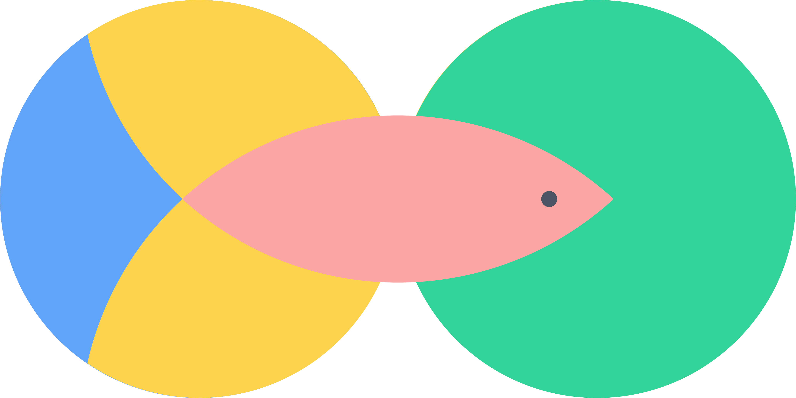
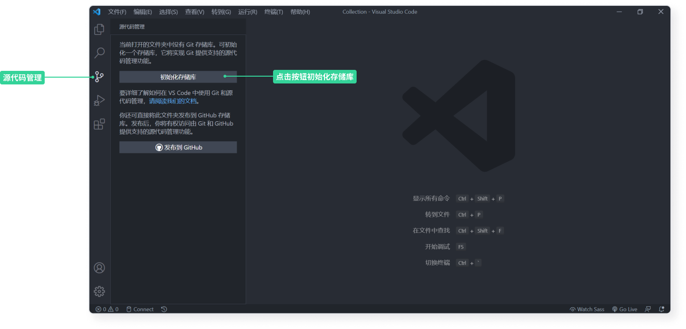

# 一鱼两吃
two-dishes-one-fish 是一个 VuePress-next 模板，用以构架一个静态网站作为部落格和学习笔记管理系统。



部落格和学习笔记管理体系搭建记录

:link: [English Version](./two-dishes-one-fish-en)

「一鱼两吃」是一道很「聪明」的菜品，利用一条鱼的不同部位做出两味，甚至多味菜。我由此获得启发，基于相同的一堆 Markdown 文件作为数据源，搭建一个静态网站，既可以是部落格也可以作为学习笔记管理系统，达到类似「一鱼两吃」的效果。

由于文章主要是文本，而且网站的交互需求不高，所以选择使用[静态网页](https://en.wikipedia.org/wiki/Static_web_page)。现在有很多基于 Markdown 文档生成静态网页的[工具](https://vuepress2.netlify.app/zh/guide/#%E4%B8%BA%E4%BB%80%E4%B9%88%E4%B8%8D%E6%98%AF)，基于我目前掌握的技能和需求选择以 [VuePress](https://vuepress2.netlify.app/zh/) 作为静态网站生成器。

VuePress 已经内置了默认主题只需要进行[简单的参数配置](https://v2.vuepress.vuejs.org/reference/default-theme/config.html)就可以做到开箱即用。我的主要工作是基于默认模板进行拓展，优化在检索、浏览文章和笔记时有更好的体验：

* 虽然部落格文章和学习笔记都是以 Markdown 文档为单位，但部落格是面向读者的，一般文章具较完整的前后文内容；而学习笔记则是面向自己，内容较为零碎。所以不能靠一套 UI 来实现两种需求，因此我以主页为统一入口，做了**两套文章分类导航页面**。Markdown 文档可以通过标记的方式分成两种类型，一种是作为部落格文章和学习笔记，另一种是只作为学习笔记。
* 添加了部落格文章导航页，有三种方式浏览文章：Grid 网格布局、Masonry 瀑布流式布局、List 列表布局。
* 添加了学习笔记导航页，所有的 Markdown 文件都会作为学习笔记展示，可以通过网格嵌套布局来浏览，这些笔记的层级关系和它们在文件存储系统一致，而且通过 [D3.js](https://d3js.org/) 对这些笔记文件数据进行可视化构建出树图，方便快速浏览。
* 支持给 Markdown 文档加标签，在导航页中可以基于标签对文章进行筛选。
* 遵循 RWD 响应式网页设计原则，可以在不同尺寸的屏幕浏览网页。

:warning: 这也是作为我学习 Vue3 的一个练手小项目，所以使用的 VuePress 是 V2 版本（也称作 VuePress-next），该版本仍处于不稳定的 **Beta** 状态（后期可能会出现不兼容的版本更新），因此如果你需要将它应用到日常正式的开发中需要谨慎考量。根据 VuePress-next 的[开发计划](https://github.com/vuepress/vuepress-next/discussions/68) **Stable** 版本可能会[在 2021 年 Q2 末推出](https://github.com/vuepress/vuepress-next/discussions/68#discussioncomment-782395)。由于是练手项目，项目可能有不少 Bugs 导致编译不成功，但静态网站是基于 Markdown 文件构建的，所以**只要保存好 `.md` 后缀的文档和相关图片等静态资源，数据是不会丢失的，也可以将文档迁移到别处**，使用其他支持 Markdown 文件的笔记软件管理知识体系或静态网站生成器构建博客。

## 设计理念

### 工作流程

* 以 Markdown 文件为单位，在本地进行写作、记笔记
* 以 VuePress 为引擎，基于 Markdown 生成网页
* 通过 Git 进行版本控管，与 Github [远端仓库](https://github.com/Benbinbin/tech-blog)同步，并以 [Github Page](https://benbinbin.github.io/tech-blog/) 作为网页的托管。


### 首页

**首页**的卡片按主题进行区分，作为部落格文章导航页和笔记导航页的统一入口：

* **直接点击**相应的卡片，可以进入**部落格文章导航页**，其中 URL 路径格式是 `/postslist/相应主题`
* **按住 `Shift+Ctrl` 再点击**相应的卡片，可以进入**笔记导航页**，其中 URL 路径格式是 `/folderslist/相应主题`

:bulb: 如果触动设备无法配合键盘点击卡片进入笔记导航页，可以先进入相应的部落格文章导航页，再手动更改浏览器地址栏的 URL，将路径中的 `postslist` 更改为 `folderslist`


### 部落格文章导航页

**部落格文章导航页**提供 3 种布局，便于浏览和快速检索文章：

* 网格布局 Grid：规则的网格布局，卡片可能包含文章概述
* 瀑布流式布局 Masonry：与网格布局相比更紧凑些
* 列表布局 List：只包括必要的文章信息，不显示文章的概述

文章可以按照创建日期（默认）或更新日期 `Updated` ，进行降序 `Descend`（默认）或升序 `Ascend` 方式**排序**。

在顶部的导航栏可以点击主题浏览相关的文章，此外还支持基于标签 `#tag` 对文章进行**筛选**。

:bulb: 点击顶部的导航栏按钮可以切换到相应的主题，如果按住 `Shift+Ctrl` 再点击按钮，则可以直接进入相应主题的**笔记导航页**。


### 笔记导航页

**笔记导航页**提供 2 种布局，基于熟悉的文件夹嵌套的层级关系来检索大量琐碎笔记：

* 网格布局 Grid：以网格布局展示「当前文件夹」中包含的文件和子文件夹，为了方便子文件夹也展示了（下钻一级）其中的文件
* 树状布局 Tree：以树图的形式展示「当前文件夹」及其下钻两级的文件夹包含的文件和子文件夹，支持展开和收起文件夹操作

在网格布局下支持基于标签 `#tag` 对「当前文件夹」中的文章进行**高亮**，还提供面板屑 breadcrumb 导航栏，便于从深层嵌套的文件夹快速返回到其上游的文件夹。

在树状布局下支持对树图进行缩放平移操作，提供 `Resize` 按钮对树图一键复位。


### 系列文章

除了通过以上展示的各种布局浏览检索文章，还可以基于当前文章查看其所属系列的相关文章。如果一篇文章属于一个系列，则会出现一个集合 `Collection` 按钮，点击后会弹出一个 modal 展示同属一个系列的所有文章。


### 文章目录

在文章内部基于标题生成目录，方便了解文章的纲要和快速定位到所需段落。


## 使用指南

### 搭建本地工作环境

1. 安装写作和开发软件：

	* [Git](https://git-scm.com/downloads)：版本控管软件
	* [node.js](https://nodejs.org/zh-cn/download/)：开发依赖
		:bulb: 更推荐使用 [nvm](https://github.com/nvm-sh/nvm#installing-and-updating) 安装和管理 node.js，它是 node.js 版本管理器。在 macOS 和 Linux 系统中[使用命令行进行安装](https://github.com/nvm-sh/nvm#install--update-script)；如果是 Windows 系统可以安装 [nvm-windows](https://github.com/coreybutler/nvm-windows#installation--upgrades)。
	* [Typora](https://typora.io/)：一款开源免费的 Markdown 编辑器，用于写作
	* [VS Code](https://code.visualstudio.com/Download)：微软推出的代码编辑器，用于开发

2. 下载 VuePress 模板 two-dishes-one-fish，有两种方法：

   * 方法一：在终端通过输入命令并按回车键 `Enter` 下载

     ```shell
     git clone https://github.com/Benbinbin/two-dishes-one-fish.git
     ```

   * 方法二：在 [Github 仓库](https://github.com/Benbinbin/two-dishes-one-fish)下载代码压缩包

   

3. 安装 VuePress 依赖：

   * 使用 VS Code 代码编辑器打开项目文件夹 :file_folder: `two-dishes-one-fish`

   * 点击（菜单栏）`查看(V)` -> `终端` 打开终端（或使用快捷键 <code>Ctrl+`</code> 打开终端）

   * 在终端输入以下命令并按回车键，安装项目依赖的包

       ```shell
       npm install
       ```

       :bulb: 如果安装较慢或失败，可以用这条命令替代（使用淘宝提供的资源加速安装） `npm install --registry https://registry.npm.taobao.org`

### 项目结构

完成以上步骤后，就获得了一个完整的项目结构：

* :file_folder: `two-dishes-one-fish`：项目的根文件夹（可进行重命名，不影响后续操作），其中包含项目的相关配置文件，还有一个文件夹 :file_folder: `docs`
* :file_folder: `docs`：该文件夹中的 Markdown 文件（文件后缀为 `.md`）会自动编译为网页文件，如图中标注文件夹 :file_folder: `folder1` 和 :file_folder: `folder2` 里就存放了文章示例
* :file_folder: `.vuepress`：该文件夹在 :file_folder: `docs` 中，但是它不是存放写作文章，而是存放 VuePress 相关的配置文件
* :file_folder: `public`：该文件夹在 :file_folder: `.vuepress` 中，它是用于存放一些静态资源

  * 在导航栏和页尾使用的头像图片 `avatar.png`
  * 在浏览器标签栏显示的图标 `favicon.ico`
  * 首页的每个卡片的背景图存放在子文件夹 :file_folder: `images/home` 中
  * 部落格文章导航页的一些文章卡片的配图存放在子文件夹 :file_folder: `images/covers` 中
  * 网页中使用到的图标（如页尾的一些社交媒体图标）存放在子文件夹 :file_folder: `images/icons` 中


一般只需要对文档 :page_facing_up: `config.js` 进行一次修改，然后日常就可以在文件夹 :file_folder: `docs` 中通过创建 Markdown 文件进行写作：

* :page_facing_up: `config.js`：在文件夹 :file_folder: `.vuepress` 下的文档，它是用于配置网站大部分参数
* :file_folder: `folder1` 和 :file_folder: `folder2`：在文件夹 :file_folder: `docs` 下用于存放示例文章的，可以重命名或创建更多的文件夹，也允许创建嵌套文件夹结构，在它们中创建的每一个 Markdown 文件会相应生成一篇文章

:bulb: 如果要添加首页的主题卡片的背景图，以及部落格文章导航页中一些文章的配图，还有页尾社交媒体图标，记得将这些图片/图标资源放置在文件夹 :file_folder: `public` 的相应子文件夹中。

### 参数设置

使用 VS Code 代码编辑器打开文件夹 :file_folder: `.vuepress` 下的文档 :page_facing_up: `config.js` 以对网页参数进行配置（根据 `// 中文注释` 进行修改）

```js
const { path } = require('@vuepress/utils')

module.exports = {
  open: true,
  lang: 'zh-CN',
  // 属性 base 的值 "repo" 是指需要部署到你的 Github 上的仓库名称
  // 例如我将网站部署到路径为 https://github.com/Benbinbin/Collection 这个仓库中，那么我的 Github 用户名是 Benbinbin，部署仓库名是 Collection，则属性 base 的值就应该是 "/Collection/"
  // 如果部署到 https://github.com/username/username.github.io 这个特殊的 Github 仓库（其中 username 是指你的 Github 用户名），则属性 base 的值应该是 "/"（也可以不设置，因为该属性的默认值为 "/"）
  base: "/repo/",
  // 属性 title 是站点的标题，会作为所有页面的标题后缀，即显示在浏览器标签页上
  title: "Blog",
  // 属性 description 是站点的描述，便于搜索引擎进行识别
  description: 'A blog shows some of the notes I took while learning skills.',
  head: [
    // 以下用于设置网站的图标，即显示在浏览器标签栏左侧的图标
    // 下面的 repo 要设置为仓库名，例如我将网站部署到路径为 https://github.com/Benbinbin/Collection 这个仓库中，则属性 href 的值为 '/Collection/images/favicon.ico'
   	// 如果要将网站部署在 https://github.com/username/username.github.io 这个特殊的 Github 仓库，则属性 href 的值为 '/images/favicon.ico'
    // 模板已内置了图标文件，如果需要修改请见新的图标文件 favicon.ico 放在静态资源文件夹 public 中，覆盖原来的图标文件
    ['link', { rel: 'icon', href: '/repo/images/favicon.ico' }],
    ['link', { rel: 'stylesheet', href: 'https://cdn.jsdelivr.net/npm/katex@0.13.5/dist/katex.min.css' }],
  ],
  bundler: '@vuepress/vite',
  bundlerConfig: {
    viteOptions: {
      css: {
        postcss: {
            plugins: [
              require('tailwindcss'),
              require('autoprefixer')
            ]
        }
      },
    }
  },
  plugins: [
    require('./plugins/addTime.js'),
    [require('./plugins/createHomePage.js'),
    {
      // 属性 cards 是用于设置首页主题卡片
      // 它的值是一个数组，其中每一个元素对应的是一个主题，也就文件夹 docs 中包含的下一级子文件夹。
      // 每一个元素都有两个属性 name 和 image，分别表示卡片主题名称（和文件夹名称相同），和卡片背景图片文件
      // 例如模板中就有文件夹 folder1 和 folder2，卡片背景图片分别是 folder1-cover.svg 和 folder2-cover.svg
      // 记得将卡片背景图文件放在静态资源文件夹 public 的子文件夹 images/home 中
      cards: [
        {
          name: "Folder1",
          image: "folder1-cover.svg"
        },
        {
          name: "Folder2",
          image: "folder2-cover.svg"
        },
      ]
    }],
    [require('./plugins/generateListPages.js'),
    {
      // 属性 postClassification 是指部落格文章的主题，用于部落格文章导航页
      // 它的值是一个数组，其中每一个元素对应的是一个主题，也就是文件夹 docs 中所包含的下一级子文件夹
      // 例如模板中就有文件夹 folder1 和 folder2，这些文件夹中就是用户写作生成的许多 markdown 文件
      postClassifications: ['folder1', 'folder2']
    }],
    [require('./plugins/generateFolderPages.js'),
    {
      // 属性 postFolders 是指笔记的主题，它类似于属性 postClassification，一般两个属性的值是一样的，因为共用一个文件系统（一鱼两吃）
      // 它的值是一个数组，其中每一个元素对应的是一个主题，也就是文件夹 docs 中所包含的子文件夹
      // 例如刚下载的模板中就就有文件夹 folder1 和 folder2，这些文件夹中就是包含了许多 markdown 文件
      postFolders: ['folder1', 'folder2']
    }],
  ],
  theme: path.resolve(__dirname, './theme/index.js'),
  themeConfig: {
    navbar: false,
    sidebar: false,
    contributors: false,
    lastUpdatedText: '更新时间',
    themePlugins: {
      backToTop: false,
      nprogress: false,
    }
  },
  markdown: {
    links: {
      externalIcon: false
    }
  },
  extendsMarkdown: (md) => {
    md.use(require('@neilsustc/markdown-it-katex'), {output: 'html'})
  },
  // 属性 define 中的有不少属性和前面设置相关，这是为了开发方便设置的全局变量，请对照着进行修改
  define: {
    // 属性 __BASE__ 和前面的属性 base 一致，如果是部署到 https://github.com/username/username.github.io 这个特殊的 Github 仓库，该属性值请设置为 "/"（不可省略）
    __BASE__: "/repo/",
    // 属性 __HOME_PAGE_TITLE__ 的值是指首页的标题
    __HOME_PAGE_TITLE__: "Blog",
    // 属性 __HOME_PAGE_ICON__ 的值是指首页的标题和下方分割线中的图标文件，记得将图标文件放置在静态资源文件 public 的子文件夹 images/home 中
    __HOME_PAGE_ICON__: "home_icon.svg",
    // 属性 __HOME_DESCRIPTION__ 的值是指首页的标题下方的描述，支持纯文本和 HTML
    __HOME_DESCRIPTION__: "我是 Ben，这是我的部落格和知识管理系统。",
    // 属性 __HOME_PAGE_COLOR__ 的值是指首页的颜色
    __HOME_PAGE_COLOR__: '#9CA3AF',
    // 属性 __AVATAR__ 的值是指展示在导航栏和页尾的头像的图像文件名称，请记得将这个图像文件放在静态资源文件夹 public 中
    __AVATAR__: 'avatar.png',
    // 属性 __CLASSIFICATIONS__ 用于生成部落格文章导航页的顶部导航栏
    // 它的值是一个数组，和前面的属性 postClassifications 类似，但是在添加一个元素 'All'，这样可以添加一个导航页面显示所有部落格文章
    __CLASSIFICATIONS__: ['All', 'Folder1', 'Folder2'],
    // 属性 __FOLDERS__ 用于生成笔记导航页的顶部导航栏
    // 它的值是一个数组，和前面的属性 postFolders 类似
    __FOLDERS__: ['Folder1', 'Folder2'],
    // 属性 __FOOTER_AVATAR_LINK__ 的值是指页尾的头像点击后跳转的链接，可以设置为自己 portfolio 页面
    __FOOTER_AVATAR_LINK__: 'https://www.google.com/',
    // 属性 __AUTHOR__ 的值是指页尾标注的该网站文章作品的许可权利所属者
    __AUTHOR__: 'Benbinbin',
    // 属性 __FOOTER_LICENSE__ 的值是指页尾标注的该网站文章遵循的许可协议，默认遵循 CC-BY-SA-4.0 署名-相同方式共享 4.0 国际 方式进行共享
    __FOOTER_LICENSE__: 'CC-BY-SA-4.0',
    // 属性 __FOOTER_LICENSE_LINK__ 的值是指页尾标注的该网站文章准许的许可协议具体内容的链接
    __FOOTER_LICENSE_LINK__: 'https://creativecommons.org/licenses/by-sa/4.0/deed.en',
    // 属性 __SOCIAL_MEDIA__ 用于生成页尾社交媒体图标
    // 它的值是一个数组，每一个元素都是一个社交媒体账号相关信息，你可以根据进行需要增删
    // 每一个元素都包含 3 个属性：
    // 属性 name 表示社交媒体的名称，它值应该是唯一且不重复的
    // 属性 logo 是指显示在页尾的图标的文件，请记得将这个图标文件放在静态资源文件夹 public 的子文件夹 images/icons 中，当前已预设了 6 种社交媒体图标
    // 属性 url 是指社交媒体的链接，以用点击图标进行访问
    // 如果社交媒体是邮件账号，则属性 url 格式是 mailto: 作为前缀，再接着写邮箱地址
    __SOCIAL_MEDIA__: [
      {
        name: 'email',
        logo: 'email.svg',
        url: 'mailto:[example]@gmail.com'
      },
      {
        name: 'github',
        logo: 'github.svg',
        url: 'https://github.com/[username]'
      },
      {
        name: 'juejin',
        logo: 'juejin.svg',
        url: 'https://juejin.cn/user/[userid]/posts'
      },
      {
        name: 'dribbble',
        logo: 'dribbble.svg',
        url: 'https://dribbble.com/[username]'
      },
      {
        name: 'twitter',
        logo: 'twitter.svg',
        url: 'https://twitter.com/[username]'
      },
      {
        name: 'weibo',
        logo: 'weibo.svg',
        url: 'https://weibo.com/[username]'
      },
    ],
  },
}
```

:bulb: 除了上述中文注释标注的修改以外，由于该模板基于 VuePress-next 的默认主题进行修改，因此[默认主题的其他配置](https://vuepress2.netlify.app/zh/reference/default-theme/config.html)也同样适用。

:bulb: 如果需要进行深度定制，对其他文档进行修改，可以参考 VuePress-next 的[官方文档](https://vuepress2.netlify.app/zh/)和本文的[开发日志](#开发日志)部分。

### 写作创作

在文件夹 :file_folder: `docs` 下依照主题创建文件夹（允许创建嵌套文件夹结构，方便进行文章的分类管理），在这些文件夹内创建 Markdown 文件，然后使用 Typora 进行写作创作了。

每一个后缀为 `.md` 文档都是一篇文章，通过 VuePress 引擎[编译](#开发与预览（可选）)会生成一个网页。

#### Markdown 语法

以下是示例文章，左边是一个 Markdown 文档，列出了常见的语法，右边是编译出来的相应文章。更多关于 markdown 语法的介绍可以查看这一篇文章 [Mastering Markdown](https://guides.github.com/features/mastering-markdown/)。

:bulb: 该模板还支持插入 [katex 数学公式](https://katex.org/docs/supported.html)


:bulb: 如果插入本地图片，推荐在与当前 Markdown 文档同级的目录下创建一个文件夹 :file_folder: `images` 存放图片文件，然后就可以在该 Markdown 文件中使用相对路径插入相应的图片。如在 Markdown 文件中插入图片 `img1.png`

```md

```

:bulb: 可以通过 `<iframe>` 的形式插入视频，为了解决视频的高宽比例和网页响应式适配问题，可以调整元素 `style` 属性的 `width` 和 `aspect-ratio` 选项值

通过以下代码嵌入一个 Youtube [视频](https://www.youtube.com/watch?v=Y50_RSWpWkA)

```html
<iframe
  style="width: 100%; aspect-ratio: 16/9;"
  src="https://www.youtube.com/embed/Y50_RSWpWkA?start=3403&end=3441&modestbranding=1&rel=0"
  allowfullscreen
  loading="lazy">
</iframe>
```

更多关于 YouTube 嵌入式播放器及播放器参数可以参考[官方文档](https://developers.google.com/youtube/player_parameters)

* `start` 参数设置播放的开始时间，单位为秒
* `end` 参数设置播放的结束时间，单位为秒
* `modestbranding` 参数设置为 1 可以阻止 YouTube 徽标显示在控制栏中
* `rel` 参数设置为 0 在播放结束显示的相关视频来自于相同的频道
* `allowfullscreen` 属性允许播放器全屏显示
* `loading` 属性设置为 `lazy` 可以实现[懒加载](http://www.deathghost.cn/article/html/80)

通过以下代码嵌入一个 Bilibili [视频](https://www.bilibili.com/video/BV1W64y1X7ok)

```html
<iframe
  style="width: 100%;aspect-ratio: 16/9;"
  src="//player.bilibili.com/player.html?aid=759111032&bvid=BV1W64y1X7ok&cid=366423332&page=1&high_quality=1&t=60"
  allowfullscreen="true"
  loading="lazy">
</iframe>
```

由于 Bilibili 官方未给出关于嵌入式播放器的参数，参考相关文章尝试进行以下设置

* `high_quality` 参数设置为 `1` 是为了[将视频设置为片源可用的最高清晰度](https://www.zhihu.com/question/363423550/answer/1357554124)
* `src` 属性里面有很多参数，可以只保留 `bvid` 这个参数
* `page` 参数指定选集里第几个视频
* `t` 参数设置视频开始播放的时间，单位为秒
* `loading` 属性设置为 `lazy` 可以实现懒加载

更多可能的参数设置可以参考 [Bilibili 视频适应页面宽度](https://sunete.github.io/tutorial/bilibili-video-adapts-to-the-width/) 这一篇文章。

#### Frontmatter

在 Markdown 文件中除了正文内容，还可以在文章的顶部添加一些额外的信息，称为 [YAML Frontmatter](https://yaml.org/)，作为参数传递给 VuePress 控制引擎如何编译生成相应网页。

在 Frontmatter 中可以设置的字段（注意大小写，采用驼峰式命名法）：

* `show`：设置当前 Markdown 文档是否作为部落格文章。如果其值为 `true` 就显示在**部落格文章导航页**和**笔记导航页**中；如果其值为 `false` 文章就不会显示在部落格文章导航页中。
* `cover`：设置文章的封面图，该图片是显示在部落导航页的相应的文章卡片上（因此文章的 Frontmatter 字段 `show` 需要设置为 `true`），记得将图片文件放置在静态资源文件夹 :file_folder: `public` 的子文件夹 :file_folder: `images/covers` 中
* `collection`：设置文章所属系列
* `collectionOrder`：设置当前文章在所属系列中的排序（因此需要先设置文章的 Frontmatter 字段 `collection`）
* `tags`：设置文章的标签，其值是一个数组，每个元素以 `-` 开始
* `summary`: 设置当文章的概述，它会显示在部落格导航页的相应文章卡片上（因此文章的 Frontmatter 字段 `show` 需要设置为 `true`）

Frontmatter 写在文章的顶部，被包裹在一对**三短划线**中，以下是一个示例：

* 该 Markdown 文档是一篇部落格文章
* 文章封面图是 `img1.png`（文件放置在 :file_folder: `public/images/covers` 中）
* 文章属于 `linear algebra` 这个系列，在系列中排序为 `5`
* 文章打上的标签是 `math` 和 `linear algebra`

```md
---
show: true
cover: img1.png
collection: linear algebra
collection: 5
summary: A summary of this article will show on navigator page
tags:
  - math
  - linear algebra
---

# 正文标题一
以下是正文内容

```

:bulb: 除了以上提到的字段，VuePress 默认主题还支持设置其他 Frontmatter 字段，具体参考[官方文档](https://vuepress2.netlify.app/zh/reference/frontmatter.html#lang)。

:warning: 由于 Frontmatter 设置的参数优先级更高，当 Frontmatter 中的字段（针对当前文章） 与 VuePress 配置文件 :page_facing_up: `config.js` 中的字段（针对整个网页）一致时，Frontmatter 的字段值会覆盖 `config.js` 相应的字段值，对当前文章起作用。

### 开发与预览（可选）
设置好参数后，或每次写作完成后，**推荐通过启动本地服务器，预览生成的网站**，在本地编译成功后再[将代码推送到 Github 远程仓库](#与远程仓库同步)可以提高部署的成功率。

在终端输入以下命令启动本地服务器，编译完成后，会自动打开浏览器加载生成的网页，可以进行实时的开发调试

```shell
npm run docs:dev
```

:bulb: 如果未自动打开网页，可以按住 `Ctrl` 键点击终端输出的 URL 中任意一条链接，即可使用系统默认的浏览器预览网页；也可以复制其中一条链接，输入到浏览器地址栏中进行访问


如果需要停止本地服务器，点击终端面板以便激活响应输入，然后按下快捷键 `Ctrl+C`，终端会弹出「终止批处理操作」提示，按下 `y` 后再按回车键 `Enter` 确定即可


:bulb: 如果编译没有错误提示，但是无法正常预览，可以尝试停止本地服务器后再**重启**服务器。

### 版本控管

当写作完成保存了 Markdown 文件后（推荐进一步通过启动本地服务器，预览生成的网页查看效果），还需要通过 Git 对项目进行版本控管。保存 Markdown 文件是对当前文章的保存，而版本控管就可以理解为对当前整个项目的状态的保存，只有保存了这个状态才可以将本地项目的增删同步到远程仓库。

使用 VS Code 代码编辑器打开本地项目文件夹 :file_folder: `two-dishes-one-fish`，点击编辑器左侧的 `源代码管理` 按钮，然后按照下图提示操作，保存项目当前的状态。


:bulb: 如果项目模板是通过在 [Github 仓库](https://github.com/Benbinbin/two-dishes-one-fish)下载代码压缩包得到的，那么项目可能并未进行版本控管的初始化，可以按照图中提示，点击 `初始化存储库` 按钮实现初始化，然后就可以对项目的状态变动进行追踪。



### 与远程仓库同步

为了使用 Github 托管项目，并利用 Github Page 展示生成的网页，需要将本地项目与远程的  Github 仓库进行同步：

1. 根据下图操作提示，在 Github 上创建一个仓库

   

2. 为本地项目添加远程仓库。在 Github 上新建一个仓库后，页面会跳转到仓库的主页，其中 `…or push an existing repository from the command line` 下的代码，就是将本地仓库与该 Github 仓库相连接的命令。

   

   * 使用 VS Code 代码编辑器打开本地的项目文件夹 :file_folder: `two-dishes-one-fish`

   * 点击（菜单栏）`查看(V)` -> `终端` 打开终端（或使用快捷键 <code>Ctrl+`</code>）

   * 在终端输入以下命令为本地项目添加远程仓库（其中 [username] 是你的 Github 用户名称，[repo] 是新建的仓库名称）

     ```shell
     git remote add origin https://github.com/[username]/[repo].git
     ```

     :warning: 由于本地的项目是基于从 Github 下载的[模板 `two-dishes-on-fish`](https://github.com/Benbinbin/two-dishes-one-fish) 而创建的，因此本地项目原本就已经与这个模板的 Github 远程仓库现连。如果直接输入以上命令是无法成功执行的，会输出错误提示 `fatal: remote origin already exists.` 表示名为 `origin` 的远程仓库已存在，因此需要**先在终端输入以下命令移除这个已存在的远程仓库** `git remote remove origin`，然后再输入以上的命令才能够执行成功。

     :bulb: 可以在终端输入命令 `git remote -v` 来查看本地项目已连接的远程仓库，更多的 Git 命令可以参考[官方指南](https://git-scm.com/book/zh/v2)。

   * 在终端输入以下命令为本地项目创建一个名为 `main` 的分支

     ```shell
     git branch -M main
     ```

3. 与远程仓库同步。在终端输入以下命令，将本地项目代码同步到远端仓库

   ```shell
   git push -u origin main
   ```

:bulb: 前面的两个步骤只需要配置一次即可，**而这一步是本地项目与远程仓库同步，应该在每次[版本控管](#版本控管)，即每次保存完项目的状态后都执行一次**。而且这一次已经设置了同步的分支，下一次同步就可以使用更简洁的命令 `git push` 即可。

### 部署网页

项目模板已经内置了[部署脚本 `.github/workflows/docs.yml`](https://vuepress2.netlify.app/zh/guide/deployment.html#github-pages)，每当将本地项目代码同步到远程仓库时，Github 监听到仓库的变化就会自动执行脚本，将 Markdown 文件编译为的静态网页，并将网页部署到仓库的分支 `gh-pages`。

只需要进入仓库的 Github Pages 设置页，指定一次网页的数据源为分支 `gh-pages` 即可。


:bulb: 首次指定网页数据源后，可能要等待一段短时间，待上图的 `这个就是该仓库的 Github Page` 方框变绿，才能成功浏览到网页。

:bulb: 每次将本地项目代码[同步到 Github 远程仓库](#与远程仓库同步)后，都要等待 Github Action 执行部署脚本，成功后才能够浏览到新页面，可以到仓库主页的 `Actions` 标签栏内查看执行情况。如果部署成功但网页并不更改，可以按快捷键 `Shift + Ctrl + R` 或 `Shift + F5` 清除网页缓存强制刷新。


:bulb: 如果希望优化网页的访问速度，可以注册一个 [Gitee](https://gitee.com/) 账号，并创建一个 Github 远程仓库的[仓库镜像](https://gitee.com/help/articles/4336)，然后开启 [Gitee Page](https://gitee.com/help/articles/4136)。

:bulb: VuePress 提供了更多部署选项，请参考[官方文档](https://vuepress2.netlify.app/zh/guide/deployment.html)。

## 开发日志

以下部分是我基于 VuePress 的默认主题进行二次开发的踩坑笔记。

:warning: 使用 VuePress 的版本是 [v2.0.0-beta.20](https://github.com/vuepress/vuepress-next/releases/tag/v2.0.0-beta.20)，该版本仍处于不稳定的 **Beta** 状态（后期可能会出现不兼容的版本更新），因此如果你需要将它应用到日常正式的开发中需要谨慎考量。

### 项目结构


### 注意要点

* 插件或者主题的入口文件会在 Node App 中被加载，因此它们需要使用 CommonJS 格式。

* 客户端文件会在 Client App 中被加载，它们最好使用 ESM 格式。

* VuePress 会在构建过程中生成一个 SSR 应用，用以对页面进行预渲染。

* 如果一个组件在 `setup()` 中直接使用浏览器 / DOM API ，它会导致构建过程报错，因为这些 API 在 Node.js 的环境中是无法使用的。在这种情况下，你可以选择一种方式：

  - 将需要访问浏览器 / DOM API  的代码部分写在 `onBeforeMount()` 或 `onMounted()` Hook 中。

  - 使用 `<ClientOnly>` 包裹这个组件。

  - 如果在组件中导入的模块会立即执行访问 DOM API 操作，使用 `<ClientOnly>` 包裹这个组件也可能会在构建过程报错，可以使用动态导入的方式引入模块。

    ```js
    export default {
      setup(props) {
        onMounted(async () => {
          // dynamic import masonry
          const module = await import("masonry-layout");
          const Masonry = module.default;
          // do something
        })
      }
    }
    ```

* 布局组件 `Layout` 应该包含 [Content](https://v2.vuepress.vuejs.org/zh/reference/components.html#content) 组件来展示 Markdown 内容

### tailwindcss 整合

项目的打包工具使用 [Vite](https://v2.vuepress.vuejs.org/zh/guide/bundler.html#vite)

* 按照 Tailwind CSS 官方文档安装依赖并生成配置文件

  ```shell
  npm install -D tailwindcss@latest postcss@latest autoprefixer@latest
  npx tailwindcss init -p
  ```

  :bulb: 执行完以上命令后，会在项目的根文件夹下生成配置文件 `tailwind.config.js` ，可以配置其中的属性 `purge`，以在生产环境下优化 Tailwind CSS 文件大小。但是由于项目中存在通过拼接字符串构成的类名，如果执行优化会出现样式丢失的情况，因此没有配置 `purge` 属性。

* 在文件 `.vuepress/config.js` 中为打包工具配置 postcss 参数

  ```js
  // ...
  module.exports = {
    // ...
    bundlerConfig: {
      // vite 打包工具的选项
      viteOptions: {
        css: {
          postcss: {
              plugins: [
                require('tailwindcss'),
                require('autoprefixer')
              ]
          }
        },
      }
    },
    // ...
  }
  ```

* 在文件 `.vuepress/styles/index.scss`  的开头中引入 Tailwind

  ```scss
  @tailwind base;
  @tailwind components;
  @tailwind utilities;
  ```

  :warning: 由于引入了 `@tailwind base` 可能会会造成默认主题样式的重置，可以手动添加相应的 CSS 样式修正。

### markdown-it 插件

VuePress 使用 [markdown-it](https://github.com/markdown-it/markdown-it) 来解析 Markdown 内容，支持通过安装插件来实现语法扩展，还可以对插件进行参数配置。

安装插件的方法参考：

* [extendsMarkdown](https://v2.vuepress.vuejs.org/zh/reference/plugin-api.html#extendsmarkdown)
* [Plugins load](https://github.com/markdown-it/markdown-it#plugins-load)

#### markdown-it-katex

添加 [`@neilsustc/markdown-it-katex` 插件](https://github.com/yzhang-gh/markdown-it-katex)为 Markdown 添加数学公式的支持。

* 安装依赖 `npm i @neilsustc/markdown-it-katex`

  :bulb: [`markdown-it-katex`](https://www.npmjs.com/package/markdown-it-katex) 这个包在 npm 里下载量最多，但是它依赖的 [katex 版本](https://github.com/waylonflinn/markdown-it-katex/blob/81b84a7d91d74a1ba3d4769b847a5bf1947256cb/package.json#L25)很低，已经没有维护了，所以换成 [`@neilsustc/markdown-it-katex` ](https://github.com/yzhang-gh/markdown-it-katex)

* 在文件 `.vuepress/config.js` 中配置 markdown-it 插件

  ```js
  // ...
  module.exports = {
    // ...
    extendsMarkdown: (md) => {
      md.use(require('@neilsustc/markdown-it-katex'), {output: 'html'})
    },
    // ...
  }
  ```

  :warning: 根据 KaTex [官方文档](https://katex.org/docs/options.html)可以通过属性 `output` 来设置数学公式的渲染模式，应该设置为 `html`，因为默认值 `ouput: htmlAndMathml` 会将一些 mathml 格式的非标准标签插入到 HTML，导致构建过程报错

* 除了安装插件，还需要引入 katex 的样式表，在文件 `.vuepress/config.js` 中配置 [head 参数](https://v2.vuepress.vuejs.org/zh/reference/config.html#head)

  ```js
  // ...
  module.exports = {
    // ...
    head: [
      ['link', { rel: 'stylesheet', href: 'https://cdn.jsdelivr.net/npm/katex@0.13.5/dist/katex.min.css' }],
    ],
    // ...
  }
  ```

### 插件开发

借助 VuePress 提供的[插件 API](https://v2.vuepress.vuejs.org/zh/reference/plugin-api.html) 可以为网站新增页面（不依赖 Markdown 文件），还可以为指定的页面提供额外的数据。

:bulb: VuePress 插件是一个符合插件 API 的 JS 对象或返回值为 JS 对象的函数，具体参考官方文档[开发插件](https://v2.vuepress.vuejs.org/zh/advanced/plugin.html)一章。

VuePress 提供的插件 API 有多种 Hooks，它们的执行顺序和时间点都不同，可以参考官方文档的[核心流程与 Hooks 一节](https://v2.vuepress.vuejs.org/zh/advanced/architecture.html#%E6%A0%B8%E5%BF%83%E6%B5%81%E7%A8%8B%E4%B8%8E-hooks)，代码需要在合适 Hooks 下执行才不会报错。


#### 添加时间

参考[官方插件 Git](https://v2.vuepress.vuejs.org/zh/reference/plugin/git.html#git) 的[代码](https://github.com/vuepress/vuepress-next/tree/main/packages/%40vuepress/plugin-git)，通过插件 `.vuepress/plugins/addTime.js` 为 Markdown 文件添加时间修改的信息。

使用 [extendsPageOptions](https://v2.vuepress.vuejs.org/zh/reference/plugin-api.html#extendspageoptions) Hook 将 Markdown 文件的创建时间 `createdTime` 和更新时间 `updatedTime` 作为 Frontmatter 字段添加到相应文件中。

```js
/**
 * refer to @vuepress/plugin-git: https://www.npmjs.com/package/@vuepress/plugin-git
 */
 const execa = require('execa')

 /**
  * Check if the git repo is valid
  */
 const checkGitRepo = (cwd) => {
   try {
     execa.commandSync('git log', { cwd })
     return true
   } catch {
     return false
   }
 }

 const getUpdatedTime = async (filePath, cwd) => {
   const { stdout } = await execa(
     'git',
     ['--no-pager', 'log', '-1', '--format=%at', filePath],
     {
       cwd,
     }
   )

   return Number.parseInt(stdout, 10) * 1000
 }

 const getCreatedTime = async (filePath, cwd) => {
   const { stdout } = await execa(
     'git',
     ['--no-pager', 'log', '--diff-filter=A', '--format=%at', filePath],
     {
       cwd,
     }
   )

   return Number.parseInt(stdout, 10) * 1000
 }

 const addTime = {
   name: 'vuepress-plugin-addTime',
   async extendsPageOptions(options, app) {
     if (options.filePath) {
       filePath = options.filePath;
       const cwd = app.dir.source()
       const isGitRepoValid = checkGitRepo(cwd)

       let createdTime = null;
       let updatedTime = null;

       if (isGitRepoValid) {
         createdTime = await getCreatedTime(filePath, cwd)
         updatedTime = await getUpdatedTime(filePath, cwd)
       }

       return {
         frontmatter: {
           createdTime,
           updatedTime
         },
       }
     } else {
       return {}
     }

   }
 }

 module.exports = addTime
```

#### 创建页面

参考官方文档[添加额外页面](https://v2.vuepress.vuejs.org/zh/advanced/cookbook/adding-extra-pages.html)一章，通过插件 `.vuepress/plugins/createHomePage.js` 为网站添加主页，通过插件 `.vuepress/plugins/generateFolderPages.js` 和 `.vuepress/plugins/generateListPages.js` 创建一些导航页。

主要使用 `createPage ` 方法异步创建页面，由于导航页需要基于所有 Markdown 文件的数据，代码所以需要在 [onInitialized](https://v2.vuepress.vuejs.org/zh/reference/plugin-api.html#oninitialized) Hook 下执行，此时页面已经加载完毕。

```js
// 创建首页
const { createPage } = require('@vuepress/core')

const createHomePage = (options, app) => {
  return {
    name: 'vuepress-plugin-createHomePage',
    async onInitialized(app) {
      // if homepage doesn't exist
      if (app.pages.every((page) => page.path !== '/')) {
        // async create a homepage
        const homepage = await createPage(app, {
          path: '/',
          // set frontmatter
          frontmatter: {
            layout: 'HomeLayout',
            cards: options.cards || []
          },
        })

        // push the homepage to app.pages
        app.pages.push(homepage)
      }
    },
  }
}

module.exports = createHomePage
```

### 继承主题

参考官方文档[继承一个主题](https://v2.vuepress.vuejs.org/zh/advanced/cookbook/extending-a-theme.html)一章。

由于我继承的主题并没有发布到 NPM 上而是作为本地主题，因此在文件 `.vuepress/config.js` 中配置 theme 参数时[通过绝对路径来使用它](https://v2.vuepress.vuejs.org/zh/guide/theme.html#%E6%9C%AC%E5%9C%B0%E4%B8%BB%E9%A2%98)

```js
// ...
module.exports = {
  // ...
  theme: path.resolve(__dirname, './theme/index.js'),
  // ...
}
```

### 添加布局组件

有两种方式新增布局，然后就可以直接在 Markdown 文件的顶部 Frontmatter [字段 layout](https://v2.vuepress.vuejs.org/zh/reference/frontmatter.html#layout) 中使用它们：

* 方法一：如果布局组件放置在主题的 `.vuepress/theme/layouts/` 目录下，需要在主题的入口文件 `.vuepress/theme/index.js` 中通过配置属性 `layouts` 来显式指定

  ```js
  const { path } = require('@vuepress/utils')

  module.exports = {
    name: 'vuepress-theme-two-dish-cat-fish',
    extends: '@vuepress/theme-default',
    // registe 4 layouts
    layouts: {
      HomeLayout: path.resolve(__dirname, 'layouts/HomeLayout.vue'),
      ClassificationLayout: path.resolve(__dirname, 'layouts/ClassificationLayout.vue'),
      FolderLayout: path.resolve(__dirname, 'layouts/FolderLayout.vue'),
      Layout: path.resolve(__dirname, 'layouts/Layout.vue'),
    },
  }
  ```

* 方法二：如果使用默认主题（不进行继承拓展），可以通过插件 API 的 [clientAppEnhanceFiles Hook](https://v2.vuepress.vuejs.org/zh/reference/plugin-api.html#clientappenhancefiles) 来[注册自定义的布局组件](https://v2.vuepress.vuejs.org/zh/reference/frontmatter.html#layout)。

  * 创建 `.vuepress/clientAppEnhance.js` 文件

  * 在文件中使用 `clientAppEnhanceFile` 方法注册组件

    ```js
    import { defineClientAppEnhance } from '@vuepress/client'
    import CustomLayout from './CustomLayout.vue'

    export default defineClientAppEnhance(({ app }) => {
      app.component('CustomLayout', CustomLayout)
    })
    ```

:bulb: 如果布局是基于[默认主题的布局组件 `Layout`](https://github.com/vuepress/vuepress-next/blob/main/packages/%40vuepress/theme-default/src/client/layouts/Layout.vue) 进行二次开发，可以使用该组件提供的的插槽

- `navbar-before`
- `navbar-after`
- `sidebar-top`
- `sidebar-bottom`
- `page-top`
- `page-bottom`

### 树图导航

基于 Markdown 文件在存储系统的位置，使用 [D3.js](https://d3js.org/) 构建[树形图](https://github.com/d3/d3-hierarchy/#tree)来可视化文件夹的嵌套层级关系。

* 安装 D3.js 依赖 `npm install d3@6.5.0`

* 在插件 `.vuepress/plugins/generateFolderPages.js` 中通过遍历所有 Markdown 文件（生成的页面），使用 [extendsPageData](https://v2.vuepress.vuejs.org/zh/reference/plugin-api.html#extendspagedata) Hook 为笔记导航页添加额外的数据。

  ```js
  const { createPage } = require('@vuepress/core');

  const generateFolderPages = (options, app) => {
    let postFolders = {}
    options.postFolders.forEach(folder => {
      postFolders[folder] = {
        posts: [],
        tags: []
      }
    })

    return {
      name: 'vuepress-plugin-generateFolderPages',
      async onInitialized(app) {
        // rearrange posts to different folder
        app.pages.forEach((page) => {
          let folder = '';
          if (page.filePathRelative) {
            folder = page.filePathRelative.split("/")[0]
            if (!(folder in postFolders)) return
          } else {
            return
          }

          const post = {
            key: page.key,
            title: page.title,
            path: page.path,
            pathRelative: page.htmlFilePathRelative,
            filePathRelative: page.filePathRelative,
            tags: page.frontmatter.tags || [],
            createdTime: page.frontmatter.createdTime || null,
            updatedTime: page.frontmatter.updatedTime || null,
            date: page.frontmatter.date || null,
            collection: page.frontmatter.collection || '',
            collectionOrder: page.frontmatter.collectionOrder || 0,
          }

          postFolders[folder].posts.push(post);
          postFolders[folder].tags = [...new Set([...postFolders[folder].tags, ...post.tags])]
        })

        //...
      },
      extendsPageData: (page, app) => {
        // add data to each folder navigation pages
        if (page.frontmatter.folder) {
          return {
            postsData: postFolders[page.frontmatter.folder]
          }
        } else {
          return {}
        }
      },
    }
  }

  module.exports = generateFolderPages
  ```

* 为笔记导航页添加的额外数据是一个数组，在布局组件 `.vuepress/theme/layouts/FolderLayout.vue` 中将这个扁平的数据结构转换为一个 JS 对象，使它符合 D3.js 用于[计算层次布局的数据结构要求](https://github.com/d3/d3-hierarchy/#hierarchy)。

  ```vue
  <script>
  //...
  function buildPostsTreeData(rootName, postsList) {
    let tree = {
      name: rootName,
      type: "root",
      parent: null,
      children: [],
    };

    const mdReg = /\.md$/;

    postsList.forEach((post) => {
      const paths = post.filePathRelative.split("/").slice(1);
      let folder = tree;
      let currentContent = tree.children;

      for (let index = 0; index < paths.length; index++) {
        const path = paths[index];
        // let existingPath = getLocation(currentLevel, "name", path);
        let existingPath = currentContent.find((item) => {
          return item.name === path;
        });
        if (existingPath) {
          folder = existingPath;
          currentContent = existingPath.children;
        } else if (mdReg.test(path)) {
          const newPath = {
            name: path,
            type: "post",
            parent: folder,
            data: post,
          };
          currentContent.push(newPath);
        } else {
          const newPath = {
            name: path,
            type: "folder",
            parent: folder,
            children: [],
          };

          currentContent.push(newPath);
          folder = newPath;
          currentContent = newPath.children;
        }
      }
    });

    return tree;
  }

  export default {
    setup(props) {
      // data
      const data = reactive({
        //...
        folder: "",
        posts: [],
        postsTreeData: null,
        //...
      });
      //...
      data.folder = page.value.frontmatter.folder;
      data.posts = page.value.postsData.posts;
      data.postsTreeData = buildPostsTreeData(data.folder, data.posts);
      //...
    }
  }
  </script>
  ```

* 在组件 `.vuepress/components/PostsTree.vue` 中构建树形图，使用 D3.js 计算树图节点的定位等数据，再使用 Vue3 将数据绑定到 DOM 上控制 svg 的生成。